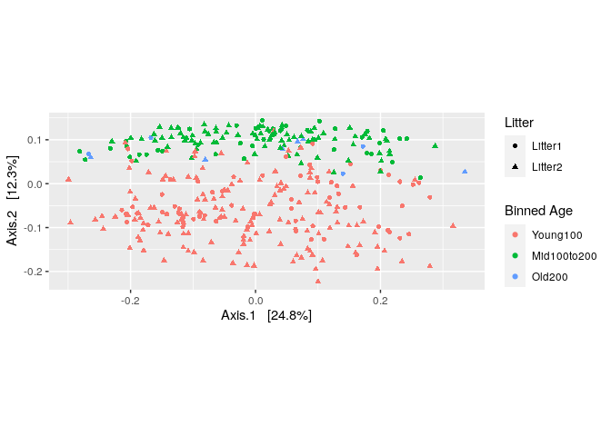

R Notebook
================

##CC1 Pierric MATHIS–FUMEL

``` bash
sudo apt-get update -y
sudo apt-get install -y libglpk-dev 
sudo apt-get install -y liblzma-dev libbz2-dev
```

``` r
if (!requireNamespace("BiocManager", quietly = TRUE))
    install.packages("BiocManager")
BiocManager::install("BiocStyle")
BiocManager::install("Rhtslib")
```

``` r
library("knitr")
library("BiocStyle")
.cran_packages <- c("ggplot2", "gridExtra", "devtools")
install.packages(.cran_packages) 
.bioc_packages <- c("dada2", "phyloseq", "DECIPHER", "phangorn")
BiocManager::install(.bioc_packages)
# Load packages into session, and print package version
sapply(c(.cran_packages, .bioc_packages), require, character.only = TRUE)
```

``` bash
cd ~
wget https://mothur.s3.us-east-2.amazonaws.com/wiki/miseqsopdata.zip
unzip miseqsopdata.zip
```

``` r
library("knitr")
library("BiocStyle")
.cran_packages <- c("ggplot2", "gridExtra")
.bioc_packages <- c("dada2", "phyloseq", "DECIPHER", "phangorn")
# Charger les packages dans la session, et imprimer la version du package
sapply(c(.cran_packages, .bioc_packages), require, character.only = TRUE)
```

    ## Loading required package: ggplot2

    ## Loading required package: gridExtra

    ## Loading required package: dada2

    ## Loading required package: Rcpp

    ## Loading required package: phyloseq

    ## Loading required package: DECIPHER

    ## Loading required package: Biostrings

    ## Loading required package: BiocGenerics

    ## 
    ## Attaching package: 'BiocGenerics'

    ## The following object is masked from 'package:gridExtra':
    ## 
    ##     combine

    ## The following objects are masked from 'package:stats':
    ## 
    ##     IQR, mad, sd, var, xtabs

    ## The following objects are masked from 'package:base':
    ## 
    ##     anyDuplicated, append, as.data.frame, basename, cbind, colnames,
    ##     dirname, do.call, duplicated, eval, evalq, Filter, Find, get, grep,
    ##     grepl, intersect, is.unsorted, lapply, Map, mapply, match, mget,
    ##     order, paste, pmax, pmax.int, pmin, pmin.int, Position, rank,
    ##     rbind, Reduce, rownames, sapply, setdiff, sort, table, tapply,
    ##     union, unique, unsplit, which.max, which.min

    ## Loading required package: S4Vectors

    ## Loading required package: stats4

    ## 
    ## Attaching package: 'S4Vectors'

    ## The following objects are masked from 'package:base':
    ## 
    ##     expand.grid, I, unname

    ## Loading required package: IRanges

    ## 
    ## Attaching package: 'IRanges'

    ## The following object is masked from 'package:phyloseq':
    ## 
    ##     distance

    ## Loading required package: XVector

    ## Loading required package: GenomeInfoDb

    ## 
    ## Attaching package: 'Biostrings'

    ## The following object is masked from 'package:base':
    ## 
    ##     strsplit

    ## Loading required package: RSQLite

    ## Loading required package: parallel

    ## Loading required package: phangorn

    ## Loading required package: ape

    ## 
    ## Attaching package: 'ape'

    ## The following object is masked from 'package:Biostrings':
    ## 
    ##     complement

    ##   ggplot2 gridExtra     dada2  phyloseq  DECIPHER  phangorn 
    ##      TRUE      TRUE      TRUE      TRUE      TRUE      TRUE

``` r
set.seed(100)
miseq_path <- "/home/rstudio/MiSeq_SOP"
list.files(miseq_path)
```

    ##  [1] "F3D0_S188_L001_R1_001.fastq"   "F3D0_S188_L001_R2_001.fastq"  
    ##  [3] "F3D1_S189_L001_R1_001.fastq"   "F3D1_S189_L001_R2_001.fastq"  
    ##  [5] "F3D141_S207_L001_R1_001.fastq" "F3D141_S207_L001_R2_001.fastq"
    ##  [7] "F3D142_S208_L001_R1_001.fastq" "F3D142_S208_L001_R2_001.fastq"
    ##  [9] "F3D143_S209_L001_R1_001.fastq" "F3D143_S209_L001_R2_001.fastq"
    ## [11] "F3D144_S210_L001_R1_001.fastq" "F3D144_S210_L001_R2_001.fastq"
    ## [13] "F3D145_S211_L001_R1_001.fastq" "F3D145_S211_L001_R2_001.fastq"
    ## [15] "F3D146_S212_L001_R1_001.fastq" "F3D146_S212_L001_R2_001.fastq"
    ## [17] "F3D147_S213_L001_R1_001.fastq" "F3D147_S213_L001_R2_001.fastq"
    ## [19] "F3D148_S214_L001_R1_001.fastq" "F3D148_S214_L001_R2_001.fastq"
    ## [21] "F3D149_S215_L001_R1_001.fastq" "F3D149_S215_L001_R2_001.fastq"
    ## [23] "F3D150_S216_L001_R1_001.fastq" "F3D150_S216_L001_R2_001.fastq"
    ## [25] "F3D2_S190_L001_R1_001.fastq"   "F3D2_S190_L001_R2_001.fastq"  
    ## [27] "F3D3_S191_L001_R1_001.fastq"   "F3D3_S191_L001_R2_001.fastq"  
    ## [29] "F3D5_S193_L001_R1_001.fastq"   "F3D5_S193_L001_R2_001.fastq"  
    ## [31] "F3D6_S194_L001_R1_001.fastq"   "F3D6_S194_L001_R2_001.fastq"  
    ## [33] "F3D7_S195_L001_R1_001.fastq"   "F3D7_S195_L001_R2_001.fastq"  
    ## [35] "F3D8_S196_L001_R1_001.fastq"   "F3D8_S196_L001_R2_001.fastq"  
    ## [37] "F3D9_S197_L001_R1_001.fastq"   "F3D9_S197_L001_R2_001.fastq"  
    ## [39] "filtered"                      "HMP_MOCK.v35.fasta"           
    ## [41] "Mock_S280_L001_R1_001.fastq"   "Mock_S280_L001_R2_001.fastq"  
    ## [43] "mouse.dpw.metadata"            "mouse.time.design"            
    ## [45] "stability.batch"               "stability.files"

``` r
# Sort garantit que les reads forward/reverse sont dans le même ordre
fnFs <- sort(list.files(miseq_path, pattern = "_R1_001.fastq"))
fnRs <- sort(list.files(miseq_path, pattern = "_R2_001.fastq"))
# Extraire les noms des échantillons, en considérant que les noms de fichiers ont le format : SAMPLENAME_XXX.fastq
sampleNames <- sapply(strsplit(fnFs,"_"),'[',1)    #fnFs transformé, strsplit=on garde juste la première partie d'une liste de caractères séparés par underscore  <=> on transforme le nom fichier en nom échantillon
# Spécifier le chemin complet vers fnFs et fnRs (forward/reverse)
fnFs <- file.path(miseq_path,fnFs)  #file.path = construire une voie indépendante de la plateforme, utilisable par Unix, Windows, etc.
fnRs <- file.path(miseq_path,fnRs)
fnFs[1:3]
```

    ## [1] "/home/rstudio/MiSeq_SOP/F3D0_S188_L001_R1_001.fastq"  
    ## [2] "/home/rstudio/MiSeq_SOP/F3D1_S189_L001_R1_001.fastq"  
    ## [3] "/home/rstudio/MiSeq_SOP/F3D141_S207_L001_R1_001.fastq"

``` r
fnRs[1:3]
```

    ## [1] "/home/rstudio/MiSeq_SOP/F3D0_S188_L001_R2_001.fastq"  
    ## [2] "/home/rstudio/MiSeq_SOP/F3D1_S189_L001_R2_001.fastq"  
    ## [3] "/home/rstudio/MiSeq_SOP/F3D141_S207_L001_R2_001.fastq"

``` r
plotQualityProfile(fnFs[1:2]) # =fonction de DADA2
```

    ## Warning: `guides(<scale> = FALSE)` is deprecated. Please use `guides(<scale> =
    ## "none")` instead.

<!-- -->

``` r
#en noir = score qualité le plus fréquent à chaque position/nucléotide
#score qualité, va de 0 à 50 en général ; à 30 = 1 chance sur 10^3 que ce soit pas la bonne base, etc.
#en vert = moyenne des scores qualité
#rouge = proportion des reads qui vont au moins jusqu'à cette position
#La plupart des données de séquençage Illumina montrent une tendance à la baisse de la qualité moyenne vers la fin des lectures de séquençage.
plotQualityProfile(fnRs[1:2])
```

    ## Warning: `guides(<scale> = FALSE)` is deprecated. Please use `guides(<scale> =
    ## "none")` instead.

<!-- -->

``` r
#Ici, les reads forward conservent une qualité élevée tout au long du processus, tandis que la qualité des reads reverse chute de manière significative à la position 160 environ. Par conséquent, nous choisissons de tronquer les reads Forward à la position 245, et les reads Reverse à la position 160. Nous choisissons également de tronquer les 10 premiers nucléotides de chaque read en nous basant sur des observations empiriques sur de nombreux ensembles de données Illumina, selon lesquelles ces positions de base sont particulièrement susceptibles de contenir des erreurs.
#on enlève les bases les moins sures, donc on perd le chevauchement, mais il faut faire attention et prendre en compte la taille de la région pour quand même avoir un alignement (au moins 10 pb !)
```

``` r
#Nous définissons les noms de fichiers pour les fichiers fastq.gz filtrés :
filt_path <- file.path(miseq_path,"filtered") # Placer les fichiers filtrés dans le sous-répertoire filtered/
if(!file_test("-d",filt_path)) dir.create(filt.path)
filtFs <- file.path(filt_path,paste0(sampleNames, "_F_filt.fastq.gz"))
filtRs <- file.path(filt_path,paste0(sampleNames, "_R_filt.fastq.gz"))

#Nous combinons ces paramètres de sélection avec des paramètres de filtrage standard, le plus important étant l'application d'un maximum de 2 erreurs attendues par lecture (Edgar et Flyvbjerg 2015). Ces filtrages sont effectués conjointement sur les reads appariées, c'est-à-dire que les deux reads doivent passer le filtre pour que la paire passe.
```

``` r
#Filtrer les reads F et R :
out <- filterAndTrim(fnFs,filtFs,fnRs,filtRs,truncLen=c(240,160),
                     maxN=0, maxEE=c(2,2), truncQ=2, rm.phix=TRUE,
                     compress=TRUE, multithread=TRUE) #truncLen=1e valeur pour les reads Forward, 2e pour les Reverse ; qd le séquenceur ne sait pas qoi mettre, il met N, donc on veut nb de N=0 ; truncQ=2 = on enlève toutes les bases qd score arrvive à 20 ; on ajoute l'ADN de phiX, qui sert de témoin, mais faut ê sûr de bien l'enlever ensuite ; compress, car fichiers sont compressés ; multithread=on utilise tous les processeurs de la machine
head(out)
```

    ##                               reads.in reads.out
    ## F3D0_S188_L001_R1_001.fastq       7793      7113
    ## F3D1_S189_L001_R1_001.fastq       5869      5299
    ## F3D141_S207_L001_R1_001.fastq     5958      5463
    ## F3D142_S208_L001_R1_001.fastq     3183      2914
    ## F3D143_S209_L001_R1_001.fastq     3178      2941
    ## F3D144_S210_L001_R1_001.fastq     4827      4312

#Déduire les variantes de séquences #Après le filtrage, le flux de
travail bioinformatique typique des amplicons regroupe les lectures de
séquençage en unités taxonomiques opérationnelles (OTU) : des groupes de
lectures de séquençage qui diffèrent par moins d’un seuil de
dissimilarité fixe. Ici, nous utilisons plutôt la méthode DADA2 à haute
résolution pour déduire les variantes de séquences d’amplicons (ASV) de
manière exacte, sans imposer de seuil arbitraire, et ainsi résoudre les
variantes qui diffèrent d’un seul nucléotide (Benjamin J Callahan et
al. 2016). #Les données de séquence sont importées dans R à partir de
fichiers fastq démultiplexés (c’est-à-dire un fastq pour chaque
échantillon) et simultanément dérépliquées pour éliminer la redondance.
Nous nommons les objets de la classe derep résultants par leur nom
d’échantillon.

``` r
#La déréplication combine tous les reads de séquençage identiques en "séquences uniques" avec une "abondance" correspondante : le nombre de lectures avec cette séquence unique. La déréplication réduit considérablement le temps de calcul en éliminant les comparaisons redondantes.

derepFs <- derepFastq(filtFs, verbose=TRUE)  #dérépliquer   #verbose=on lui demande d'expliquer les étapes qu'il fait
```

    ## Dereplicating sequence entries in Fastq file: /home/rstudio/MiSeq_SOP/filtered/F3D0_F_filt.fastq.gz

    ## Encountered 1979 unique sequences from 7113 total sequences read.

    ## Dereplicating sequence entries in Fastq file: /home/rstudio/MiSeq_SOP/filtered/F3D1_F_filt.fastq.gz

    ## Encountered 1639 unique sequences from 5299 total sequences read.

    ## Dereplicating sequence entries in Fastq file: /home/rstudio/MiSeq_SOP/filtered/F3D141_F_filt.fastq.gz

    ## Encountered 1477 unique sequences from 5463 total sequences read.

    ## Dereplicating sequence entries in Fastq file: /home/rstudio/MiSeq_SOP/filtered/F3D142_F_filt.fastq.gz

    ## Encountered 904 unique sequences from 2914 total sequences read.

    ## Dereplicating sequence entries in Fastq file: /home/rstudio/MiSeq_SOP/filtered/F3D143_F_filt.fastq.gz

    ## Encountered 939 unique sequences from 2941 total sequences read.

    ## Dereplicating sequence entries in Fastq file: /home/rstudio/MiSeq_SOP/filtered/F3D144_F_filt.fastq.gz

    ## Encountered 1267 unique sequences from 4312 total sequences read.

    ## Dereplicating sequence entries in Fastq file: /home/rstudio/MiSeq_SOP/filtered/F3D145_F_filt.fastq.gz

    ## Encountered 1756 unique sequences from 6741 total sequences read.

    ## Dereplicating sequence entries in Fastq file: /home/rstudio/MiSeq_SOP/filtered/F3D146_F_filt.fastq.gz

    ## Encountered 1438 unique sequences from 4560 total sequences read.

    ## Dereplicating sequence entries in Fastq file: /home/rstudio/MiSeq_SOP/filtered/F3D147_F_filt.fastq.gz

    ## Encountered 3590 unique sequences from 15637 total sequences read.

    ## Dereplicating sequence entries in Fastq file: /home/rstudio/MiSeq_SOP/filtered/F3D148_F_filt.fastq.gz

    ## Encountered 2762 unique sequences from 11413 total sequences read.

    ## Dereplicating sequence entries in Fastq file: /home/rstudio/MiSeq_SOP/filtered/F3D149_F_filt.fastq.gz

    ## Encountered 3021 unique sequences from 12017 total sequences read.

    ## Dereplicating sequence entries in Fastq file: /home/rstudio/MiSeq_SOP/filtered/F3D150_F_filt.fastq.gz

    ## Encountered 1566 unique sequences from 5032 total sequences read.

    ## Dereplicating sequence entries in Fastq file: /home/rstudio/MiSeq_SOP/filtered/F3D2_F_filt.fastq.gz

    ## Encountered 3707 unique sequences from 18075 total sequences read.

    ## Dereplicating sequence entries in Fastq file: /home/rstudio/MiSeq_SOP/filtered/F3D3_F_filt.fastq.gz

    ## Encountered 1479 unique sequences from 6250 total sequences read.

    ## Dereplicating sequence entries in Fastq file: /home/rstudio/MiSeq_SOP/filtered/F3D5_F_filt.fastq.gz

    ## Encountered 1195 unique sequences from 4052 total sequences read.

    ## Dereplicating sequence entries in Fastq file: /home/rstudio/MiSeq_SOP/filtered/F3D6_F_filt.fastq.gz

    ## Encountered 1832 unique sequences from 7369 total sequences read.

    ## Dereplicating sequence entries in Fastq file: /home/rstudio/MiSeq_SOP/filtered/F3D7_F_filt.fastq.gz

    ## Encountered 1183 unique sequences from 4765 total sequences read.

    ## Dereplicating sequence entries in Fastq file: /home/rstudio/MiSeq_SOP/filtered/F3D8_F_filt.fastq.gz

    ## Encountered 1382 unique sequences from 4871 total sequences read.

    ## Dereplicating sequence entries in Fastq file: /home/rstudio/MiSeq_SOP/filtered/F3D9_F_filt.fastq.gz

    ## Encountered 1709 unique sequences from 6504 total sequences read.

    ## Dereplicating sequence entries in Fastq file: /home/rstudio/MiSeq_SOP/filtered/Mock_F_filt.fastq.gz

    ## Encountered 897 unique sequences from 4314 total sequences read.

``` r
derepRs <- derepFastq(filtRs, verbose=TRUE)
```

    ## Dereplicating sequence entries in Fastq file: /home/rstudio/MiSeq_SOP/filtered/F3D0_R_filt.fastq.gz

    ## Encountered 1660 unique sequences from 7113 total sequences read.

    ## Dereplicating sequence entries in Fastq file: /home/rstudio/MiSeq_SOP/filtered/F3D1_R_filt.fastq.gz

    ## Encountered 1349 unique sequences from 5299 total sequences read.

    ## Dereplicating sequence entries in Fastq file: /home/rstudio/MiSeq_SOP/filtered/F3D141_R_filt.fastq.gz

    ## Encountered 1335 unique sequences from 5463 total sequences read.

    ## Dereplicating sequence entries in Fastq file: /home/rstudio/MiSeq_SOP/filtered/F3D142_R_filt.fastq.gz

    ## Encountered 853 unique sequences from 2914 total sequences read.

    ## Dereplicating sequence entries in Fastq file: /home/rstudio/MiSeq_SOP/filtered/F3D143_R_filt.fastq.gz

    ## Encountered 880 unique sequences from 2941 total sequences read.

    ## Dereplicating sequence entries in Fastq file: /home/rstudio/MiSeq_SOP/filtered/F3D144_R_filt.fastq.gz

    ## Encountered 1286 unique sequences from 4312 total sequences read.

    ## Dereplicating sequence entries in Fastq file: /home/rstudio/MiSeq_SOP/filtered/F3D145_R_filt.fastq.gz

    ## Encountered 1803 unique sequences from 6741 total sequences read.

    ## Dereplicating sequence entries in Fastq file: /home/rstudio/MiSeq_SOP/filtered/F3D146_R_filt.fastq.gz

    ## Encountered 1265 unique sequences from 4560 total sequences read.

    ## Dereplicating sequence entries in Fastq file: /home/rstudio/MiSeq_SOP/filtered/F3D147_R_filt.fastq.gz

    ## Encountered 3414 unique sequences from 15637 total sequences read.

    ## Dereplicating sequence entries in Fastq file: /home/rstudio/MiSeq_SOP/filtered/F3D148_R_filt.fastq.gz

    ## Encountered 2522 unique sequences from 11413 total sequences read.

    ## Dereplicating sequence entries in Fastq file: /home/rstudio/MiSeq_SOP/filtered/F3D149_R_filt.fastq.gz

    ## Encountered 2771 unique sequences from 12017 total sequences read.

    ## Dereplicating sequence entries in Fastq file: /home/rstudio/MiSeq_SOP/filtered/F3D150_R_filt.fastq.gz

    ## Encountered 1415 unique sequences from 5032 total sequences read.

    ## Dereplicating sequence entries in Fastq file: /home/rstudio/MiSeq_SOP/filtered/F3D2_R_filt.fastq.gz

    ## Encountered 3290 unique sequences from 18075 total sequences read.

    ## Dereplicating sequence entries in Fastq file: /home/rstudio/MiSeq_SOP/filtered/F3D3_R_filt.fastq.gz

    ## Encountered 1390 unique sequences from 6250 total sequences read.

    ## Dereplicating sequence entries in Fastq file: /home/rstudio/MiSeq_SOP/filtered/F3D5_R_filt.fastq.gz

    ## Encountered 1134 unique sequences from 4052 total sequences read.

    ## Dereplicating sequence entries in Fastq file: /home/rstudio/MiSeq_SOP/filtered/F3D6_R_filt.fastq.gz

    ## Encountered 1635 unique sequences from 7369 total sequences read.

    ## Dereplicating sequence entries in Fastq file: /home/rstudio/MiSeq_SOP/filtered/F3D7_R_filt.fastq.gz

    ## Encountered 1084 unique sequences from 4765 total sequences read.

    ## Dereplicating sequence entries in Fastq file: /home/rstudio/MiSeq_SOP/filtered/F3D8_R_filt.fastq.gz

    ## Encountered 1161 unique sequences from 4871 total sequences read.

    ## Dereplicating sequence entries in Fastq file: /home/rstudio/MiSeq_SOP/filtered/F3D9_R_filt.fastq.gz

    ## Encountered 1502 unique sequences from 6504 total sequences read.

    ## Dereplicating sequence entries in Fastq file: /home/rstudio/MiSeq_SOP/filtered/Mock_R_filt.fastq.gz

    ## Encountered 732 unique sequences from 4314 total sequences read.

``` r
# Nommer les objets de la classe Derep avec les noms des échantillons.
names(derepFs) <- sampleNames
names(derepRs) <- sampleNames
```

``` r
#La méthode DADA2 s'appuie sur un modèle paramétré d'erreurs de substitution pour distinguer les erreurs de séquençage de la variation biologique réelle. Comme les taux d'erreur peuvent varier (et varient souvent) de manière substantielle entre les cycles de séquençage et les protocoles PCR, les paramètres du modèle peuvent être découverts à partir des données elles-mêmes en utilisant une forme d'apprentissage non supervisé dans laquelle l'inférence de l'échantillon est alternée avec l'estimation des paramètres jusqu'à ce que les deux soient cohérents.
#L'apprentissage des paramètres est intensif en termes de calcul, car il nécessite de multiples itérations de l'algorithme d'inférence de séquence, et il est donc souvent utile d'estimer les taux d'erreur à partir d'un sous-ensemble (suffisamment grand) de données.

errF <- learnErrors(filtFs, multithread=TRUE)
```

    ## 33514080 total bases in 139642 reads from 20 samples will be used for learning the error rates.

``` r
errR <- learnErrors(filtRs, multithread=TRUE)
```

    ## 22342720 total bases in 139642 reads from 20 samples will be used for learning the error rates.

``` r
plotErrors(errF) # moy des scores q en abscisse pour les différentes positions, qu'importe l'ordre ; en ordonnées, la fqce des erreurs obs par DADA2 en log ; "A2C" = remplacement de A par C, etc.    #applique les corrections direct ds les reads
```

    ## Warning: Transformation introduced infinite values in continuous y-axis

<!-- -->

``` r
plotErrors(errR)
```

    ## Warning: Transformation introduced infinite values in continuous y-axis

<!-- -->

``` r
#Afin de vérifier que les taux d'erreur ont été raisonnablement bien estimés, nous inspectons l'ajustement entre les taux d'erreur observés (points noirs) et les taux d'erreur ajustés (lignes noires) dans la figure 1. Ces figures montrent les fréquences de chaque type de transition en fonction de la qualité.
```

seule raison de faire des OTUs = erreurs de séquençage ; donc DADA2
permet de ne plus avoir à regrouper en OTUs -> ASVs

``` r
#La méthode d'inférence de séquence DADA2 peut fonctionner selon deux modes différents : Inférence indépendante par échantillon (pool=FALSE), et inférence à partir des reads de séquençage regroupées de tous les échantillons (pool=TRUE). L'inférence indépendante présente l'avantage que le temps de calcul est linéaire par rapport au nombre d'échantillons, et que les besoins en mémoire sont constants avec le nombre d'échantillons. Cela permet de mettre à l'échelle des ensembles de données de taille presque illimitée. L'inférence groupée est plus exigeante en termes de temps de calcul et peut devenir intraitable pour des ensembles de données de plusieurs dizaines de millions de reads. Cependant, la mise en commun améliore la détection de variantes rares qui n'ont été observées qu'une ou deux fois dans un échantillon individuel mais plusieurs fois dans l'ensemble des échantillons. Comme cet ensemble de données n'est pas particulièrement grand, nous effectuons une inférence groupée. Depuis la version 1.2, le multithreading peut être activé avec les arguments multithread = TRUE, ce qui accélère considérablement cette étape.

dadaFs <- dada(derepFs, err=errF, multithread=TRUE)
```

    ## Sample 1 - 7113 reads in 1979 unique sequences.
    ## Sample 2 - 5299 reads in 1639 unique sequences.
    ## Sample 3 - 5463 reads in 1477 unique sequences.
    ## Sample 4 - 2914 reads in 904 unique sequences.
    ## Sample 5 - 2941 reads in 939 unique sequences.
    ## Sample 6 - 4312 reads in 1267 unique sequences.
    ## Sample 7 - 6741 reads in 1756 unique sequences.
    ## Sample 8 - 4560 reads in 1438 unique sequences.
    ## Sample 9 - 15637 reads in 3590 unique sequences.
    ## Sample 10 - 11413 reads in 2762 unique sequences.
    ## Sample 11 - 12017 reads in 3021 unique sequences.
    ## Sample 12 - 5032 reads in 1566 unique sequences.
    ## Sample 13 - 18075 reads in 3707 unique sequences.
    ## Sample 14 - 6250 reads in 1479 unique sequences.
    ## Sample 15 - 4052 reads in 1195 unique sequences.
    ## Sample 16 - 7369 reads in 1832 unique sequences.
    ## Sample 17 - 4765 reads in 1183 unique sequences.
    ## Sample 18 - 4871 reads in 1382 unique sequences.
    ## Sample 19 - 6504 reads in 1709 unique sequences.
    ## Sample 20 - 4314 reads in 897 unique sequences.

``` r
dadaRs <- dada(derepRs, err=errR, multithread=TRUE)
```

    ## Sample 1 - 7113 reads in 1660 unique sequences.
    ## Sample 2 - 5299 reads in 1349 unique sequences.
    ## Sample 3 - 5463 reads in 1335 unique sequences.
    ## Sample 4 - 2914 reads in 853 unique sequences.
    ## Sample 5 - 2941 reads in 880 unique sequences.
    ## Sample 6 - 4312 reads in 1286 unique sequences.
    ## Sample 7 - 6741 reads in 1803 unique sequences.
    ## Sample 8 - 4560 reads in 1265 unique sequences.
    ## Sample 9 - 15637 reads in 3414 unique sequences.
    ## Sample 10 - 11413 reads in 2522 unique sequences.
    ## Sample 11 - 12017 reads in 2771 unique sequences.
    ## Sample 12 - 5032 reads in 1415 unique sequences.
    ## Sample 13 - 18075 reads in 3290 unique sequences.
    ## Sample 14 - 6250 reads in 1390 unique sequences.
    ## Sample 15 - 4052 reads in 1134 unique sequences.
    ## Sample 16 - 7369 reads in 1635 unique sequences.
    ## Sample 17 - 4765 reads in 1084 unique sequences.
    ## Sample 18 - 4871 reads in 1161 unique sequences.
    ## Sample 19 - 6504 reads in 1502 unique sequences.
    ## Sample 20 - 4314 reads in 732 unique sequences.

``` r
#Inspection de l'objet dada-class renvoyé par dada :
dadaFs[[1]] #premier élmt d'une liste, faisant elle-^m partie d'une liste
```

    ## dada-class: object describing DADA2 denoising results
    ## 128 sequence variants were inferred from 1979 input unique sequences.
    ## Key parameters: OMEGA_A = 1e-40, OMEGA_C = 1e-40, BAND_SIZE = 16

``` r
#L'algorithme DADA2 a inféré 128 variants de séquence réels à partir des 1979 séquences uniques du premier échantillon. L'objet dada-class contient de multiples diagnostics sur la qualité de chaque variante de séquence inférée (voir help("dada-class") pour plus d'informations).
#L'étape d'inférence de séquence DADA2 a éliminé (presque) toutes les erreurs de substitution et d'indel des données (Benjamin J Callahan et al. 2016). Nous fusionnons maintenant ensemble les séquences F et R inférées, en supprimant les séquences appariées qui ne se chevauchent pas parfaitement, comme un contrôle final contre les erreurs résiduelles.
```

``` r
#Construire le tableau des séquences et supprimer les chimères
#La méthode DADA2 produit un tableau de séquences qui est un analogue à plus haute résolution du "tableau OTU" commun, c'est-à-dire un tableau de caractéristiques échantillon par séquence évalué par le nombre de fois que chaque séquence a été observée dans chaque échantillon.

mergers <- mergePairs(dadaFs, derepFs, dadaRs, derepRs)   #on aligne les reads F et R, appli sur jeu dadaFs, dérépliqué en derepFs, et idem R
seqtabAll <- makeSequenceTable(mergers[!grepl("Mock", names(mergers))])  #nb de fois que chaq ASVs apparaît ds chaq échantillon -> table d'observations   #exclut les éch contenant "Mock" = commu artificielle pour évaluer notre pipeline
table(nchar(getSequences(seqtabAll)))  #cherche les seq dans la table qu'on vient de construire -> lecture nb de caractères -> table de fréquence
```

    ## 
    ## 251 252 253 254 255 
    ##   1  85 186   5   2

``` r
#Notamment, les chimères n'ont pas encore été supprimées. Le modèle d'erreur de l'algorithme d'inférence des séquences n'inclut pas de composante chimérique, et nous nous attendons donc à ce que ce tableau de séquences comprenne de nombreuses séquences chimériques. Nous éliminons maintenant les séquences chimériques en comparant chaque séquence inférée aux autres séquences du tableau, et en éliminant celles qui peuvent être reproduites en assemblant deux séquences plus abondantes.

seqtabNoC <- removeBimeraDenovo(seqtabAll)  # chimères pdt PCR = fragments incomplets, p une raison x l'élongation s'est arrêtée avt fin du V4 -> fragment s'hybride à autre 16S amplifié car zones conservées, donc on a un mélange entre deux gènes de 16S = début d une bactos + fin d une autre bactos ; amplifié au cours des cycles restants ; mais on arrive bien à les enlever.

#Bien que les nombres exacts varient considérablement selon les conditions expérimentales, il est typique que les chimères constituent une fraction substantielle des variants de séquence inférés, mais seulement une petite fraction de toutes les lectures. C'est ce que l'on observe ici : les chimères représentent environ 22 % des variants de séquence déduits, mais ces variants ne représentent qu'environ 4 % du total des reads.
```

``` bash
cd home/rstudio
wget https://zenodo.org/record/4587955/files/silva_nr99_v138.1_train_set.fa.gz   #jeu d'entraînement Silva
```

    ## bash: line 0: cd: home/rstudio: No such file or directory
    ## --2021-12-16 10:06:01--  https://zenodo.org/record/4587955/files/silva_nr99_v138.1_train_set.fa.gz
    ## Resolving zenodo.org (zenodo.org)... 137.138.76.77
    ## Connecting to zenodo.org (zenodo.org)|137.138.76.77|:443... connected.
    ## HTTP request sent, awaiting response... 200 OK
    ## Length: 137283333 (131M) [application/octet-stream]
    ## Saving to: ‘silva_nr99_v138.1_train_set.fa.gz.2’
    ## 
    ##      0K .......... .......... .......... .......... ..........  0% 3.26M 40s
    ##     50K .......... .......... .......... .......... ..........  0% 3.84M 37s
    ##    100K .......... .......... .......... .......... ..........  0% 3.88M 36s
    ##    150K .......... .......... .......... .......... ..........  0% 3.67M 36s
    ##    200K .......... .......... .......... .......... ..........  0% 4.96M 34s
    ##    250K .......... .......... .......... .......... ..........  0% 8.22M 31s
    ##    300K .......... .......... .......... .......... ..........  0% 8.08M 29s
    ##    350K .......... .......... .......... .......... ..........  0% 5.64M 28s
    ##    400K .......... .......... .......... .......... ..........  0% 7.96M 27s
    ##    450K .......... .......... .......... .......... ..........  0% 8.26M 26s
    ##    500K .......... .......... .......... .......... ..........  0% 7.46M 25s
    ##    550K .......... .......... .......... .......... ..........  0% 9.47M 24s
    ##    600K .......... .......... .......... .......... ..........  0% 7.61M 23s
    ##    650K .......... .......... .......... .......... ..........  0% 9.92M 23s
    ##    700K .......... .......... .......... .......... ..........  0% 6.75M 22s
    ##    750K .......... .......... .......... .......... ..........  0% 6.87M 22s
    ##    800K .......... .......... .......... .......... ..........  0% 6.43M 22s
    ##    850K .......... .......... .......... .......... ..........  0% 8.06M 22s
    ##    900K .......... .......... .......... .......... ..........  0% 9.56M 21s
    ##    950K .......... .......... .......... .......... ..........  0% 8.30M 21s
    ##   1000K .......... .......... .......... .......... ..........  0% 10.8M 21s
    ##   1050K .......... .......... .......... .......... ..........  0% 7.49M 20s
    ##   1100K .......... .......... .......... .......... ..........  0% 7.12M 20s
    ##   1150K .......... .......... .......... .......... ..........  0% 7.46M 20s
    ##   1200K .......... .......... .......... .......... ..........  0% 14.5M 20s
    ##   1250K .......... .......... .......... .......... ..........  0% 7.37M 20s
    ##   1300K .......... .......... .......... .......... ..........  1% 13.4M 19s
    ##   1350K .......... .......... .......... .......... ..........  1% 7.36M 19s
    ##   1400K .......... .......... .......... .......... ..........  1% 15.9M 19s
    ##   1450K .......... .......... .......... .......... ..........  1% 12.8M 19s
    ##   1500K .......... .......... .......... .......... ..........  1% 7.29M 19s
    ##   1550K .......... .......... .......... .......... ..........  1% 6.92M 19s
    ##   1600K .......... .......... .......... .......... ..........  1% 12.7M 18s
    ##   1650K .......... .......... .......... .......... ..........  1% 7.46M 18s
    ##   1700K .......... .......... .......... .......... ..........  1% 13.6M 18s
    ##   1750K .......... .......... .......... .......... ..........  1% 12.9M 18s
    ##   1800K .......... .......... .......... .......... ..........  1% 12.7M 18s
    ##   1850K .......... .......... .......... .......... ..........  1% 6.72M 18s
    ##   1900K .......... .......... .......... .......... ..........  1% 14.6M 17s
    ##   1950K .......... .......... .......... .......... ..........  1% 5.44M 17s
    ##   2000K .......... .......... .......... .......... ..........  1% 12.2M 17s
    ##   2050K .......... .......... .......... .......... ..........  1% 12.2M 17s
    ##   2100K .......... .......... .......... .......... ..........  1% 4.75M 17s
    ##   2150K .......... .......... .......... .......... ..........  1% 11.0M 17s
    ##   2200K .......... .......... .......... .......... ..........  1% 15.8M 17s
    ##   2250K .......... .......... .......... .......... ..........  1% 7.82M 17s
    ##   2300K .......... .......... .......... .......... ..........  1% 5.79M 17s
    ##   2350K .......... .......... .......... .......... ..........  1% 3.08M 18s
    ##   2400K .......... .......... .......... .......... ..........  1% 15.1M 17s
    ##   2450K .......... .......... .......... .......... ..........  1% 16.2M 17s
    ##   2500K .......... .......... .......... .......... ..........  1% 8.34M 17s
    ##   2550K .......... .......... .......... .......... ..........  1% 12.7M 17s
    ##   2600K .......... .......... .......... .......... ..........  1% 13.5M 17s
    ##   2650K .......... .......... .......... .......... ..........  2% 9.68M 17s
    ##   2700K .......... .......... .......... .......... ..........  2% 15.2M 17s
    ##   2750K .......... .......... .......... .......... ..........  2% 12.9M 17s
    ##   2800K .......... .......... .......... .......... ..........  2% 13.0M 16s
    ##   2850K .......... .......... .......... .......... ..........  2% 13.0M 16s
    ##   2900K .......... .......... .......... .......... ..........  2% 10.3M 16s
    ##   2950K .......... .......... .......... .......... ..........  2% 7.41M 16s
    ##   3000K .......... .......... .......... .......... ..........  2% 5.90M 16s
    ##   3050K .......... .......... .......... .......... ..........  2% 5.70M 16s
    ##   3100K .......... .......... .......... .......... ..........  2% 7.86M 16s
    ##   3150K .......... .......... .......... .......... ..........  2% 12.9M 16s
    ##   3200K .......... .......... .......... .......... ..........  2% 9.43M 16s
    ##   3250K .......... .......... .......... .......... ..........  2% 9.19M 16s
    ##   3300K .......... .......... .......... .......... ..........  2% 13.1M 16s
    ##   3350K .......... .......... .......... .......... ..........  2% 15.5M 16s
    ##   3400K .......... .......... .......... .......... ..........  2% 14.8M 16s
    ##   3450K .......... .......... .......... .......... ..........  2% 16.1M 16s
    ##   3500K .......... .......... .......... .......... ..........  2% 13.8M 16s
    ##   3550K .......... .......... .......... .......... ..........  2% 11.7M 16s
    ##   3600K .......... .......... .......... .......... ..........  2% 9.24M 16s
    ##   3650K .......... .......... .......... .......... ..........  2% 10.4M 15s
    ##   3700K .......... .......... .......... .......... ..........  2% 14.2M 15s
    ##   3750K .......... .......... .......... .......... ..........  2% 14.7M 15s
    ##   3800K .......... .......... .......... .......... ..........  2% 4.92M 15s
    ##   3850K .......... .......... .......... .......... ..........  2% 15.5M 15s
    ##   3900K .......... .......... .......... .......... ..........  2% 15.3M 15s
    ##   3950K .......... .......... .......... .......... ..........  2% 10.6M 15s
    ##   4000K .......... .......... .......... .......... ..........  3% 16.1M 15s
    ##   4050K .......... .......... .......... .......... ..........  3% 14.5M 15s
    ##   4100K .......... .......... .......... .......... ..........  3% 13.9M 15s
    ##   4150K .......... .......... .......... .......... ..........  3% 58.1M 15s
    ##   4200K .......... .......... .......... .......... ..........  3% 15.3M 15s
    ##   4250K .......... .......... .......... .......... ..........  3% 12.3M 15s
    ##   4300K .......... .......... .......... .......... ..........  3% 12.8M 15s
    ##   4350K .......... .......... .......... .......... ..........  3% 15.8M 15s
    ##   4400K .......... .......... .......... .......... ..........  3% 14.0M 14s
    ##   4450K .......... .......... .......... .......... ..........  3% 12.3M 14s
    ##   4500K .......... .......... .......... .......... ..........  3% 15.2M 14s
    ##   4550K .......... .......... .......... .......... ..........  3% 12.5M 14s
    ##   4600K .......... .......... .......... .......... ..........  3% 12.9M 14s
    ##   4650K .......... .......... .......... .......... ..........  3% 6.83M 14s
    ##   4700K .......... .......... .......... .......... ..........  3% 11.0M 14s
    ##   4750K .......... .......... .......... .......... ..........  3% 9.01M 14s
    ##   4800K .......... .......... .......... .......... ..........  3% 10.4M 14s
    ##   4850K .......... .......... .......... .......... ..........  3% 9.13M 14s
    ##   4900K .......... .......... .......... .......... ..........  3% 10.7M 14s
    ##   4950K .......... .......... .......... .......... ..........  3% 17.3M 14s
    ##   5000K .......... .......... .......... .......... ..........  3% 21.7M 14s
    ##   5050K .......... .......... .......... .......... ..........  3% 13.9M 14s
    ##   5100K .......... .......... .......... .......... ..........  3% 15.7M 14s
    ##   5150K .......... .......... .......... .......... ..........  3% 14.5M 14s
    ##   5200K .......... .......... .......... .......... ..........  3% 31.1M 14s
    ##   5250K .......... .......... .......... .......... ..........  3% 16.7M 14s
    ##   5300K .......... .......... .......... .......... ..........  3% 13.7M 14s
    ##   5350K .......... .......... .......... .......... ..........  4% 12.4M 14s
    ##   5400K .......... .......... .......... .......... ..........  4% 16.1M 14s
    ##   5450K .......... .......... .......... .......... ..........  4% 17.1M 13s
    ##   5500K .......... .......... .......... .......... ..........  4% 14.7M 13s
    ##   5550K .......... .......... .......... .......... ..........  4% 18.1M 13s
    ##   5600K .......... .......... .......... .......... ..........  4% 14.9M 13s
    ##   5650K .......... .......... .......... .......... ..........  4% 29.3M 13s
    ##   5700K .......... .......... .......... .......... ..........  4% 16.3M 13s
    ##   5750K .......... .......... .......... .......... ..........  4% 12.5M 13s
    ##   5800K .......... .......... .......... .......... ..........  4% 16.2M 13s
    ##   5850K .......... .......... .......... .......... ..........  4% 14.6M 13s
    ##   5900K .......... .......... .......... .......... ..........  4% 59.4M 13s
    ##   5950K .......... .......... .......... .......... ..........  4% 7.63M 13s
    ##   6000K .......... .......... .......... .......... ..........  4% 12.2M 13s
    ##   6050K .......... .......... .......... .......... ..........  4% 17.7M 13s
    ##   6100K .......... .......... .......... .......... ..........  4% 16.6M 13s
    ##   6150K .......... .......... .......... .......... ..........  4% 29.2M 13s
    ##   6200K .......... .......... .......... .......... ..........  4% 13.3M 13s
    ##   6250K .......... .......... .......... .......... ..........  4% 13.1M 13s
    ##   6300K .......... .......... .......... .......... ..........  4% 12.3M 13s
    ##   6350K .......... .......... .......... .......... ..........  4% 11.5M 13s
    ##   6400K .......... .......... .......... .......... ..........  4% 15.8M 13s
    ##   6450K .......... .......... .......... .......... ..........  4% 14.5M 13s
    ##   6500K .......... .......... .......... .......... ..........  4% 65.1M 12s
    ##   6550K .......... .......... .......... .......... ..........  4% 14.8M 12s
    ##   6600K .......... .......... .......... .......... ..........  4% 15.4M 12s
    ##   6650K .......... .......... .......... .......... ..........  4% 14.2M 12s
    ##   6700K .......... .......... .......... .......... ..........  5% 15.6M 12s
    ##   6750K .......... .......... .......... .......... ..........  5% 13.3M 12s
    ##   6800K .......... .......... .......... .......... ..........  5% 24.7M 12s
    ##   6850K .......... .......... .......... .......... ..........  5% 6.25M 12s
    ##   6900K .......... .......... .......... .......... ..........  5% 75.2M 12s
    ##   6950K .......... .......... .......... .......... ..........  5% 5.91M 12s
    ##   7000K .......... .......... .......... .......... ..........  5% 11.2M 12s
    ##   7050K .......... .......... .......... .......... ..........  5% 4.06M 12s
    ##   7100K .......... .......... .......... .......... ..........  5% 5.17M 12s
    ##   7150K .......... .......... .......... .......... ..........  5% 3.46M 13s
    ##   7200K .......... .......... .......... .......... ..........  5% 6.49M 13s
    ##   7250K .......... .......... .......... .......... ..........  5% 7.23M 13s
    ##   7300K .......... .......... .......... .......... ..........  5% 6.07M 13s
    ##   7350K .......... .......... .......... .......... ..........  5% 4.34M 13s
    ##   7400K .......... .......... .......... .......... ..........  5% 7.74M 13s
    ##   7450K .......... .......... .......... .......... ..........  5% 7.58M 13s
    ##   7500K .......... .......... .......... .......... ..........  5% 3.73M 13s
    ##   7550K .......... .......... .......... .......... ..........  5% 5.71M 13s
    ##   7600K .......... .......... .......... .......... ..........  5% 6.91M 13s
    ##   7650K .......... .......... .......... .......... ..........  5% 10.9M 13s
    ##   7700K .......... .......... .......... .......... ..........  5% 13.3M 13s
    ##   7750K .......... .......... .......... .......... ..........  5% 9.07M 13s
    ##   7800K .......... .......... .......... .......... ..........  5% 9.99M 13s
    ##   7850K .......... .......... .......... .......... ..........  5% 5.17M 13s
    ##   7900K .......... .......... .......... .......... ..........  5% 8.54M 13s
    ##   7950K .......... .......... .......... .......... ..........  5% 6.50M 13s
    ##   8000K .......... .......... .......... .......... ..........  6% 6.45M 13s
    ##   8050K .......... .......... .......... .......... ..........  6% 10.8M 13s
    ##   8100K .......... .......... .......... .......... ..........  6% 6.61M 13s
    ##   8150K .......... .......... .......... .......... ..........  6% 1.87M 13s
    ##   8200K .......... .......... .......... .......... ..........  6% 13.1M 13s
    ##   8250K .......... .......... .......... .......... ..........  6% 15.5M 13s
    ##   8300K .......... .......... .......... .......... ..........  6% 2.43M 14s
    ##   8350K .......... .......... .......... .......... ..........  6% 8.56M 14s
    ##   8400K .......... .......... .......... .......... ..........  6% 11.7M 14s
    ##   8450K .......... .......... .......... .......... ..........  6% 11.7M 14s
    ##   8500K .......... .......... .......... .......... ..........  6% 11.1M 14s
    ##   8550K .......... .......... .......... .......... ..........  6% 10.6M 14s
    ##   8600K .......... .......... .......... .......... ..........  6% 10.5M 14s
    ##   8650K .......... .......... .......... .......... ..........  6% 11.9M 13s
    ##   8700K .......... .......... .......... .......... ..........  6% 10.5M 13s
    ##   8750K .......... .......... .......... .......... ..........  6% 8.56M 13s
    ##   8800K .......... .......... .......... .......... ..........  6% 6.89M 13s
    ##   8850K .......... .......... .......... .......... ..........  6% 13.4M 13s
    ##   8900K .......... .......... .......... .......... ..........  6% 16.7M 13s
    ##   8950K .......... .......... .......... .......... ..........  6% 11.2M 13s
    ##   9000K .......... .......... .......... .......... ..........  6% 9.37M 13s
    ##   9050K .......... .......... .......... .......... ..........  6% 11.0M 13s
    ##   9100K .......... .......... .......... .......... ..........  6% 13.0M 13s
    ##   9150K .......... .......... .......... .......... ..........  6% 10.2M 13s
    ##   9200K .......... .......... .......... .......... ..........  6% 11.9M 13s
    ##   9250K .......... .......... .......... .......... ..........  6% 14.5M 13s
    ##   9300K .......... .......... .......... .......... ..........  6% 15.1M 13s
    ##   9350K .......... .......... .......... .......... ..........  7% 10.8M 13s
    ##   9400K .......... .......... .......... .......... ..........  7% 17.3M 13s
    ##   9450K .......... .......... .......... .......... ..........  7% 13.5M 13s
    ##   9500K .......... .......... .......... .......... ..........  7% 14.5M 13s
    ##   9550K .......... .......... .......... .......... ..........  7% 14.4M 13s
    ##   9600K .......... .......... .......... .......... ..........  7% 12.5M 13s
    ##   9650K .......... .......... .......... .......... ..........  7% 14.5M 13s
    ##   9700K .......... .......... .......... .......... ..........  7% 14.5M 13s
    ##   9750K .......... .......... .......... .......... ..........  7% 18.5M 13s
    ##   9800K .......... .......... .......... .......... ..........  7% 22.6M 13s
    ##   9850K .......... .......... .......... .......... ..........  7% 12.0M 13s
    ##   9900K .......... .......... .......... .......... ..........  7% 19.3M 13s
    ##   9950K .......... .......... .......... .......... ..........  7% 10.8M 13s
    ##  10000K .......... .......... .......... .......... ..........  7% 16.5M 13s
    ##  10050K .......... .......... .......... .......... ..........  7% 15.5M 13s
    ##  10100K .......... .......... .......... .......... ..........  7% 16.2M 13s
    ##  10150K .......... .......... .......... .......... ..........  7% 15.4M 13s
    ##  10200K .......... .......... .......... .......... ..........  7% 14.2M 13s
    ##  10250K .......... .......... .......... .......... ..........  7% 18.0M 13s
    ##  10300K .......... .......... .......... .......... ..........  7% 10.4M 13s
    ##  10350K .......... .......... .......... .......... ..........  7% 14.9M 13s
    ##  10400K .......... .......... .......... .......... ..........  7% 15.2M 13s
    ##  10450K .......... .......... .......... .......... ..........  7% 20.8M 13s
    ##  10500K .......... .......... .......... .......... ..........  7% 14.2M 13s
    ##  10550K .......... .......... .......... .......... ..........  7% 13.7M 13s
    ##  10600K .......... .......... .......... .......... ..........  7% 14.5M 13s
    ##  10650K .......... .......... .......... .......... ..........  7% 19.2M 12s
    ##  10700K .......... .......... .......... .......... ..........  8% 10.9M 12s
    ##  10750K .......... .......... .......... .......... ..........  8% 15.0M 12s
    ##  10800K .......... .......... .......... .......... ..........  8% 22.5M 12s
    ##  10850K .......... .......... .......... .......... ..........  8% 14.5M 12s
    ##  10900K .......... .......... .......... .......... ..........  8% 18.1M 12s
    ##  10950K .......... .......... .......... .......... ..........  8% 16.0M 12s
    ##  11000K .......... .......... .......... .......... ..........  8% 15.6M 12s
    ##  11050K .......... .......... .......... .......... ..........  8% 24.1M 12s
    ##  11100K .......... .......... .......... .......... ..........  8% 18.1M 12s
    ##  11150K .......... .......... .......... .......... ..........  8% 14.8M 12s
    ##  11200K .......... .......... .......... .......... ..........  8% 14.3M 12s
    ##  11250K .......... .......... .......... .......... ..........  8% 17.6M 12s
    ##  11300K .......... .......... .......... .......... ..........  8% 14.0M 12s
    ##  11350K .......... .......... .......... .......... ..........  8% 17.3M 12s
    ##  11400K .......... .......... .......... .......... ..........  8% 21.5M 12s
    ##  11450K .......... .......... .......... .......... ..........  8% 14.5M 12s
    ##  11500K .......... .......... .......... .......... ..........  8% 14.2M 12s
    ##  11550K .......... .......... .......... .......... ..........  8% 17.0M 12s
    ##  11600K .......... .......... .......... .......... ..........  8% 15.0M 12s
    ##  11650K .......... .......... .......... .......... ..........  8% 14.9M 12s
    ##  11700K .......... .......... .......... .......... ..........  8% 23.3M 12s
    ##  11750K .......... .......... .......... .......... ..........  8% 12.4M 12s
    ##  11800K .......... .......... .......... .......... ..........  8% 18.1M 12s
    ##  11850K .......... .......... .......... .......... ..........  8% 18.7M 12s
    ##  11900K .......... .......... .......... .......... ..........  8% 22.9M 12s
    ##  11950K .......... .......... .......... .......... ..........  8% 13.8M 12s
    ##  12000K .......... .......... .......... .......... ..........  8% 16.4M 12s
    ##  12050K .......... .......... .......... .......... ..........  9% 19.2M 12s
    ##  12100K .......... .......... .......... .......... ..........  9% 17.2M 12s
    ##  12150K .......... .......... .......... .......... ..........  9% 12.2M 12s
    ##  12200K .......... .......... .......... .......... ..........  9% 13.7M 12s
    ##  12250K .......... .......... .......... .......... ..........  9% 12.4M 12s
    ##  12300K .......... .......... .......... .......... ..........  9% 24.8M 12s
    ##  12350K .......... .......... .......... .......... ..........  9% 12.2M 12s
    ##  12400K .......... .......... .......... .......... ..........  9% 16.4M 12s
    ##  12450K .......... .......... .......... .......... ..........  9% 13.3M 12s
    ##  12500K .......... .......... .......... .......... ..........  9% 18.1M 12s
    ##  12550K .......... .......... .......... .......... ..........  9% 26.2M 12s
    ##  12600K .......... .......... .......... .......... ..........  9% 11.2M 12s
    ##  12650K .......... .......... .......... .......... ..........  9% 25.9M 12s
    ##  12700K .......... .......... .......... .......... ..........  9% 19.8M 11s
    ##  12750K .......... .......... .......... .......... ..........  9% 12.8M 11s
    ##  12800K .......... .......... .......... .......... ..........  9% 18.5M 11s
    ##  12850K .......... .......... .......... .......... ..........  9% 16.6M 11s
    ##  12900K .......... .......... .......... .......... ..........  9% 23.0M 11s
    ##  12950K .......... .......... .......... .......... ..........  9% 14.4M 11s
    ##  13000K .......... .......... .......... .......... ..........  9% 13.4M 11s
    ##  13050K .......... .......... .......... .......... ..........  9% 15.7M 11s
    ##  13100K .......... .......... .......... .......... ..........  9% 31.7M 11s
    ##  13150K .......... .......... .......... .......... ..........  9% 9.26M 11s
    ##  13200K .......... .......... .......... .......... ..........  9% 17.8M 11s
    ##  13250K .......... .......... .......... .......... ..........  9% 12.2M 11s
    ##  13300K .......... .......... .......... .......... ..........  9% 20.0M 11s
    ##  13350K .......... .......... .......... .......... ..........  9% 20.4M 11s
    ##  13400K .......... .......... .......... .......... .......... 10% 17.7M 11s
    ##  13450K .......... .......... .......... .......... .......... 10% 13.3M 11s
    ##  13500K .......... .......... .......... .......... .......... 10% 15.0M 11s
    ##  13550K .......... .......... .......... .......... .......... 10% 17.1M 11s
    ##  13600K .......... .......... .......... .......... .......... 10% 21.3M 11s
    ##  13650K .......... .......... .......... .......... .......... 10% 19.2M 11s
    ##  13700K .......... .......... .......... .......... .......... 10% 21.7M 11s
    ##  13750K .......... .......... .......... .......... .......... 10% 15.1M 11s
    ##  13800K .......... .......... .......... .......... .......... 10% 16.3M 11s
    ##  13850K .......... .......... .......... .......... .......... 10% 23.0M 11s
    ##  13900K .......... .......... .......... .......... .......... 10% 13.9M 11s
    ##  13950K .......... .......... .......... .......... .......... 10% 15.1M 11s
    ##  14000K .......... .......... .......... .......... .......... 10% 20.5M 11s
    ##  14050K .......... .......... .......... .......... .......... 10% 21.7M 11s
    ##  14100K .......... .......... .......... .......... .......... 10% 19.3M 11s
    ##  14150K .......... .......... .......... .......... .......... 10% 15.0M 11s
    ##  14200K .......... .......... .......... .......... .......... 10% 17.5M 11s
    ##  14250K .......... .......... .......... .......... .......... 10% 18.6M 11s
    ##  14300K .......... .......... .......... .......... .......... 10% 19.9M 11s
    ##  14350K .......... .......... .......... .......... .......... 10% 12.7M 11s
    ##  14400K .......... .......... .......... .......... .......... 10% 13.4M 11s
    ##  14450K .......... .......... .......... .......... .......... 10% 23.5M 11s
    ##  14500K .......... .......... .......... .......... .......... 10% 17.4M 11s
    ##  14550K .......... .......... .......... .......... .......... 10% 15.2M 11s
    ##  14600K .......... .......... .......... .......... .......... 10% 18.8M 11s
    ##  14650K .......... .......... .......... .......... .......... 10% 19.8M 11s
    ##  14700K .......... .......... .......... .......... .......... 11% 16.9M 11s
    ##  14750K .......... .......... .......... .......... .......... 11% 12.1M 11s
    ##  14800K .......... .......... .......... .......... .......... 11% 25.8M 11s
    ##  14850K .......... .......... .......... .......... .......... 11% 11.2M 11s
    ##  14900K .......... .......... .......... .......... .......... 11% 21.4M 11s
    ##  14950K .......... .......... .......... .......... .......... 11% 14.4M 11s
    ##  15000K .......... .......... .......... .......... .......... 11% 24.8M 11s
    ##  15050K .......... .......... .......... .......... .......... 11% 15.7M 11s
    ##  15100K .......... .......... .......... .......... .......... 11% 16.7M 11s
    ##  15150K .......... .......... .......... .......... .......... 11% 16.2M 11s
    ##  15200K .......... .......... .......... .......... .......... 11% 14.3M 11s
    ##  15250K .......... .......... .......... .......... .......... 11% 14.6M 11s
    ##  15300K .......... .......... .......... .......... .......... 11% 23.4M 11s
    ##  15350K .......... .......... .......... .......... .......... 11% 16.2M 10s
    ##  15400K .......... .......... .......... .......... .......... 11% 15.1M 10s
    ##  15450K .......... .......... .......... .......... .......... 11% 17.5M 10s
    ##  15500K .......... .......... .......... .......... .......... 11% 18.2M 10s
    ##  15550K .......... .......... .......... .......... .......... 11% 14.5M 10s
    ##  15600K .......... .......... .......... .......... .......... 11% 22.9M 10s
    ##  15650K .......... .......... .......... .......... .......... 11% 14.0M 10s
    ##  15700K .......... .......... .......... .......... .......... 11% 19.6M 10s
    ##  15750K .......... .......... .......... .......... .......... 11% 13.2M 10s
    ##  15800K .......... .......... .......... .......... .......... 11% 24.5M 10s
    ##  15850K .......... .......... .......... .......... .......... 11% 11.3M 10s
    ##  15900K .......... .......... .......... .......... .......... 11% 15.9M 10s
    ##  15950K .......... .......... .......... .......... .......... 11% 14.7M 10s
    ##  16000K .......... .......... .......... .......... .......... 11% 13.4M 10s
    ##  16050K .......... .......... .......... .......... .......... 12% 25.6M 10s
    ##  16100K .......... .......... .......... .......... .......... 12% 16.4M 10s
    ##  16150K .......... .......... .......... .......... .......... 12% 15.0M 10s
    ##  16200K .......... .......... .......... .......... .......... 12% 6.90M 10s
    ##  16250K .......... .......... .......... .......... .......... 12% 25.9M 10s
    ##  16300K .......... .......... .......... .......... .......... 12% 15.1M 10s
    ##  16350K .......... .......... .......... .......... .......... 12% 14.6M 10s
    ##  16400K .......... .......... .......... .......... .......... 12% 18.9M 10s
    ##  16450K .......... .......... .......... .......... .......... 12% 20.4M 10s
    ##  16500K .......... .......... .......... .......... .......... 12% 20.1M 10s
    ##  16550K .......... .......... .......... .......... .......... 12% 14.2M 10s
    ##  16600K .......... .......... .......... .......... .......... 12% 23.8M 10s
    ##  16650K .......... .......... .......... .......... .......... 12% 16.1M 10s
    ##  16700K .......... .......... .......... .......... .......... 12% 17.8M 10s
    ##  16750K .......... .......... .......... .......... .......... 12% 18.1M 10s
    ##  16800K .......... .......... .......... .......... .......... 12% 13.6M 10s
    ##  16850K .......... .......... .......... .......... .......... 12% 27.6M 10s
    ##  16900K .......... .......... .......... .......... .......... 12% 9.05M 10s
    ##  16950K .......... .......... .......... .......... .......... 12% 14.9M 10s
    ##  17000K .......... .......... .......... .......... .......... 12% 20.0M 10s
    ##  17050K .......... .......... .......... .......... .......... 12% 15.1M 10s
    ##  17100K .......... .......... .......... .......... .......... 12% 12.1M 10s
    ##  17150K .......... .......... .......... .......... .......... 12% 12.0M 10s
    ##  17200K .......... .......... .......... .......... .......... 12% 10.9M 10s
    ##  17250K .......... .......... .......... .......... .......... 12% 9.38M 10s
    ##  17300K .......... .......... .......... .......... .......... 12% 26.3M 10s
    ##  17350K .......... .......... .......... .......... .......... 12% 15.5M 10s
    ##  17400K .......... .......... .......... .......... .......... 13% 15.9M 10s
    ##  17450K .......... .......... .......... .......... .......... 13% 28.7M 10s
    ##  17500K .......... .......... .......... .......... .......... 13% 13.6M 10s
    ##  17550K .......... .......... .......... .......... .......... 13% 12.8M 10s
    ##  17600K .......... .......... .......... .......... .......... 13% 14.8M 10s
    ##  17650K .......... .......... .......... .......... .......... 13% 13.8M 10s
    ##  17700K .......... .......... .......... .......... .......... 13% 13.0M 10s
    ##  17750K .......... .......... .......... .......... .......... 13% 25.4M 10s
    ##  17800K .......... .......... .......... .......... .......... 13% 3.58M 10s
    ##  17850K .......... .......... .......... .......... .......... 13% 30.4M 10s
    ##  17900K .......... .......... .......... .......... .......... 13% 18.5M 10s
    ##  17950K .......... .......... .......... .......... .......... 13% 11.4M 10s
    ##  18000K .......... .......... .......... .......... .......... 13% 17.3M 10s
    ##  18050K .......... .......... .......... .......... .......... 13% 19.6M 10s
    ##  18100K .......... .......... .......... .......... .......... 13% 26.0M 10s
    ##  18150K .......... .......... .......... .......... .......... 13% 16.1M 10s
    ##  18200K .......... .......... .......... .......... .......... 13% 9.69M 10s
    ##  18250K .......... .......... .......... .......... .......... 13% 20.3M 10s
    ##  18300K .......... .......... .......... .......... .......... 13% 19.3M 10s
    ##  18350K .......... .......... .......... .......... .......... 13% 12.9M 10s
    ##  18400K .......... .......... .......... .......... .......... 13% 28.1M 10s
    ##  18450K .......... .......... .......... .......... .......... 13% 18.2M 10s
    ##  18500K .......... .......... .......... .......... .......... 13% 17.6M 10s
    ##  18550K .......... .......... .......... .......... .......... 13% 12.7M 10s
    ##  18600K .......... .......... .......... .......... .......... 13% 24.8M 10s
    ##  18650K .......... .......... .......... .......... .......... 13% 18.4M 10s
    ##  18700K .......... .......... .......... .......... .......... 13% 18.6M 10s
    ##  18750K .......... .......... .......... .......... .......... 14% 15.4M 10s
    ##  18800K .......... .......... .......... .......... .......... 14% 13.0M 10s
    ##  18850K .......... .......... .......... .......... .......... 14% 26.0M 10s
    ##  18900K .......... .......... .......... .......... .......... 14% 20.3M 10s
    ##  18950K .......... .......... .......... .......... .......... 14% 15.2M 10s
    ##  19000K .......... .......... .......... .......... .......... 14% 27.2M 10s
    ##  19050K .......... .......... .......... .......... .......... 14% 12.1M 10s
    ##  19100K .......... .......... .......... .......... .......... 14% 10.9M 10s
    ##  19150K .......... .......... .......... .......... .......... 14% 13.4M 10s
    ##  19200K .......... .......... .......... .......... .......... 14% 25.4M 10s
    ##  19250K .......... .......... .......... .......... .......... 14% 17.1M 10s
    ##  19300K .......... .......... .......... .......... .......... 14% 12.7M 10s
    ##  19350K .......... .......... .......... .......... .......... 14% 18.7M 10s
    ##  19400K .......... .......... .......... .......... .......... 14% 15.1M 10s
    ##  19450K .......... .......... .......... .......... .......... 14% 14.2M 10s
    ##  19500K .......... .......... .......... .......... .......... 14% 14.3M 10s
    ##  19550K .......... .......... .......... .......... .......... 14% 6.97M 10s
    ##  19600K .......... .......... .......... .......... .......... 14% 17.8M 10s
    ##  19650K .......... .......... .......... .......... .......... 14% 14.7M 10s
    ##  19700K .......... .......... .......... .......... .......... 14% 12.2M 10s
    ##  19750K .......... .......... .......... .......... .......... 14% 20.5M 10s
    ##  19800K .......... .......... .......... .......... .......... 14% 15.9M 10s
    ##  19850K .......... .......... .......... .......... .......... 14% 6.01M 10s
    ##  19900K .......... .......... .......... .......... .......... 14% 10.4M 10s
    ##  19950K .......... .......... .......... .......... .......... 14% 21.4M 10s
    ##  20000K .......... .......... .......... .......... .......... 14% 5.07M 10s
    ##  20050K .......... .......... .......... .......... .......... 14% 26.6M 10s
    ##  20100K .......... .......... .......... .......... .......... 15% 14.2M 10s
    ##  20150K .......... .......... .......... .......... .......... 15% 6.33M 10s
    ##  20200K .......... .......... .......... .......... .......... 15% 17.1M 10s
    ##  20250K .......... .......... .......... .......... .......... 15% 14.0M 10s
    ##  20300K .......... .......... .......... .......... .......... 15% 24.8M 9s
    ##  20350K .......... .......... .......... .......... .......... 15% 16.3M 9s
    ##  20400K .......... .......... .......... .......... .......... 15% 8.31M 9s
    ##  20450K .......... .......... .......... .......... .......... 15% 14.3M 9s
    ##  20500K .......... .......... .......... .......... .......... 15% 25.3M 9s
    ##  20550K .......... .......... .......... .......... .......... 15% 17.5M 9s
    ##  20600K .......... .......... .......... .......... .......... 15% 13.6M 9s
    ##  20650K .......... .......... .......... .......... .......... 15% 17.7M 9s
    ##  20700K .......... .......... .......... .......... .......... 15% 15.1M 9s
    ##  20750K .......... .......... .......... .......... .......... 15% 13.2M 9s
    ##  20800K .......... .......... .......... .......... .......... 15% 16.7M 9s
    ##  20850K .......... .......... .......... .......... .......... 15% 26.8M 9s
    ##  20900K .......... .......... .......... .......... .......... 15% 7.62M 9s
    ##  20950K .......... .......... .......... .......... .......... 15% 4.75M 9s
    ##  21000K .......... .......... .......... .......... .......... 15% 31.4M 9s
    ##  21050K .......... .......... .......... .......... .......... 15% 2.15M 9s
    ##  21100K .......... .......... .......... .......... .......... 15% 10.0M 9s
    ##  21150K .......... .......... .......... .......... .......... 15% 8.93M 9s
    ##  21200K .......... .......... .......... .......... .......... 15% 26.1M 9s
    ##  21250K .......... .......... .......... .......... .......... 15% 13.9M 9s
    ##  21300K .......... .......... .......... .......... .......... 15% 11.5M 9s
    ##  21350K .......... .......... .......... .......... .......... 15% 22.8M 9s
    ##  21400K .......... .......... .......... .......... .......... 15% 17.9M 9s
    ##  21450K .......... .......... .......... .......... .......... 16% 12.6M 9s
    ##  21500K .......... .......... .......... .......... .......... 16% 27.5M 9s
    ##  21550K .......... .......... .......... .......... .......... 16% 13.7M 9s
    ##  21600K .......... .......... .......... .......... .......... 16% 14.3M 9s
    ##  21650K .......... .......... .......... .......... .......... 16% 15.1M 9s
    ##  21700K .......... .......... .......... .......... .......... 16% 15.0M 9s
    ##  21750K .......... .......... .......... .......... .......... 16% 21.0M 9s
    ##  21800K .......... .......... .......... .......... .......... 16% 15.4M 9s
    ##  21850K .......... .......... .......... .......... .......... 16% 10.1M 9s
    ##  21900K .......... .......... .......... .......... .......... 16% 27.5M 9s
    ##  21950K .......... .......... .......... .......... .......... 16% 7.70M 9s
    ##  22000K .......... .......... .......... .......... .......... 16% 17.1M 9s
    ##  22050K .......... .......... .......... .......... .......... 16% 14.4M 9s
    ##  22100K .......... .......... .......... .......... .......... 16% 11.3M 9s
    ##  22150K .......... .......... .......... .......... .......... 16% 28.2M 9s
    ##  22200K .......... .......... .......... .......... .......... 16% 15.2M 9s
    ##  22250K .......... .......... .......... .......... .......... 16% 17.9M 9s
    ##  22300K .......... .......... .......... .......... .......... 16% 31.6M 9s
    ##  22350K .......... .......... .......... .......... .......... 16% 14.0M 9s
    ##  22400K .......... .......... .......... .......... .......... 16% 16.0M 9s
    ##  22450K .......... .......... .......... .......... .......... 16% 17.3M 9s
    ##  22500K .......... .......... .......... .......... .......... 16% 16.7M 9s
    ##  22550K .......... .......... .......... .......... .......... 16% 19.6M 9s
    ##  22600K .......... .......... .......... .......... .......... 16% 16.8M 9s
    ##  22650K .......... .......... .......... .......... .......... 16% 27.7M 9s
    ##  22700K .......... .......... .......... .......... .......... 16% 14.1M 9s
    ##  22750K .......... .......... .......... .......... .......... 17% 13.6M 9s
    ##  22800K .......... .......... .......... .......... .......... 17% 14.5M 9s
    ##  22850K .......... .......... .......... .......... .......... 17% 32.5M 9s
    ##  22900K .......... .......... .......... .......... .......... 17% 15.1M 9s
    ##  22950K .......... .......... .......... .......... .......... 17% 10.8M 9s
    ##  23000K .......... .......... .......... .......... .......... 17% 37.3M 9s
    ##  23050K .......... .......... .......... .......... .......... 17% 21.5M 9s
    ##  23100K .......... .......... .......... .......... .......... 17% 17.0M 9s
    ##  23150K .......... .......... .......... .......... .......... 17% 16.1M 9s
    ##  23200K .......... .......... .......... .......... .......... 17% 29.0M 9s
    ##  23250K .......... .......... .......... .......... .......... 17% 12.6M 9s
    ##  23300K .......... .......... .......... .......... .......... 17% 30.3M 9s
    ##  23350K .......... .......... .......... .......... .......... 17% 15.8M 9s
    ##  23400K .......... .......... .......... .......... .......... 17% 13.8M 9s
    ##  23450K .......... .......... .......... .......... .......... 17% 34.6M 9s
    ##  23500K .......... .......... .......... .......... .......... 17% 20.8M 9s
    ##  23550K .......... .......... .......... .......... .......... 17% 18.3M 9s
    ##  23600K .......... .......... .......... .......... .......... 17% 35.2M 9s
    ##  23650K .......... .......... .......... .......... .......... 17% 14.4M 9s
    ##  23700K .......... .......... .......... .......... .......... 17% 13.8M 9s
    ##  23750K .......... .......... .......... .......... .......... 17% 25.8M 9s
    ##  23800K .......... .......... .......... .......... .......... 17% 13.4M 9s
    ##  23850K .......... .......... .......... .......... .......... 17% 14.6M 9s
    ##  23900K .......... .......... .......... .......... .......... 17% 10.7M 9s
    ##  23950K .......... .......... .......... .......... .......... 17% 15.7M 9s
    ##  24000K .......... .......... .......... .......... .......... 17% 14.4M 9s
    ##  24050K .......... .......... .......... .......... .......... 17% 16.1M 9s
    ##  24100K .......... .......... .......... .......... .......... 18% 12.3M 9s
    ##  24150K .......... .......... .......... .......... .......... 18% 17.5M 9s
    ##  24200K .......... .......... .......... .......... .......... 18% 19.2M 9s
    ##  24250K .......... .......... .......... .......... .......... 18% 16.3M 9s
    ##  24300K .......... .......... .......... .......... .......... 18% 23.7M 9s
    ##  24350K .......... .......... .......... .......... .......... 18% 18.7M 9s
    ##  24400K .......... .......... .......... .......... .......... 18% 21.6M 9s
    ##  24450K .......... .......... .......... .......... .......... 18% 23.0M 9s
    ##  24500K .......... .......... .......... .......... .......... 18% 4.53M 9s
    ##  24550K .......... .......... .......... .......... .......... 18% 14.2M 9s
    ##  24600K .......... .......... .......... .......... .......... 18% 24.8M 9s
    ##  24650K .......... .......... .......... .......... .......... 18% 7.11M 9s
    ##  24700K .......... .......... .......... .......... .......... 18% 20.4M 9s
    ##  24750K .......... .......... .......... .......... .......... 18% 12.3M 9s
    ##  24800K .......... .......... .......... .......... .......... 18% 24.6M 9s
    ##  24850K .......... .......... .......... .......... .......... 18% 13.5M 9s
    ##  24900K .......... .......... .......... .......... .......... 18% 14.1M 9s
    ##  24950K .......... .......... .......... .......... .......... 18% 15.7M 9s
    ##  25000K .......... .......... .......... .......... .......... 18% 23.5M 9s
    ##  25050K .......... .......... .......... .......... .......... 18% 15.7M 9s
    ##  25100K .......... .......... .......... .......... .......... 18% 19.0M 9s
    ##  25150K .......... .......... .......... .......... .......... 18% 17.8M 9s
    ##  25200K .......... .......... .......... .......... .......... 18% 17.2M 9s
    ##  25250K .......... .......... .......... .......... .......... 18% 24.8M 9s
    ##  25300K .......... .......... .......... .......... .......... 18% 17.7M 9s
    ##  25350K .......... .......... .......... .......... .......... 18% 17.3M 9s
    ##  25400K .......... .......... .......... .......... .......... 18% 25.2M 9s
    ##  25450K .......... .......... .......... .......... .......... 19% 13.3M 9s
    ##  25500K .......... .......... .......... .......... .......... 19% 7.45M 9s
    ##  25550K .......... .......... .......... .......... .......... 19% 11.3M 9s
    ##  25600K .......... .......... .......... .......... .......... 19% 25.0M 9s
    ##  25650K .......... .......... .......... .......... .......... 19% 22.9M 9s
    ##  25700K .......... .......... .......... .......... .......... 19% 6.22M 9s
    ##  25750K .......... .......... .......... .......... .......... 19% 11.5M 9s
    ##  25800K .......... .......... .......... .......... .......... 19% 25.7M 9s
    ##  25850K .......... .......... .......... .......... .......... 19% 14.3M 9s
    ##  25900K .......... .......... .......... .......... .......... 19% 19.0M 9s
    ##  25950K .......... .......... .......... .......... .......... 19% 22.0M 9s
    ##  26000K .......... .......... .......... .......... .......... 19% 14.2M 9s
    ##  26050K .......... .......... .......... .......... .......... 19% 8.05M 9s
    ##  26100K .......... .......... .......... .......... .......... 19% 20.6M 9s
    ##  26150K .......... .......... .......... .......... .......... 19% 9.19M 9s
    ##  26200K .......... .......... .......... .......... .......... 19% 6.43M 9s
    ##  26250K .......... .......... .......... .......... .......... 19% 6.74M 9s
    ##  26300K .......... .......... .......... .......... .......... 19% 12.3M 9s
    ##  26350K .......... .......... .......... .......... .......... 19% 11.6M 9s
    ##  26400K .......... .......... .......... .......... .......... 19% 3.88M 9s
    ##  26450K .......... .......... .......... .......... .......... 19% 28.4M 9s
    ##  26500K .......... .......... .......... .......... .......... 19% 6.67M 9s
    ##  26550K .......... .......... .......... .......... .......... 19% 17.9M 9s
    ##  26600K .......... .......... .......... .......... .......... 19% 20.5M 9s
    ##  26650K .......... .......... .......... .......... .......... 19% 18.6M 9s
    ##  26700K .......... .......... .......... .......... .......... 19% 17.9M 9s
    ##  26750K .......... .......... .......... .......... .......... 19% 22.1M 9s
    ##  26800K .......... .......... .......... .......... .......... 20% 16.4M 9s
    ##  26850K .......... .......... .......... .......... .......... 20% 13.7M 9s
    ##  26900K .......... .......... .......... .......... .......... 20% 30.8M 9s
    ##  26950K .......... .......... .......... .......... .......... 20% 14.8M 9s
    ##  27000K .......... .......... .......... .......... .......... 20% 8.44M 9s
    ##  27050K .......... .......... .......... .......... .......... 20% 28.2M 9s
    ##  27100K .......... .......... .......... .......... .......... 20% 3.13M 9s
    ##  27150K .......... .......... .......... .......... .......... 20% 9.86M 9s
    ##  27200K .......... .......... .......... .......... .......... 20% 13.8M 9s
    ##  27250K .......... .......... .......... .......... .......... 20% 5.46M 9s
    ##  27300K .......... .......... .......... .......... .......... 20% 14.0M 9s
    ##  27350K .......... .......... .......... .......... .......... 20% 17.4M 9s
    ##  27400K .......... .......... .......... .......... .......... 20% 12.5M 9s
    ##  27450K .......... .......... .......... .......... .......... 20% 13.9M 9s
    ##  27500K .......... .......... .......... .......... .......... 20% 9.90M 9s
    ##  27550K .......... .......... .......... .......... .......... 20% 6.58M 9s
    ##  27600K .......... .......... .......... .......... .......... 20% 9.66M 9s
    ##  27650K .......... .......... .......... .......... .......... 20% 5.83M 9s
    ##  27700K .......... .......... .......... .......... .......... 20% 13.6M 9s
    ##  27750K .......... .......... .......... .......... .......... 20% 13.9M 9s
    ##  27800K .......... .......... .......... .......... .......... 20% 20.0M 9s
    ##  27850K .......... .......... .......... .......... .......... 20% 20.6M 9s
    ##  27900K .......... .......... .......... .......... .......... 20% 17.4M 9s
    ##  27950K .......... .......... .......... .......... .......... 20% 11.5M 9s
    ##  28000K .......... .......... .......... .......... .......... 20% 12.0M 9s
    ##  28050K .......... .......... .......... .......... .......... 20% 15.2M 9s
    ##  28100K .......... .......... .......... .......... .......... 20% 13.7M 9s
    ##  28150K .......... .......... .......... .......... .......... 21% 13.7M 9s
    ##  28200K .......... .......... .......... .......... .......... 21% 34.2M 9s
    ##  28250K .......... .......... .......... .......... .......... 21% 13.5M 9s
    ##  28300K .......... .......... .......... .......... .......... 21% 15.7M 9s
    ##  28350K .......... .......... .......... .......... .......... 21% 9.98M 9s
    ##  28400K .......... .......... .......... .......... .......... 21% 15.0M 9s
    ##  28450K .......... .......... .......... .......... .......... 21% 29.7M 9s
    ##  28500K .......... .......... .......... .......... .......... 21% 17.6M 9s
    ##  28550K .......... .......... .......... .......... .......... 21% 11.9M 9s
    ##  28600K .......... .......... .......... .......... .......... 21% 14.3M 8s
    ##  28650K .......... .......... .......... .......... .......... 21% 16.1M 8s
    ##  28700K .......... .......... .......... .......... .......... 21% 16.1M 8s
    ##  28750K .......... .......... .......... .......... .......... 21% 15.8M 8s
    ##  28800K .......... .......... .......... .......... .......... 21% 21.5M 8s
    ##  28850K .......... .......... .......... .......... .......... 21% 16.1M 8s
    ##  28900K .......... .......... .......... .......... .......... 21% 14.8M 8s
    ##  28950K .......... .......... .......... .......... .......... 21% 11.9M 8s
    ##  29000K .......... .......... .......... .......... .......... 21% 23.1M 8s
    ##  29050K .......... .......... .......... .......... .......... 21% 16.6M 8s
    ##  29100K .......... .......... .......... .......... .......... 21% 18.5M 8s
    ##  29150K .......... .......... .......... .......... .......... 21% 12.6M 8s
    ##  29200K .......... .......... .......... .......... .......... 21% 14.1M 8s
    ##  29250K .......... .......... .......... .......... .......... 21% 17.0M 8s
    ##  29300K .......... .......... .......... .......... .......... 21% 13.3M 8s
    ##  29350K .......... .......... .......... .......... .......... 21% 16.3M 8s
    ##  29400K .......... .......... .......... .......... .......... 21% 18.9M 8s
    ##  29450K .......... .......... .......... .......... .......... 22% 19.2M 8s
    ##  29500K .......... .......... .......... .......... .......... 22% 18.3M 8s
    ##  29550K .......... .......... .......... .......... .......... 22% 15.9M 8s
    ##  29600K .......... .......... .......... .......... .......... 22% 17.7M 8s
    ##  29650K .......... .......... .......... .......... .......... 22% 21.5M 8s
    ##  29700K .......... .......... .......... .......... .......... 22% 18.9M 8s
    ##  29750K .......... .......... .......... .......... .......... 22% 20.1M 8s
    ##  29800K .......... .......... .......... .......... .......... 22% 14.0M 8s
    ##  29850K .......... .......... .......... .......... .......... 22% 15.8M 8s
    ##  29900K .......... .......... .......... .......... .......... 22% 19.2M 8s
    ##  29950K .......... .......... .......... .......... .......... 22% 13.0M 8s
    ##  30000K .......... .......... .......... .......... .......... 22% 23.7M 8s
    ##  30050K .......... .......... .......... .......... .......... 22% 13.8M 8s
    ##  30100K .......... .......... .......... .......... .......... 22% 19.7M 8s
    ##  30150K .......... .......... .......... .......... .......... 22% 17.7M 8s
    ##  30200K .......... .......... .......... .......... .......... 22% 16.2M 8s
    ##  30250K .......... .......... .......... .......... .......... 22% 17.1M 8s
    ##  30300K .......... .......... .......... .......... .......... 22% 20.6M 8s
    ##  30350K .......... .......... .......... .......... .......... 22% 4.30M 8s
    ##  30400K .......... .......... .......... .......... .......... 22% 17.9M 8s
    ##  30450K .......... .......... .......... .......... .......... 22% 25.8M 8s
    ##  30500K .......... .......... .......... .......... .......... 22% 18.8M 8s
    ##  30550K .......... .......... .......... .......... .......... 22% 5.28M 8s
    ##  30600K .......... .......... .......... .......... .......... 22% 11.5M 8s
    ##  30650K .......... .......... .......... .......... .......... 22% 8.59M 8s
    ##  30700K .......... .......... .......... .......... .......... 22% 26.4M 8s
    ##  30750K .......... .......... .......... .......... .......... 22% 8.70M 8s
    ##  30800K .......... .......... .......... .......... .......... 23% 8.84M 8s
    ##  30850K .......... .......... .......... .......... .......... 23% 19.2M 8s
    ##  30900K .......... .......... .......... .......... .......... 23% 13.2M 8s
    ##  30950K .......... .......... .......... .......... .......... 23% 15.5M 8s
    ##  31000K .......... .......... .......... .......... .......... 23% 22.3M 8s
    ##  31050K .......... .......... .......... .......... .......... 23% 21.4M 8s
    ##  31100K .......... .......... .......... .......... .......... 23% 13.5M 8s
    ##  31150K .......... .......... .......... .......... .......... 23% 17.4M 8s
    ##  31200K .......... .......... .......... .......... .......... 23% 22.1M 8s
    ##  31250K .......... .......... .......... .......... .......... 23% 17.0M 8s
    ##  31300K .......... .......... .......... .......... .......... 23% 21.6M 8s
    ##  31350K .......... .......... .......... .......... .......... 23% 14.4M 8s
    ##  31400K .......... .......... .......... .......... .......... 23% 18.5M 8s
    ##  31450K .......... .......... .......... .......... .......... 23% 22.6M 8s
    ##  31500K .......... .......... .......... .......... .......... 23% 13.8M 8s
    ##  31550K .......... .......... .......... .......... .......... 23% 14.8M 8s
    ##  31600K .......... .......... .......... .......... .......... 23% 15.8M 8s
    ##  31650K .......... .......... .......... .......... .......... 23% 15.4M 8s
    ##  31700K .......... .......... .......... .......... .......... 23% 8.04M 8s
    ##  31750K .......... .......... .......... .......... .......... 23% 16.5M 8s
    ##  31800K .......... .......... .......... .......... .......... 23% 22.2M 8s
    ##  31850K .......... .......... .......... .......... .......... 23% 15.1M 8s
    ##  31900K .......... .......... .......... .......... .......... 23% 8.72M 8s
    ##  31950K .......... .......... .......... .......... .......... 23% 3.78M 8s
    ##  32000K .......... .......... .......... .......... .......... 23% 3.20M 8s
    ##  32050K .......... .......... .......... .......... .......... 23% 8.12M 8s
    ##  32100K .......... .......... .......... .......... .......... 23% 12.6M 8s
    ##  32150K .......... .......... .......... .......... .......... 24% 24.7M 8s
    ##  32200K .......... .......... .......... .......... .......... 24% 13.6M 8s
    ##  32250K .......... .......... .......... .......... .......... 24% 8.11M 8s
    ##  32300K .......... .......... .......... .......... .......... 24% 16.5M 8s
    ##  32350K .......... .......... .......... .......... .......... 24% 13.0M 8s
    ##  32400K .......... .......... .......... .......... .......... 24% 16.3M 8s
    ##  32450K .......... .......... .......... .......... .......... 24% 13.1M 8s
    ##  32500K .......... .......... .......... .......... .......... 24% 28.7M 8s
    ##  32550K .......... .......... .......... .......... .......... 24% 16.7M 8s
    ##  32600K .......... .......... .......... .......... .......... 24% 15.2M 8s
    ##  32650K .......... .......... .......... .......... .......... 24% 20.3M 8s
    ##  32700K .......... .......... .......... .......... .......... 24% 28.5M 8s
    ##  32750K .......... .......... .......... .......... .......... 24% 14.2M 8s
    ##  32800K .......... .......... .......... .......... .......... 24% 14.5M 8s
    ##  32850K .......... .......... .......... .......... .......... 24% 12.8M 8s
    ##  32900K .......... .......... .......... .......... .......... 24% 18.2M 8s
    ##  32950K .......... .......... .......... .......... .......... 24% 23.3M 8s
    ##  33000K .......... .......... .......... .......... .......... 24% 14.2M 8s
    ##  33050K .......... .......... .......... .......... .......... 24% 16.1M 8s
    ##  33100K .......... .......... .......... .......... .......... 24% 14.8M 8s
    ##  33150K .......... .......... .......... .......... .......... 24% 18.1M 8s
    ##  33200K .......... .......... .......... .......... .......... 24% 15.9M 8s
    ##  33250K .......... .......... .......... .......... .......... 24% 29.2M 8s
    ##  33300K .......... .......... .......... .......... .......... 24% 13.1M 8s
    ##  33350K .......... .......... .......... .......... .......... 24% 15.8M 8s
    ##  33400K .......... .......... .......... .......... .......... 24% 19.6M 8s
    ##  33450K .......... .......... .......... .......... .......... 24% 18.0M 8s
    ##  33500K .......... .......... .......... .......... .......... 25% 16.7M 8s
    ##  33550K .......... .......... .......... .......... .......... 25% 15.1M 8s
    ##  33600K .......... .......... .......... .......... .......... 25% 14.9M 8s
    ##  33650K .......... .......... .......... .......... .......... 25% 14.7M 8s
    ##  33700K .......... .......... .......... .......... .......... 25% 18.2M 8s
    ##  33750K .......... .......... .......... .......... .......... 25% 24.6M 8s
    ##  33800K .......... .......... .......... .......... .......... 25% 16.1M 8s
    ##  33850K .......... .......... .......... .......... .......... 25% 15.7M 8s
    ##  33900K .......... .......... .......... .......... .......... 25% 20.6M 8s
    ##  33950K .......... .......... .......... .......... .......... 25% 13.1M 8s
    ##  34000K .......... .......... .......... .......... .......... 25% 14.3M 8s
    ##  34050K .......... .......... .......... .......... .......... 25% 20.4M 8s
    ##  34100K .......... .......... .......... .......... .......... 25% 12.1M 8s
    ##  34150K .......... .......... .......... .......... .......... 25% 20.3M 8s
    ##  34200K .......... .......... .......... .......... .......... 25% 17.6M 8s
    ##  34250K .......... .......... .......... .......... .......... 25% 22.7M 8s
    ##  34300K .......... .......... .......... .......... .......... 25% 13.8M 8s
    ##  34350K .......... .......... .......... .......... .......... 25% 17.5M 8s
    ##  34400K .......... .......... .......... .......... .......... 25% 14.1M 8s
    ##  34450K .......... .......... .......... .......... .......... 25% 17.9M 8s
    ##  34500K .......... .......... .......... .......... .......... 25% 25.2M 8s
    ##  34550K .......... .......... .......... .......... .......... 25% 15.4M 8s
    ##  34600K .......... .......... .......... .......... .......... 25% 13.3M 8s
    ##  34650K .......... .......... .......... .......... .......... 25% 12.9M 8s
    ##  34700K .......... .......... .......... .......... .......... 25% 16.3M 8s
    ##  34750K .......... .......... .......... .......... .......... 25% 17.1M 8s
    ##  34800K .......... .......... .......... .......... .......... 25% 27.0M 8s
    ##  34850K .......... .......... .......... .......... .......... 26% 14.7M 8s
    ##  34900K .......... .......... .......... .......... .......... 26% 19.3M 8s
    ##  34950K .......... .......... .......... .......... .......... 26% 15.8M 8s
    ##  35000K .......... .......... .......... .......... .......... 26% 26.7M 8s
    ##  35050K .......... .......... .......... .......... .......... 26% 18.9M 8s
    ##  35100K .......... .......... .......... .......... .......... 26% 16.0M 8s
    ##  35150K .......... .......... .......... .......... .......... 26% 8.36M 8s
    ##  35200K .......... .......... .......... .......... .......... 26% 19.4M 8s
    ##  35250K .......... .......... .......... .......... .......... 26% 13.4M 8s
    ##  35300K .......... .......... .......... .......... .......... 26% 30.3M 8s
    ##  35350K .......... .......... .......... .......... .......... 26% 17.9M 8s
    ##  35400K .......... .......... .......... .......... .......... 26% 13.9M 8s
    ##  35450K .......... .......... .......... .......... .......... 26% 30.0M 8s
    ##  35500K .......... .......... .......... .......... .......... 26% 15.9M 8s
    ##  35550K .......... .......... .......... .......... .......... 26% 14.3M 8s
    ##  35600K .......... .......... .......... .......... .......... 26% 19.5M 8s
    ##  35650K .......... .......... .......... .......... .......... 26% 25.8M 8s
    ##  35700K .......... .......... .......... .......... .......... 26% 15.9M 8s
    ##  35750K .......... .......... .......... .......... .......... 26% 17.0M 8s
    ##  35800K .......... .......... .......... .......... .......... 26% 18.1M 8s
    ##  35850K .......... .......... .......... .......... .......... 26% 26.7M 8s
    ##  35900K .......... .......... .......... .......... .......... 26% 14.4M 8s
    ##  35950K .......... .......... .......... .......... .......... 26% 18.3M 8s
    ##  36000K .......... .......... .......... .......... .......... 26% 17.5M 8s
    ##  36050K .......... .......... .......... .......... .......... 26% 17.7M 8s
    ##  36100K .......... .......... .......... .......... .......... 26% 27.0M 8s
    ##  36150K .......... .......... .......... .......... .......... 27% 15.2M 8s
    ##  36200K .......... .......... .......... .......... .......... 27% 15.5M 8s
    ##  36250K .......... .......... .......... .......... .......... 27% 15.8M 8s
    ##  36300K .......... .......... .......... .......... .......... 27% 28.9M 8s
    ##  36350K .......... .......... .......... .......... .......... 27% 10.7M 8s
    ##  36400K .......... .......... .......... .......... .......... 27% 21.1M 8s
    ##  36450K .......... .......... .......... .......... .......... 27% 16.6M 8s
    ##  36500K .......... .......... .......... .......... .......... 27% 18.5M 8s
    ##  36550K .......... .......... .......... .......... .......... 27% 15.2M 8s
    ##  36600K .......... .......... .......... .......... .......... 27% 29.4M 8s
    ##  36650K .......... .......... .......... .......... .......... 27% 8.91M 8s
    ##  36700K .......... .......... .......... .......... .......... 27% 15.5M 8s
    ##  36750K .......... .......... .......... .......... .......... 27% 15.3M 8s
    ##  36800K .......... .......... .......... .......... .......... 27% 12.9M 8s
    ##  36850K .......... .......... .......... .......... .......... 27% 19.0M 7s
    ##  36900K .......... .......... .......... .......... .......... 27% 18.5M 7s
    ##  36950K .......... .......... .......... .......... .......... 27% 16.3M 7s
    ##  37000K .......... .......... .......... .......... .......... 27% 19.1M 7s
    ##  37050K .......... .......... .......... .......... .......... 27% 5.98M 7s
    ##  37100K .......... .......... .......... .......... .......... 27% 20.5M 7s
    ##  37150K .......... .......... .......... .......... .......... 27% 15.1M 7s
    ##  37200K .......... .......... .......... .......... .......... 27% 12.2M 7s
    ##  37250K .......... .......... .......... .......... .......... 27% 17.1M 7s
    ##  37300K .......... .......... .......... .......... .......... 27% 18.0M 7s
    ##  37350K .......... .......... .......... .......... .......... 27% 13.7M 7s
    ##  37400K .......... .......... .......... .......... .......... 27% 14.8M 7s
    ##  37450K .......... .......... .......... .......... .......... 27% 19.7M 7s
    ##  37500K .......... .......... .......... .......... .......... 28% 17.3M 7s
    ##  37550K .......... .......... .......... .......... .......... 28% 16.6M 7s
    ##  37600K .......... .......... .......... .......... .......... 28% 22.6M 7s
    ##  37650K .......... .......... .......... .......... .......... 28% 14.9M 7s
    ##  37700K .......... .......... .......... .......... .......... 28% 14.9M 7s
    ##  37750K .......... .......... .......... .......... .......... 28% 13.6M 7s
    ##  37800K .......... .......... .......... .......... .......... 28% 24.4M 7s
    ##  37850K .......... .......... .......... .......... .......... 28% 17.8M 7s
    ##  37900K .......... .......... .......... .......... .......... 28% 17.1M 7s
    ##  37950K .......... .......... .......... .......... .......... 28% 10.0M 7s
    ##  38000K .......... .......... .......... .......... .......... 28% 25.8M 7s
    ##  38050K .......... .......... .......... .......... .......... 28% 19.0M 7s
    ##  38100K .......... .......... .......... .......... .......... 28% 17.8M 7s
    ##  38150K .......... .......... .......... .......... .......... 28% 24.1M 7s
    ##  38200K .......... .......... .......... .......... .......... 28% 4.52M 7s
    ##  38250K .......... .......... .......... .......... .......... 28% 16.2M 7s
    ##  38300K .......... .......... .......... .......... .......... 28% 29.2M 7s
    ##  38350K .......... .......... .......... .......... .......... 28% 18.5M 7s
    ##  38400K .......... .......... .......... .......... .......... 28% 10.9M 7s
    ##  38450K .......... .......... .......... .......... .......... 28% 15.2M 7s
    ##  38500K .......... .......... .......... .......... .......... 28% 14.8M 7s
    ##  38550K .......... .......... .......... .......... .......... 28% 26.4M 7s
    ##  38600K .......... .......... .......... .......... .......... 28% 12.5M 7s
    ##  38650K .......... .......... .......... .......... .......... 28% 16.2M 7s
    ##  38700K .......... .......... .......... .......... .......... 28% 31.4M 7s
    ##  38750K .......... .......... .......... .......... .......... 28% 14.1M 7s
    ##  38800K .......... .......... .......... .......... .......... 28% 13.3M 7s
    ##  38850K .......... .......... .......... .......... .......... 29% 17.6M 7s
    ##  38900K .......... .......... .......... .......... .......... 29% 19.3M 7s
    ##  38950K .......... .......... .......... .......... .......... 29% 12.0M 7s
    ##  39000K .......... .......... .......... .......... .......... 29% 28.3M 7s
    ##  39050K .......... .......... .......... .......... .......... 29% 11.8M 7s
    ##  39100K .......... .......... .......... .......... .......... 29% 13.2M 7s
    ##  39150K .......... .......... .......... .......... .......... 29% 15.1M 7s
    ##  39200K .......... .......... .......... .......... .......... 29% 8.83M 7s
    ##  39250K .......... .......... .......... .......... .......... 29% 36.3M 7s
    ##  39300K .......... .......... .......... .......... .......... 29% 14.4M 7s
    ##  39350K .......... .......... .......... .......... .......... 29% 13.9M 7s
    ##  39400K .......... .......... .......... .......... .......... 29% 16.4M 7s
    ##  39450K .......... .......... .......... .......... .......... 29% 24.8M 7s
    ##  39500K .......... .......... .......... .......... .......... 29% 15.1M 7s
    ##  39550K .......... .......... .......... .......... .......... 29% 11.3M 7s
    ##  39600K .......... .......... .......... .......... .......... 29% 18.8M 7s
    ##  39650K .......... .......... .......... .......... .......... 29% 14.4M 7s
    ##  39700K .......... .......... .......... .......... .......... 29% 28.2M 7s
    ##  39750K .......... .......... .......... .......... .......... 29% 13.2M 7s
    ##  39800K .......... .......... .......... .......... .......... 29% 11.3M 7s
    ##  39850K .......... .......... .......... .......... .......... 29% 14.2M 7s
    ##  39900K .......... .......... .......... .......... .......... 29% 27.6M 7s
    ##  39950K .......... .......... .......... .......... .......... 29% 16.0M 7s
    ##  40000K .......... .......... .......... .......... .......... 29% 14.7M 7s
    ##  40050K .......... .......... .......... .......... .......... 29% 12.5M 7s
    ##  40100K .......... .......... .......... .......... .......... 29% 21.2M 7s
    ##  40150K .......... .......... .......... .......... .......... 29% 17.2M 7s
    ##  40200K .......... .......... .......... .......... .......... 30% 13.9M 7s
    ##  40250K .......... .......... .......... .......... .......... 30% 15.5M 7s
    ##  40300K .......... .......... .......... .......... .......... 30% 16.3M 7s
    ##  40350K .......... .......... .......... .......... .......... 30% 13.7M 7s
    ##  40400K .......... .......... .......... .......... .......... 30% 14.1M 7s
    ##  40450K .......... .......... .......... .......... .......... 30% 3.38M 7s
    ##  40500K .......... .......... .......... .......... .......... 30% 32.6M 7s
    ##  40550K .......... .......... .......... .......... .......... 30% 29.4M 7s
    ##  40600K .......... .......... .......... .......... .......... 30% 14.2M 7s
    ##  40650K .......... .......... .......... .......... .......... 30% 3.75M 7s
    ##  40700K .......... .......... .......... .......... .......... 30% 3.05M 7s
    ##  40750K .......... .......... .......... .......... .......... 30% 29.6M 7s
    ##  40800K .......... .......... .......... .......... .......... 30% 35.1M 7s
    ##  40850K .......... .......... .......... .......... .......... 30% 9.25M 7s
    ##  40900K .......... .......... .......... .......... .......... 30% 8.00M 7s
    ##  40950K .......... .......... .......... .......... .......... 30% 9.44M 7s
    ##  41000K .......... .......... .......... .......... .......... 30% 2.37M 7s
    ##  41050K .......... .......... .......... .......... .......... 30% 6.00M 7s
    ##  41100K .......... .......... .......... .......... .......... 30% 13.3M 7s
    ##  41150K .......... .......... .......... .......... .......... 30% 7.29M 7s
    ##  41200K .......... .......... .......... .......... .......... 30% 11.0M 7s
    ##  41250K .......... .......... .......... .......... .......... 30% 8.01M 7s
    ##  41300K .......... .......... .......... .......... .......... 30% 9.13M 7s
    ##  41350K .......... .......... .......... .......... .......... 30% 10.9M 7s
    ##  41400K .......... .......... .......... .......... .......... 30% 10.3M 7s
    ##  41450K .......... .......... .......... .......... .......... 30% 14.6M 7s
    ##  41500K .......... .......... .......... .......... .......... 30% 11.4M 7s
    ##  41550K .......... .......... .......... .......... .......... 31% 3.20M 7s
    ##  41600K .......... .......... .......... .......... .......... 31% 2.56M 7s
    ##  41650K .......... .......... .......... .......... .......... 31% 4.81M 7s
    ##  41700K .......... .......... .......... .......... .......... 31% 9.31M 7s
    ##  41750K .......... .......... .......... .......... .......... 31% 13.1M 7s
    ##  41800K .......... .......... .......... .......... .......... 31% 13.1M 7s
    ##  41850K .......... .......... .......... .......... .......... 31% 4.56M 7s
    ##  41900K .......... .......... .......... .......... .......... 31% 8.22M 7s
    ##  41950K .......... .......... .......... .......... .......... 31% 11.2M 7s
    ##  42000K .......... .......... .......... .......... .......... 31% 11.7M 7s
    ##  42050K .......... .......... .......... .......... .......... 31% 12.3M 7s
    ##  42100K .......... .......... .......... .......... .......... 31% 7.62M 7s
    ##  42150K .......... .......... .......... .......... .......... 31% 10.8M 7s
    ##  42200K .......... .......... .......... .......... .......... 31% 14.5M 7s
    ##  42250K .......... .......... .......... .......... .......... 31% 11.6M 7s
    ##  42300K .......... .......... .......... .......... .......... 31% 14.2M 7s
    ##  42350K .......... .......... .......... .......... .......... 31% 14.6M 7s
    ##  42400K .......... .......... .......... .......... .......... 31% 5.10M 7s
    ##  42450K .......... .......... .......... .......... .......... 31% 6.76M 7s
    ##  42500K .......... .......... .......... .......... .......... 31% 9.39M 7s
    ##  42550K .......... .......... .......... .......... .......... 31% 9.45M 7s
    ##  42600K .......... .......... .......... .......... .......... 31% 12.8M 7s
    ##  42650K .......... .......... .......... .......... .......... 31% 12.0M 7s
    ##  42700K .......... .......... .......... .......... .......... 31% 20.4M 7s
    ##  42750K .......... .......... .......... .......... .......... 31% 9.39M 7s
    ##  42800K .......... .......... .......... .......... .......... 31% 12.3M 7s
    ##  42850K .......... .......... .......... .......... .......... 31% 4.09M 7s
    ##  42900K .......... .......... .......... .......... .......... 32% 6.25M 7s
    ##  42950K .......... .......... .......... .......... .......... 32% 6.59M 7s
    ##  43000K .......... .......... .......... .......... .......... 32% 8.29M 7s
    ##  43050K .......... .......... .......... .......... .......... 32% 12.0M 7s
    ##  43100K .......... .......... .......... .......... .......... 32% 9.71M 7s
    ##  43150K .......... .......... .......... .......... .......... 32% 4.76M 7s
    ##  43200K .......... .......... .......... .......... .......... 32% 13.8M 7s
    ##  43250K .......... .......... .......... .......... .......... 32% 15.7M 7s
    ##  43300K .......... .......... .......... .......... .......... 32% 2.20M 7s
    ##  43350K .......... .......... .......... .......... .......... 32% 6.56M 7s
    ##  43400K .......... .......... .......... .......... .......... 32% 13.8M 7s
    ##  43450K .......... .......... .......... .......... .......... 32% 14.2M 7s
    ##  43500K .......... .......... .......... .......... .......... 32% 16.4M 7s
    ##  43550K .......... .......... .......... .......... .......... 32% 9.82M 7s
    ##  43600K .......... .......... .......... .......... .......... 32% 13.6M 7s
    ##  43650K .......... .......... .......... .......... .......... 32% 15.7M 7s
    ##  43700K .......... .......... .......... .......... .......... 32% 14.7M 7s
    ##  43750K .......... .......... .......... .......... .......... 32% 7.76M 7s
    ##  43800K .......... .......... .......... .......... .......... 32% 15.6M 7s
    ##  43850K .......... .......... .......... .......... .......... 32% 19.1M 7s
    ##  43900K .......... .......... .......... .......... .......... 32% 9.17M 7s
    ##  43950K .......... .......... .......... .......... .......... 32% 5.40M 7s
    ##  44000K .......... .......... .......... .......... .......... 32% 12.8M 7s
    ##  44050K .......... .......... .......... .......... .......... 32% 14.5M 7s
    ##  44100K .......... .......... .......... .......... .......... 32% 11.6M 7s
    ##  44150K .......... .......... .......... .......... .......... 32% 18.8M 7s
    ##  44200K .......... .......... .......... .......... .......... 33% 12.7M 7s
    ##  44250K .......... .......... .......... .......... .......... 33% 16.9M 7s
    ##  44300K .......... .......... .......... .......... .......... 33% 14.4M 7s
    ##  44350K .......... .......... .......... .......... .......... 33% 14.3M 7s
    ##  44400K .......... .......... .......... .......... .......... 33% 14.0M 7s
    ##  44450K .......... .......... .......... .......... .......... 33% 14.4M 7s
    ##  44500K .......... .......... .......... .......... .......... 33% 14.8M 7s
    ##  44550K .......... .......... .......... .......... .......... 33% 13.2M 7s
    ##  44600K .......... .......... .......... .......... .......... 33% 28.9M 7s
    ##  44650K .......... .......... .......... .......... .......... 33% 13.0M 7s
    ##  44700K .......... .......... .......... .......... .......... 33% 7.61M 7s
    ##  44750K .......... .......... .......... .......... .......... 33% 12.8M 7s
    ##  44800K .......... .......... .......... .......... .......... 33% 18.5M 7s
    ##  44850K .......... .......... .......... .......... .......... 33% 10.5M 7s
    ##  44900K .......... .......... .......... .......... .......... 33% 10.7M 7s
    ##  44950K .......... .......... .......... .......... .......... 33% 12.9M 7s
    ##  45000K .......... .......... .......... .......... .......... 33% 14.6M 7s
    ##  45050K .......... .......... .......... .......... .......... 33% 13.5M 7s
    ##  45100K .......... .......... .......... .......... .......... 33% 12.4M 7s
    ##  45150K .......... .......... .......... .......... .......... 33% 12.6M 7s
    ##  45200K .......... .......... .......... .......... .......... 33% 20.0M 7s
    ##  45250K .......... .......... .......... .......... .......... 33% 13.9M 7s
    ##  45300K .......... .......... .......... .......... .......... 33% 14.4M 7s
    ##  45350K .......... .......... .......... .......... .......... 33% 11.8M 7s
    ##  45400K .......... .......... .......... .......... .......... 33% 27.8M 7s
    ##  45450K .......... .......... .......... .......... .......... 33% 14.8M 7s
    ##  45500K .......... .......... .......... .......... .......... 33% 27.8M 7s
    ##  45550K .......... .......... .......... .......... .......... 34% 13.3M 7s
    ##  45600K .......... .......... .......... .......... .......... 34% 8.60M 7s
    ##  45650K .......... .......... .......... .......... .......... 34% 58.2M 7s
    ##  45700K .......... .......... .......... .......... .......... 34% 8.74M 7s
    ##  45750K .......... .......... .......... .......... .......... 34% 19.9M 7s
    ##  45800K .......... .......... .......... .......... .......... 34% 14.9M 7s
    ##  45850K .......... .......... .......... .......... .......... 34% 22.0M 7s
    ##  45900K .......... .......... .......... .......... .......... 34% 16.3M 7s
    ##  45950K .......... .......... .......... .......... .......... 34% 15.5M 7s
    ##  46000K .......... .......... .......... .......... .......... 34% 7.99M 7s
    ##  46050K .......... .......... .......... .......... .......... 34% 18.2M 7s
    ##  46100K .......... .......... .......... .......... .......... 34% 21.5M 7s
    ##  46150K .......... .......... .......... .......... .......... 34% 18.6M 7s
    ##  46200K .......... .......... .......... .......... .......... 34% 14.7M 7s
    ##  46250K .......... .......... .......... .......... .......... 34% 19.3M 7s
    ##  46300K .......... .......... .......... .......... .......... 34% 21.5M 7s
    ##  46350K .......... .......... .......... .......... .......... 34% 13.2M 7s
    ##  46400K .......... .......... .......... .......... .......... 34% 17.0M 7s
    ##  46450K .......... .......... .......... .......... .......... 34% 20.4M 7s
    ##  46500K .......... .......... .......... .......... .......... 34% 14.5M 7s
    ##  46550K .......... .......... .......... .......... .......... 34% 19.9M 7s
    ##  46600K .......... .......... .......... .......... .......... 34% 19.1M 7s
    ##  46650K .......... .......... .......... .......... .......... 34% 12.9M 7s
    ##  46700K .......... .......... .......... .......... .......... 34% 13.2M 7s
    ##  46750K .......... .......... .......... .......... .......... 34% 17.1M 7s
    ##  46800K .......... .......... .......... .......... .......... 34% 22.5M 7s
    ##  46850K .......... .......... .......... .......... .......... 34% 12.2M 7s
    ##  46900K .......... .......... .......... .......... .......... 35% 16.3M 7s
    ##  46950K .......... .......... .......... .......... .......... 35% 11.2M 7s
    ##  47000K .......... .......... .......... .......... .......... 35% 25.1M 7s
    ##  47050K .......... .......... .......... .......... .......... 35% 17.2M 7s
    ##  47100K .......... .......... .......... .......... .......... 35% 14.9M 7s
    ##  47150K .......... .......... .......... .......... .......... 35% 2.25M 7s
    ##  47200K .......... .......... .......... .......... .......... 35% 7.13M 7s
    ##  47250K .......... .......... .......... .......... .......... 35% 15.0M 7s
    ##  47300K .......... .......... .......... .......... .......... 35% 18.2M 7s
    ##  47350K .......... .......... .......... .......... .......... 35% 14.0M 7s
    ##  47400K .......... .......... .......... .......... .......... 35% 20.0M 7s
    ##  47450K .......... .......... .......... .......... .......... 35% 14.0M 7s
    ##  47500K .......... .......... .......... .......... .......... 35% 22.4M 7s
    ##  47550K .......... .......... .......... .......... .......... 35% 7.21M 7s
    ##  47600K .......... .......... .......... .......... .......... 35% 14.8M 7s
    ##  47650K .......... .......... .......... .......... .......... 35% 25.9M 7s
    ##  47700K .......... .......... .......... .......... .......... 35% 14.4M 7s
    ##  47750K .......... .......... .......... .......... .......... 35% 16.4M 7s
    ##  47800K .......... .......... .......... .......... .......... 35% 14.0M 7s
    ##  47850K .......... .......... .......... .......... .......... 35% 13.9M 7s
    ##  47900K .......... .......... .......... .......... .......... 35% 27.6M 7s
    ##  47950K .......... .......... .......... .......... .......... 35% 16.3M 7s
    ##  48000K .......... .......... .......... .......... .......... 35% 17.2M 7s
    ##  48050K .......... .......... .......... .......... .......... 35% 17.1M 7s
    ##  48100K .......... .......... .......... .......... .......... 35% 6.49M 7s
    ##  48150K .......... .......... .......... .......... .......... 35% 23.1M 7s
    ##  48200K .......... .......... .......... .......... .......... 35% 15.3M 7s
    ##  48250K .......... .......... .......... .......... .......... 36% 4.68M 7s
    ##  48300K .......... .......... .......... .......... .......... 36% 9.36M 7s
    ##  48350K .......... .......... .......... .......... .......... 36% 10.0M 7s
    ##  48400K .......... .......... .......... .......... .......... 36% 8.09M 7s
    ##  48450K .......... .......... .......... .......... .......... 36% 16.1M 7s
    ##  48500K .......... .......... .......... .......... .......... 36% 10.5M 7s
    ##  48550K .......... .......... .......... .......... .......... 36% 12.5M 7s
    ##  48600K .......... .......... .......... .......... .......... 36% 13.6M 7s
    ##  48650K .......... .......... .......... .......... .......... 36% 12.2M 7s
    ##  48700K .......... .......... .......... .......... .......... 36% 9.23M 7s
    ##  48750K .......... .......... .......... .......... .......... 36% 10.7M 7s
    ##  48800K .......... .......... .......... .......... .......... 36% 4.20M 7s
    ##  48850K .......... .......... .......... .......... .......... 36% 6.12M 7s
    ##  48900K .......... .......... .......... .......... .......... 36% 16.0M 7s
    ##  48950K .......... .......... .......... .......... .......... 36% 13.0M 7s
    ##  49000K .......... .......... .......... .......... .......... 36% 12.9M 7s
    ##  49050K .......... .......... .......... .......... .......... 36% 11.1M 7s
    ##  49100K .......... .......... .......... .......... .......... 36% 13.5M 7s
    ##  49150K .......... .......... .......... .......... .......... 36% 13.5M 7s
    ##  49200K .......... .......... .......... .......... .......... 36% 10.6M 7s
    ##  49250K .......... .......... .......... .......... .......... 36% 13.4M 7s
    ##  49300K .......... .......... .......... .......... .......... 36% 14.0M 7s
    ##  49350K .......... .......... .......... .......... .......... 36% 9.05M 7s
    ##  49400K .......... .......... .......... .......... .......... 36% 15.2M 7s
    ##  49450K .......... .......... .......... .......... .......... 36% 19.3M 7s
    ##  49500K .......... .......... .......... .......... .......... 36% 11.9M 7s
    ##  49550K .......... .......... .......... .......... .......... 36% 13.3M 7s
    ##  49600K .......... .......... .......... .......... .......... 37% 12.9M 7s
    ##  49650K .......... .......... .......... .......... .......... 37% 4.46M 7s
    ##  49700K .......... .......... .......... .......... .......... 37% 9.60M 7s
    ##  49750K .......... .......... .......... .......... .......... 37% 11.0M 7s
    ##  49800K .......... .......... .......... .......... .......... 37% 12.2M 7s
    ##  49850K .......... .......... .......... .......... .......... 37% 18.5M 7s
    ##  49900K .......... .......... .......... .......... .......... 37% 14.6M 7s
    ##  49950K .......... .......... .......... .......... .......... 37% 13.3M 7s
    ##  50000K .......... .......... .......... .......... .......... 37% 12.6M 7s
    ##  50050K .......... .......... .......... .......... .......... 37% 20.8M 7s
    ##  50100K .......... .......... .......... .......... .......... 37% 17.1M 7s
    ##  50150K .......... .......... .......... .......... .......... 37% 10.5M 7s
    ##  50200K .......... .......... .......... .......... .......... 37% 23.2M 7s
    ##  50250K .......... .......... .......... .......... .......... 37% 12.9M 7s
    ##  50300K .......... .......... .......... .......... .......... 37% 14.1M 7s
    ##  50350K .......... .......... .......... .......... .......... 37% 14.9M 7s
    ##  50400K .......... .......... .......... .......... .......... 37% 14.3M 7s
    ##  50450K .......... .......... .......... .......... .......... 37% 15.0M 7s
    ##  50500K .......... .......... .......... .......... .......... 37% 20.3M 7s
    ##  50550K .......... .......... .......... .......... .......... 37% 12.9M 7s
    ##  50600K .......... .......... .......... .......... .......... 37% 11.2M 7s
    ##  50650K .......... .......... .......... .......... .......... 37% 26.0M 7s
    ##  50700K .......... .......... .......... .......... .......... 37% 13.9M 7s
    ##  50750K .......... .......... .......... .......... .......... 37% 13.7M 7s
    ##  50800K .......... .......... .......... .......... .......... 37% 16.8M 7s
    ##  50850K .......... .......... .......... .......... .......... 37% 18.9M 7s
    ##  50900K .......... .......... .......... .......... .......... 38% 17.8M 7s
    ##  50950K .......... .......... .......... .......... .......... 38% 13.8M 7s
    ##  51000K .......... .......... .......... .......... .......... 38% 20.4M 7s
    ##  51050K .......... .......... .......... .......... .......... 38% 17.3M 7s
    ##  51100K .......... .......... .......... .......... .......... 38% 13.0M 7s
    ##  51150K .......... .......... .......... .......... .......... 38% 15.8M 7s
    ##  51200K .......... .......... .......... .......... .......... 38% 14.9M 7s
    ##  51250K .......... .......... .......... .......... .......... 38% 18.4M 7s
    ##  51300K .......... .......... .......... .......... .......... 38% 18.9M 7s
    ##  51350K .......... .......... .......... .......... .......... 38% 12.5M 7s
    ##  51400K .......... .......... .......... .......... .......... 38% 25.3M 7s
    ##  51450K .......... .......... .......... .......... .......... 38% 13.2M 7s
    ##  51500K .......... .......... .......... .......... .......... 38% 26.8M 7s
    ##  51550K .......... .......... .......... .......... .......... 38% 15.8M 7s
    ##  51600K .......... .......... .......... .......... .......... 38% 17.9M 7s
    ##  51650K .......... .......... .......... .......... .......... 38% 14.5M 7s
    ##  51700K .......... .......... .......... .......... .......... 38% 13.3M 7s
    ##  51750K .......... .......... .......... .......... .......... 38% 21.0M 7s
    ##  51800K .......... .......... .......... .......... .......... 38% 19.9M 6s
    ##  51850K .......... .......... .......... .......... .......... 38% 13.8M 6s
    ##  51900K .......... .......... .......... .......... .......... 38% 13.1M 6s
    ##  51950K .......... .......... .......... .......... .......... 38% 15.5M 6s
    ##  52000K .......... .......... .......... .......... .......... 38% 17.8M 6s
    ##  52050K .......... .......... .......... .......... .......... 38% 13.4M 6s
    ##  52100K .......... .......... .......... .......... .......... 38% 11.5M 6s
    ##  52150K .......... .......... .......... .......... .......... 38% 9.95M 6s
    ##  52200K .......... .......... .......... .......... .......... 38% 12.6M 6s
    ##  52250K .......... .......... .......... .......... .......... 39% 13.1M 6s
    ##  52300K .......... .......... .......... .......... .......... 39% 24.4M 6s
    ##  52350K .......... .......... .......... .......... .......... 39% 14.5M 6s
    ##  52400K .......... .......... .......... .......... .......... 39% 11.6M 6s
    ##  52450K .......... .......... .......... .......... .......... 39% 4.75M 6s
    ##  52500K .......... .......... .......... .......... .......... 39% 13.0M 6s
    ##  52550K .......... .......... .......... .......... .......... 39% 77.9M 6s
    ##  52600K .......... .......... .......... .......... .......... 39% 14.2M 6s
    ##  52650K .......... .......... .......... .......... .......... 39% 11.9M 6s
    ##  52700K .......... .......... .......... .......... .......... 39% 13.5M 6s
    ##  52750K .......... .......... .......... .......... .......... 39% 16.4M 6s
    ##  52800K .......... .......... .......... .......... .......... 39% 16.6M 6s
    ##  52850K .......... .......... .......... .......... .......... 39% 14.5M 6s
    ##  52900K .......... .......... .......... .......... .......... 39% 27.7M 6s
    ##  52950K .......... .......... .......... .......... .......... 39% 15.3M 6s
    ##  53000K .......... .......... .......... .......... .......... 39% 14.1M 6s
    ##  53050K .......... .......... .......... .......... .......... 39% 20.4M 6s
    ##  53100K .......... .......... .......... .......... .......... 39% 14.3M 6s
    ##  53150K .......... .......... .......... .......... .......... 39% 13.4M 6s
    ##  53200K .......... .......... .......... .......... .......... 39% 3.76M 6s
    ##  53250K .......... .......... .......... .......... .......... 39% 9.97M 6s
    ##  53300K .......... .......... .......... .......... .......... 39% 28.4M 6s
    ##  53350K .......... .......... .......... .......... .......... 39% 11.3M 6s
    ##  53400K .......... .......... .......... .......... .......... 39% 7.58M 6s
    ##  53450K .......... .......... .......... .......... .......... 39% 14.2M 6s
    ##  53500K .......... .......... .......... .......... .......... 39% 13.6M 6s
    ##  53550K .......... .......... .......... .......... .......... 39% 8.49M 6s
    ##  53600K .......... .......... .......... .......... .......... 40% 17.1M 6s
    ##  53650K .......... .......... .......... .......... .......... 40% 29.9M 6s
    ##  53700K .......... .......... .......... .......... .......... 40% 12.4M 6s
    ##  53750K .......... .......... .......... .......... .......... 40% 14.5M 6s
    ##  53800K .......... .......... .......... .......... .......... 40% 19.1M 6s
    ##  53850K .......... .......... .......... .......... .......... 40% 14.6M 6s
    ##  53900K .......... .......... .......... .......... .......... 40% 30.4M 6s
    ##  53950K .......... .......... .......... .......... .......... 40% 14.9M 6s
    ##  54000K .......... .......... .......... .......... .......... 40% 13.7M 6s
    ##  54050K .......... .......... .......... .......... .......... 40% 15.4M 6s
    ##  54100K .......... .......... .......... .......... .......... 40% 22.5M 6s
    ##  54150K .......... .......... .......... .......... .......... 40% 15.2M 6s
    ##  54200K .......... .......... .......... .......... .......... 40% 15.0M 6s
    ##  54250K .......... .......... .......... .......... .......... 40% 30.1M 6s
    ##  54300K .......... .......... .......... .......... .......... 40% 14.2M 6s
    ##  54350K .......... .......... .......... .......... .......... 40% 15.9M 6s
    ##  54400K .......... .......... .......... .......... .......... 40% 20.0M 6s
    ##  54450K .......... .......... .......... .......... .......... 40% 18.4M 6s
    ##  54500K .......... .......... .......... .......... .......... 40% 31.7M 6s
    ##  54550K .......... .......... .......... .......... .......... 40% 15.3M 6s
    ##  54600K .......... .......... .......... .......... .......... 40% 14.7M 6s
    ##  54650K .......... .......... .......... .......... .......... 40% 17.5M 6s
    ##  54700K .......... .......... .......... .......... .......... 40% 56.9M 6s
    ##  54750K .......... .......... .......... .......... .......... 40% 2.90M 6s
    ##  54800K .......... .......... .......... .......... .......... 40% 8.76M 6s
    ##  54850K .......... .......... .......... .......... .......... 40% 34.5M 6s
    ##  54900K .......... .......... .......... .......... .......... 40% 14.0M 6s
    ##  54950K .......... .......... .......... .......... .......... 41% 9.04M 6s
    ##  55000K .......... .......... .......... .......... .......... 41% 12.7M 6s
    ##  55050K .......... .......... .......... .......... .......... 41% 13.0M 6s
    ##  55100K .......... .......... .......... .......... .......... 41% 55.3M 6s
    ##  55150K .......... .......... .......... .......... .......... 41% 13.3M 6s
    ##  55200K .......... .......... .......... .......... .......... 41% 15.2M 6s
    ##  55250K .......... .......... .......... .......... .......... 41% 14.7M 6s
    ##  55300K .......... .......... .......... .......... .......... 41% 17.7M 6s
    ##  55350K .......... .......... .......... .......... .......... 41% 13.1M 6s
    ##  55400K .......... .......... .......... .......... .......... 41% 23.1M 6s
    ##  55450K .......... .......... .......... .......... .......... 41% 13.7M 6s
    ##  55500K .......... .......... .......... .......... .......... 41% 4.85M 6s
    ##  55550K .......... .......... .......... .......... .......... 41% 9.19M 6s
    ##  55600K .......... .......... .......... .......... .......... 41% 14.8M 6s
    ##  55650K .......... .......... .......... .......... .......... 41% 14.7M 6s
    ##  55700K .......... .......... .......... .......... .......... 41% 54.0M 6s
    ##  55750K .......... .......... .......... .......... .......... 41% 12.4M 6s
    ##  55800K .......... .......... .......... .......... .......... 41% 11.5M 6s
    ##  55850K .......... .......... .......... .......... .......... 41% 19.5M 6s
    ##  55900K .......... .......... .......... .......... .......... 41% 26.3M 6s
    ##  55950K .......... .......... .......... .......... .......... 41% 12.1M 6s
    ##  56000K .......... .......... .......... .......... .......... 41% 14.6M 6s
    ##  56050K .......... .......... .......... .......... .......... 41% 4.00M 6s
    ##  56100K .......... .......... .......... .......... .......... 41% 14.4M 6s
    ##  56150K .......... .......... .......... .......... .......... 41% 59.9M 6s
    ##  56200K .......... .......... .......... .......... .......... 41% 15.7M 6s
    ##  56250K .......... .......... .......... .......... .......... 41% 14.6M 6s
    ##  56300K .......... .......... .......... .......... .......... 42% 81.4M 6s
    ##  56350K .......... .......... .......... .......... .......... 42% 14.5M 6s
    ##  56400K .......... .......... .......... .......... .......... 42% 13.6M 6s
    ##  56450K .......... .......... .......... .......... .......... 42% 14.8M 6s
    ##  56500K .......... .......... .......... .......... .......... 42% 13.6M 6s
    ##  56550K .......... .......... .......... .......... .......... 42% 20.1M 6s
    ##  56600K .......... .......... .......... .......... .......... 42% 30.3M 6s
    ##  56650K .......... .......... .......... .......... .......... 42% 14.7M 6s
    ##  56700K .......... .......... .......... .......... .......... 42% 15.6M 6s
    ##  56750K .......... .......... .......... .......... .......... 42% 13.6M 6s
    ##  56800K .......... .......... .......... .......... .......... 42% 21.7M 6s
    ##  56850K .......... .......... .......... .......... .......... 42% 15.9M 6s
    ##  56900K .......... .......... .......... .......... .......... 42% 34.4M 6s
    ##  56950K .......... .......... .......... .......... .......... 42% 20.5M 6s
    ##  57000K .......... .......... .......... .......... .......... 42% 14.1M 6s
    ##  57050K .......... .......... .......... .......... .......... 42% 15.8M 6s
    ##  57100K .......... .......... .......... .......... .......... 42% 16.2M 6s
    ##  57150K .......... .......... .......... .......... .......... 42% 42.1M 6s
    ##  57200K .......... .......... .......... .......... .......... 42% 12.8M 6s
    ##  57250K .......... .......... .......... .......... .......... 42% 14.1M 6s
    ##  57300K .......... .......... .......... .......... .......... 42% 19.0M 6s
    ##  57350K .......... .......... .......... .......... .......... 42% 37.1M 6s
    ##  57400K .......... .......... .......... .......... .......... 42% 13.3M 6s
    ##  57450K .......... .......... .......... .......... .......... 42% 16.6M 6s
    ##  57500K .......... .......... .......... .......... .......... 42% 15.1M 6s
    ##  57550K .......... .......... .......... .......... .......... 42% 15.9M 6s
    ##  57600K .......... .......... .......... .......... .......... 43% 22.6M 6s
    ##  57650K .......... .......... .......... .......... .......... 43% 20.0M 6s
    ##  57700K .......... .......... .......... .......... .......... 43% 4.91M 6s
    ##  57750K .......... .......... .......... .......... .......... 43% 43.1M 6s
    ##  57800K .......... .......... .......... .......... .......... 43% 14.9M 6s
    ##  57850K .......... .......... .......... .......... .......... 43% 19.7M 6s
    ##  57900K .......... .......... .......... .......... .......... 43% 15.3M 6s
    ##  57950K .......... .......... .......... .......... .......... 43% 16.2M 6s
    ##  58000K .......... .......... .......... .......... .......... 43% 40.8M 6s
    ##  58050K .......... .......... .......... .......... .......... 43% 18.4M 6s
    ##  58100K .......... .......... .......... .......... .......... 43% 13.8M 6s
    ##  58150K .......... .......... .......... .......... .......... 43% 78.6M 6s
    ##  58200K .......... .......... .......... .......... .......... 43% 14.6M 6s
    ##  58250K .......... .......... .......... .......... .......... 43% 13.3M 6s
    ##  58300K .......... .......... .......... .......... .......... 43% 14.1M 6s
    ##  58350K .......... .......... .......... .......... .......... 43% 77.6M 6s
    ##  58400K .......... .......... .......... .......... .......... 43% 14.3M 6s
    ##  58450K .......... .......... .......... .......... .......... 43% 14.9M 6s
    ##  58500K .......... .......... .......... .......... .......... 43% 17.0M 6s
    ##  58550K .......... .......... .......... .......... .......... 43% 34.1M 6s
    ##  58600K .......... .......... .......... .......... .......... 43% 15.0M 6s
    ##  58650K .......... .......... .......... .......... .......... 43% 14.9M 6s
    ##  58700K .......... .......... .......... .......... .......... 43% 12.7M 6s
    ##  58750K .......... .......... .......... .......... .......... 43% 13.3M 6s
    ##  58800K .......... .......... .......... .......... .......... 43% 76.5M 6s
    ##  58850K .......... .......... .......... .......... .......... 43% 11.9M 6s
    ##  58900K .......... .......... .......... .......... .......... 43% 13.9M 6s
    ##  58950K .......... .......... .......... .......... .......... 44% 9.43M 6s
    ##  59000K .......... .......... .......... .......... .......... 44% 12.3M 6s
    ##  59050K .......... .......... .......... .......... .......... 44% 85.6M 6s
    ##  59100K .......... .......... .......... .......... .......... 44% 6.28M 6s
    ##  59150K .......... .......... .......... .......... .......... 44% 7.11M 6s
    ##  59200K .......... .......... .......... .......... .......... 44% 11.9M 6s
    ##  59250K .......... .......... .......... .......... .......... 44% 46.5M 6s
    ##  59300K .......... .......... .......... .......... .......... 44% 8.16M 6s
    ##  59350K .......... .......... .......... .......... .......... 44% 14.3M 6s
    ##  59400K .......... .......... .......... .......... .......... 44% 2.93M 6s
    ##  59450K .......... .......... .......... .......... .......... 44% 78.3M 6s
    ##  59500K .......... .......... .......... .......... .......... 44% 8.67M 6s
    ##  59550K .......... .......... .......... .......... .......... 44% 2.11M 6s
    ##  59600K .......... .......... .......... .......... .......... 44% 1.73M 6s
    ##  59650K .......... .......... .......... .......... .......... 44% 5.40M 6s
    ##  59700K .......... .......... .......... .......... .......... 44% 7.72M 6s
    ##  59750K .......... .......... .......... .......... .......... 44% 12.0M 6s
    ##  59800K .......... .......... .......... .......... .......... 44% 7.52M 6s
    ##  59850K .......... .......... .......... .......... .......... 44% 5.40M 6s
    ##  59900K .......... .......... .......... .......... .......... 44% 31.2M 6s
    ##  59950K .......... .......... .......... .......... .......... 44% 7.20M 6s
    ##  60000K .......... .......... .......... .......... .......... 44% 16.2M 6s
    ##  60050K .......... .......... .......... .......... .......... 44% 8.00M 6s
    ##  60100K .......... .......... .......... .......... .......... 44% 70.1M 6s
    ##  60150K .......... .......... .......... .......... .......... 44% 15.7M 6s
    ##  60200K .......... .......... .......... .......... .......... 44% 9.86M 6s
    ##  60250K .......... .......... .......... .......... .......... 44% 7.41M 6s
    ##  60300K .......... .......... .......... .......... .......... 45%  108M 6s
    ##  60350K .......... .......... .......... .......... .......... 45% 6.08M 6s
    ##  60400K .......... .......... .......... .......... .......... 45% 3.63M 6s
    ##  60450K .......... .......... .......... .......... .......... 45% 8.28M 6s
    ##  60500K .......... .......... .......... .......... .......... 45% 70.6M 6s
    ##  60550K .......... .......... .......... .......... .......... 45% 13.2M 6s
    ##  60600K .......... .......... .......... .......... .......... 45% 12.2M 6s
    ##  60650K .......... .......... .......... .......... .......... 45%  120M 6s
    ##  60700K .......... .......... .......... .......... .......... 45% 11.7M 6s
    ##  60750K .......... .......... .......... .......... .......... 45% 12.8M 6s
    ##  60800K .......... .......... .......... .......... .......... 45% 9.97M 6s
    ##  60850K .......... .......... .......... .......... .......... 45% 14.8M 6s
    ##  60900K .......... .......... .......... .......... .......... 45% 49.5M 6s
    ##  60950K .......... .......... .......... .......... .......... 45% 14.5M 6s
    ##  61000K .......... .......... .......... .......... .......... 45% 15.4M 6s
    ##  61050K .......... .......... .......... .......... .......... 45% 34.0M 6s
    ##  61100K .......... .......... .......... .......... .......... 45% 17.3M 6s
    ##  61150K .......... .......... .......... .......... .......... 45% 13.2M 6s
    ##  61200K .......... .......... .......... .......... .......... 45% 2.99M 6s
    ##  61250K .......... .......... .......... .......... .......... 45% 2.67M 6s
    ##  61300K .......... .......... .......... .......... .......... 45% 32.1M 6s
    ##  61350K .......... .......... .......... .......... .......... 45% 9.73M 6s
    ##  61400K .......... .......... .......... .......... .......... 45% 9.24M 6s
    ##  61450K .......... .......... .......... .......... .......... 45% 45.8M 6s
    ##  61500K .......... .......... .......... .......... .......... 45% 13.4M 6s
    ##  61550K .......... .......... .......... .......... .......... 45% 12.2M 6s
    ##  61600K .......... .......... .......... .......... .......... 45% 12.7M 6s
    ##  61650K .......... .......... .......... .......... .......... 46% 12.6M 6s
    ##  61700K .......... .......... .......... .......... .......... 46% 39.7M 6s
    ##  61750K .......... .......... .......... .......... .......... 46% 15.8M 6s
    ##  61800K .......... .......... .......... .......... .......... 46% 12.9M 6s
    ##  61850K .......... .......... .......... .......... .......... 46% 13.0M 6s
    ##  61900K .......... .......... .......... .......... .......... 46% 8.60M 6s
    ##  61950K .......... .......... .......... .......... .......... 46% 27.3M 6s
    ##  62000K .......... .......... .......... .......... .......... 46% 7.92M 6s
    ##  62050K .......... .......... .......... .......... .......... 46% 12.6M 6s
    ##  62100K .......... .......... .......... .......... .......... 46% 81.3M 6s
    ##  62150K .......... .......... .......... .......... .......... 46% 16.0M 6s
    ##  62200K .......... .......... .......... .......... .......... 46% 13.0M 6s
    ##  62250K .......... .......... .......... .......... .......... 46% 12.2M 6s
    ##  62300K .......... .......... .......... .......... .......... 46% 14.3M 6s
    ##  62350K .......... .......... .......... .......... .......... 46% 45.1M 6s
    ##  62400K .......... .......... .......... .......... .......... 46% 13.5M 6s
    ##  62450K .......... .......... .......... .......... .......... 46% 12.0M 6s
    ##  62500K .......... .......... .......... .......... .......... 46% 65.3M 6s
    ##  62550K .......... .......... .......... .......... .......... 46% 13.3M 6s
    ##  62600K .......... .......... .......... .......... .......... 46% 13.7M 6s
    ##  62650K .......... .......... .......... .......... .......... 46% 31.5M 6s
    ##  62700K .......... .......... .......... .......... .......... 46% 17.8M 6s
    ##  62750K .......... .......... .......... .......... .......... 46% 15.2M 6s
    ##  62800K .......... .......... .......... .......... .......... 46% 14.2M 6s
    ##  62850K .......... .......... .......... .......... .......... 46%  106M 6s
    ##  62900K .......... .......... .......... .......... .......... 46% 14.6M 6s
    ##  62950K .......... .......... .......... .......... .......... 46% 19.1M 6s
    ##  63000K .......... .......... .......... .......... .......... 47% 10.5M 6s
    ##  63050K .......... .......... .......... .......... .......... 47% 48.1M 6s
    ##  63100K .......... .......... .......... .......... .......... 47% 15.2M 6s
    ##  63150K .......... .......... .......... .......... .......... 47% 14.7M 6s
    ##  63200K .......... .......... .......... .......... .......... 47% 74.3M 6s
    ##  63250K .......... .......... .......... .......... .......... 47% 13.7M 6s
    ##  63300K .......... .......... .......... .......... .......... 47% 9.16M 6s
    ##  63350K .......... .......... .......... .......... .......... 47% 67.6M 6s
    ##  63400K .......... .......... .......... .......... .......... 47% 11.5M 6s
    ##  63450K .......... .......... .......... .......... .......... 47% 12.4M 6s
    ##  63500K .......... .......... .......... .......... .......... 47% 17.4M 6s
    ##  63550K .......... .......... .......... .......... .......... 47% 13.4M 6s
    ##  63600K .......... .......... .......... .......... .......... 47% 42.2M 6s
    ##  63650K .......... .......... .......... .......... .......... 47% 15.3M 6s
    ##  63700K .......... .......... .......... .......... .......... 47% 15.3M 6s
    ##  63750K .......... .......... .......... .......... .......... 47% 40.2M 6s
    ##  63800K .......... .......... .......... .......... .......... 47% 14.3M 6s
    ##  63850K .......... .......... .......... .......... .......... 47% 14.1M 6s
    ##  63900K .......... .......... .......... .......... .......... 47% 55.6M 6s
    ##  63950K .......... .......... .......... .......... .......... 47% 15.1M 6s
    ##  64000K .......... .......... .......... .......... .......... 47% 13.5M 6s
    ##  64050K .......... .......... .......... .......... .......... 47% 13.9M 5s
    ##  64100K .......... .......... .......... .......... .......... 47% 21.4M 5s
    ##  64150K .......... .......... .......... .......... .......... 47% 33.0M 5s
    ##  64200K .......... .......... .......... .......... .......... 47% 18.7M 5s
    ##  64250K .......... .......... .......... .......... .......... 47% 43.2M 5s
    ##  64300K .......... .......... .......... .......... .......... 47% 12.9M 5s
    ##  64350K .......... .......... .......... .......... .......... 48% 13.9M 5s
    ##  64400K .......... .......... .......... .......... .......... 48% 11.7M 5s
    ##  64450K .......... .......... .......... .......... .......... 48% 26.6M 5s
    ##  64500K .......... .......... .......... .......... .......... 48% 19.9M 5s
    ##  64550K .......... .......... .......... .......... .......... 48% 25.7M 5s
    ##  64600K .......... .......... .......... .......... .......... 48% 14.9M 5s
    ##  64650K .......... .......... .......... .......... .......... 48% 20.8M 5s
    ##  64700K .......... .......... .......... .......... .......... 48% 17.3M 5s
    ##  64750K .......... .......... .......... .......... .......... 48% 12.6M 5s
    ##  64800K .......... .......... .......... .......... .......... 48% 66.3M 5s
    ##  64850K .......... .......... .......... .......... .......... 48% 13.4M 5s
    ##  64900K .......... .......... .......... .......... .......... 48% 18.2M 5s
    ##  64950K .......... .......... .......... .......... .......... 48% 37.7M 5s
    ##  65000K .......... .......... .......... .......... .......... 48% 12.1M 5s
    ##  65050K .......... .......... .......... .......... .......... 48% 20.9M 5s
    ##  65100K .......... .......... .......... .......... .......... 48% 39.3M 5s
    ##  65150K .......... .......... .......... .......... .......... 48% 14.5M 5s
    ##  65200K .......... .......... .......... .......... .......... 48% 15.3M 5s
    ##  65250K .......... .......... .......... .......... .......... 48% 17.0M 5s
    ##  65300K .......... .......... .......... .......... .......... 48% 41.4M 5s
    ##  65350K .......... .......... .......... .......... .......... 48% 13.9M 5s
    ##  65400K .......... .......... .......... .......... .......... 48% 11.0M 5s
    ##  65450K .......... .......... .......... .......... .......... 48% 68.3M 5s
    ##  65500K .......... .......... .......... .......... .......... 48% 15.0M 5s
    ##  65550K .......... .......... .......... .......... .......... 48% 12.4M 5s
    ##  65600K .......... .......... .......... .......... .......... 48% 6.39M 5s
    ##  65650K .......... .......... .......... .......... .......... 49% 7.42M 5s
    ##  65700K .......... .......... .......... .......... .......... 49% 7.02M 5s
    ##  65750K .......... .......... .......... .......... .......... 49% 20.0M 5s
    ##  65800K .......... .......... .......... .......... .......... 49% 35.0M 5s
    ##  65850K .......... .......... .......... .......... .......... 49% 13.9M 5s
    ##  65900K .......... .......... .......... .......... .......... 49% 20.4M 5s
    ##  65950K .......... .......... .......... .......... .......... 49% 15.2M 5s
    ##  66000K .......... .......... .......... .......... .......... 49% 18.5M 5s
    ##  66050K .......... .......... .......... .......... .......... 49% 16.7M 5s
    ##  66100K .......... .......... .......... .......... .......... 49% 17.5M 5s
    ##  66150K .......... .......... .......... .......... .......... 49% 31.5M 5s
    ##  66200K .......... .......... .......... .......... .......... 49% 15.0M 5s
    ##  66250K .......... .......... .......... .......... .......... 49% 30.0M 5s
    ##  66300K .......... .......... .......... .......... .......... 49% 17.2M 5s
    ##  66350K .......... .......... .......... .......... .......... 49% 14.2M 5s
    ##  66400K .......... .......... .......... .......... .......... 49% 14.2M 5s
    ##  66450K .......... .......... .......... .......... .......... 49% 13.7M 5s
    ##  66500K .......... .......... .......... .......... .......... 49% 67.6M 5s
    ##  66550K .......... .......... .......... .......... .......... 49% 13.1M 5s
    ##  66600K .......... .......... .......... .......... .......... 49% 12.1M 5s
    ##  66650K .......... .......... .......... .......... .......... 49% 72.9M 5s
    ##  66700K .......... .......... .......... .......... .......... 49% 10.7M 5s
    ##  66750K .......... .......... .......... .......... .......... 49% 12.7M 5s
    ##  66800K .......... .......... .......... .......... .......... 49% 11.9M 5s
    ##  66850K .......... .......... .......... .......... .......... 49% 65.8M 5s
    ##  66900K .......... .......... .......... .......... .......... 49% 14.0M 5s
    ##  66950K .......... .......... .......... .......... .......... 49% 11.6M 5s
    ##  67000K .......... .......... .......... .......... .......... 50% 78.0M 5s
    ##  67050K .......... .......... .......... .......... .......... 50% 12.9M 5s
    ##  67100K .......... .......... .......... .......... .......... 50% 9.53M 5s
    ##  67150K .......... .......... .......... .......... .......... 50% 11.7M 5s
    ##  67200K .......... .......... .......... .......... .......... 50% 19.1M 5s
    ##  67250K .......... .......... .......... .......... .......... 50% 21.2M 5s
    ##  67300K .......... .......... .......... .......... .......... 50% 10.2M 5s
    ##  67350K .......... .......... .......... .......... .......... 50% 30.6M 5s
    ##  67400K .......... .......... .......... .......... .......... 50% 18.6M 5s
    ##  67450K .......... .......... .......... .......... .......... 50% 3.22M 5s
    ##  67500K .......... .......... .......... .......... .......... 50% 8.46M 5s
    ##  67550K .......... .......... .......... .......... .......... 50% 11.8M 5s
    ##  67600K .......... .......... .......... .......... .......... 50% 13.5M 5s
    ##  67650K .......... .......... .......... .......... .......... 50% 6.64M 5s
    ##  67700K .......... .......... .......... .......... .......... 50% 7.65M 5s
    ##  67750K .......... .......... .......... .......... .......... 50% 6.79M 5s
    ##  67800K .......... .......... .......... .......... .......... 50% 8.62M 5s
    ##  67850K .......... .......... .......... .......... .......... 50% 11.5M 5s
    ##  67900K .......... .......... .......... .......... .......... 50% 38.2M 5s
    ##  67950K .......... .......... .......... .......... .......... 50% 3.50M 5s
    ##  68000K .......... .......... .......... .......... .......... 50% 9.80M 5s
    ##  68050K .......... .......... .......... .......... .......... 50% 13.1M 5s
    ##  68100K .......... .......... .......... .......... .......... 50% 10.7M 5s
    ##  68150K .......... .......... .......... .......... .......... 50% 12.8M 5s
    ##  68200K .......... .......... .......... .......... .......... 50% 13.2M 5s
    ##  68250K .......... .......... .......... .......... .......... 50% 10.5M 5s
    ##  68300K .......... .......... .......... .......... .......... 50% 3.59M 5s
    ##  68350K .......... .......... .......... .......... .......... 51% 8.69M 5s
    ##  68400K .......... .......... .......... .......... .......... 51% 11.2M 5s
    ##  68450K .......... .......... .......... .......... .......... 51% 22.9M 5s
    ##  68500K .......... .......... .......... .......... .......... 51% 14.3M 5s
    ##  68550K .......... .......... .......... .......... .......... 51% 13.8M 5s
    ##  68600K .......... .......... .......... .......... .......... 51% 15.2M 5s
    ##  68650K .......... .......... .......... .......... .......... 51% 28.7M 5s
    ##  68700K .......... .......... .......... .......... .......... 51% 14.6M 5s
    ##  68750K .......... .......... .......... .......... .......... 51% 15.9M 5s
    ##  68800K .......... .......... .......... .......... .......... 51% 13.5M 5s
    ##  68850K .......... .......... .......... .......... .......... 51% 8.20M 5s
    ##  68900K .......... .......... .......... .......... .......... 51% 16.9M 5s
    ##  68950K .......... .......... .......... .......... .......... 51% 3.46M 5s
    ##  69000K .......... .......... .......... .......... .......... 51% 26.4M 5s
    ##  69050K .......... .......... .......... .......... .......... 51% 2.65M 5s
    ##  69100K .......... .......... .......... .......... .......... 51% 6.33M 5s
    ##  69150K .......... .......... .......... .......... .......... 51% 12.2M 5s
    ##  69200K .......... .......... .......... .......... .......... 51% 12.8M 5s
    ##  69250K .......... .......... .......... .......... .......... 51% 11.1M 5s
    ##  69300K .......... .......... .......... .......... .......... 51% 13.3M 5s
    ##  69350K .......... .......... .......... .......... .......... 51% 18.2M 5s
    ##  69400K .......... .......... .......... .......... .......... 51% 12.9M 5s
    ##  69450K .......... .......... .......... .......... .......... 51% 13.7M 5s
    ##  69500K .......... .......... .......... .......... .......... 51% 13.4M 5s
    ##  69550K .......... .......... .......... .......... .......... 51% 5.82M 5s
    ##  69600K .......... .......... .......... .......... .......... 51% 13.4M 5s
    ##  69650K .......... .......... .......... .......... .......... 51% 7.24M 5s
    ##  69700K .......... .......... .......... .......... .......... 52% 82.8M 5s
    ##  69750K .......... .......... .......... .......... .......... 52% 14.5M 5s
    ##  69800K .......... .......... .......... .......... .......... 52% 10.6M 5s
    ##  69850K .......... .......... .......... .......... .......... 52% 15.5M 5s
    ##  69900K .......... .......... .......... .......... .......... 52% 16.4M 5s
    ##  69950K .......... .......... .......... .......... .......... 52% 9.82M 5s
    ##  70000K .......... .......... .......... .......... .......... 52% 84.5M 5s
    ##  70050K .......... .......... .......... .......... .......... 52% 15.2M 5s
    ##  70100K .......... .......... .......... .......... .......... 52% 8.51M 5s
    ##  70150K .......... .......... .......... .......... .......... 52% 4.27M 5s
    ##  70200K .......... .......... .......... .......... .......... 52% 12.1M 5s
    ##  70250K .......... .......... .......... .......... .......... 52% 63.9M 5s
    ##  70300K .......... .......... .......... .......... .......... 52% 3.16M 5s
    ##  70350K .......... .......... .......... .......... .......... 52% 2.85M 5s
    ##  70400K .......... .......... .......... .......... .......... 52% 2.73M 5s
    ##  70450K .......... .......... .......... .......... .......... 52% 5.41M 5s
    ##  70500K .......... .......... .......... .......... .......... 52% 13.6M 5s
    ##  70550K .......... .......... .......... .......... .......... 52% 16.2M 5s
    ##  70600K .......... .......... .......... .......... .......... 52% 30.9M 5s
    ##  70650K .......... .......... .......... .......... .......... 52% 11.5M 5s
    ##  70700K .......... .......... .......... .......... .......... 52% 13.3M 5s
    ##  70750K .......... .......... .......... .......... .......... 52% 12.0M 5s
    ##  70800K .......... .......... .......... .......... .......... 52% 12.8M 5s
    ##  70850K .......... .......... .......... .......... .......... 52% 11.3M 5s
    ##  70900K .......... .......... .......... .......... .......... 52% 14.0M 5s
    ##  70950K .......... .......... .......... .......... .......... 52% 14.3M 5s
    ##  71000K .......... .......... .......... .......... .......... 52% 72.3M 5s
    ##  71050K .......... .......... .......... .......... .......... 53% 11.7M 5s
    ##  71100K .......... .......... .......... .......... .......... 53% 3.91M 5s
    ##  71150K .......... .......... .......... .......... .......... 53% 5.62M 5s
    ##  71200K .......... .......... .......... .......... .......... 53% 33.2M 5s
    ##  71250K .......... .......... .......... .......... .......... 53% 13.9M 5s
    ##  71300K .......... .......... .......... .......... .......... 53% 4.97M 5s
    ##  71350K .......... .......... .......... .......... .......... 53% 8.56M 5s
    ##  71400K .......... .......... .......... .......... .......... 53% 1.77M 5s
    ##  71450K .......... .......... .......... .......... .......... 53% 8.98M 5s
    ##  71500K .......... .......... .......... .......... .......... 53% 2.94M 5s
    ##  71550K .......... .......... .......... .......... .......... 53% 14.3M 5s
    ##  71600K .......... .......... .......... .......... .......... 53% 45.0M 5s
    ##  71650K .......... .......... .......... .......... .......... 53% 11.9M 5s
    ##  71700K .......... .......... .......... .......... .......... 53% 3.21M 5s
    ##  71750K .......... .......... .......... .......... .......... 53% 1.68M 5s
    ##  71800K .......... .......... .......... .......... .......... 53% 17.6M 5s
    ##  71850K .......... .......... .......... .......... .......... 53% 8.99M 5s
    ##  71900K .......... .......... .......... .......... .......... 53% 5.06M 5s
    ##  71950K .......... .......... .......... .......... .......... 53% 8.45M 5s
    ##  72000K .......... .......... .......... .......... .......... 53% 14.1M 5s
    ##  72050K .......... .......... .......... .......... .......... 53% 19.6M 5s
    ##  72100K .......... .......... .......... .......... .......... 53% 13.7M 5s
    ##  72150K .......... .......... .......... .......... .......... 53% 11.2M 5s
    ##  72200K .......... .......... .......... .......... .......... 53% 16.4M 5s
    ##  72250K .......... .......... .......... .......... .......... 53% 15.2M 5s
    ##  72300K .......... .......... .......... .......... .......... 53% 14.9M 5s
    ##  72350K .......... .......... .......... .......... .......... 54% 5.49M 5s
    ##  72400K .......... .......... .......... .......... .......... 54% 3.31M 5s
    ##  72450K .......... .......... .......... .......... .......... 54% 3.07M 5s
    ##  72500K .......... .......... .......... .......... .......... 54% 5.54M 5s
    ##  72550K .......... .......... .......... .......... .......... 54% 14.3M 5s
    ##  72600K .......... .......... .......... .......... .......... 54% 4.53M 5s
    ##  72650K .......... .......... .......... .......... .......... 54% 12.2M 5s
    ##  72700K .......... .......... .......... .......... .......... 54% 4.61M 5s
    ##  72750K .......... .......... .......... .......... .......... 54% 13.9M 5s
    ##  72800K .......... .......... .......... .......... .......... 54% 12.3M 5s
    ##  72850K .......... .......... .......... .......... .......... 54% 72.6M 5s
    ##  72900K .......... .......... .......... .......... .......... 54% 13.2M 5s
    ##  72950K .......... .......... .......... .......... .......... 54% 7.54M 5s
    ##  73000K .......... .......... .......... .......... .......... 54% 4.11M 5s
    ##  73050K .......... .......... .......... .......... .......... 54% 7.66M 5s
    ##  73100K .......... .......... .......... .......... .......... 54% 69.7M 5s
    ##  73150K .......... .......... .......... .......... .......... 54% 11.0M 5s
    ##  73200K .......... .......... .......... .......... .......... 54% 13.7M 5s
    ##  73250K .......... .......... .......... .......... .......... 54% 5.86M 5s
    ##  73300K .......... .......... .......... .......... .......... 54% 4.62M 5s
    ##  73350K .......... .......... .......... .......... .......... 54% 73.9M 5s
    ##  73400K .......... .......... .......... .......... .......... 54% 4.02M 5s
    ##  73450K .......... .......... .......... .......... .......... 54% 10.8M 5s
    ##  73500K .......... .......... .......... .......... .......... 54% 16.4M 5s
    ##  73550K .......... .......... .......... .......... .......... 54% 10.5M 5s
    ##  73600K .......... .......... .......... .......... .......... 54% 15.4M 5s
    ##  73650K .......... .......... .......... .......... .......... 54% 44.5M 5s
    ##  73700K .......... .......... .......... .......... .......... 55% 17.2M 5s
    ##  73750K .......... .......... .......... .......... .......... 55% 17.4M 5s
    ##  73800K .......... .......... .......... .......... .......... 55% 13.0M 5s
    ##  73850K .......... .......... .......... .......... .......... 55% 78.9M 5s
    ##  73900K .......... .......... .......... .......... .......... 55% 14.6M 5s
    ##  73950K .......... .......... .......... .......... .......... 55% 16.1M 5s
    ##  74000K .......... .......... .......... .......... .......... 55% 14.7M 5s
    ##  74050K .......... .......... .......... .......... .......... 55% 11.8M 5s
    ##  74100K .......... .......... .......... .......... .......... 55% 90.4M 5s
    ##  74150K .......... .......... .......... .......... .......... 55% 13.0M 5s
    ##  74200K .......... .......... .......... .......... .......... 55% 13.8M 5s
    ##  74250K .......... .......... .......... .......... .......... 55% 11.2M 5s
    ##  74300K .......... .......... .......... .......... .......... 55%  108M 5s
    ##  74350K .......... .......... .......... .......... .......... 55% 11.0M 5s
    ##  74400K .......... .......... .......... .......... .......... 55% 10.1M 5s
    ##  74450K .......... .......... .......... .......... .......... 55% 14.9M 5s
    ##  74500K .......... .......... .......... .......... .......... 55% 11.1M 5s
    ##  74550K .......... .......... .......... .......... .......... 55% 22.0M 5s
    ##  74600K .......... .......... .......... .......... .......... 55% 16.3M 5s
    ##  74650K .......... .......... .......... .......... .......... 55% 16.5M 5s
    ##  74700K .......... .......... .......... .......... .......... 55% 14.6M 5s
    ##  74750K .......... .......... .......... .......... .......... 55% 13.7M 5s
    ##  74800K .......... .......... .......... .......... .......... 55% 20.8M 5s
    ##  74850K .......... .......... .......... .......... .......... 55% 18.6M 5s
    ##  74900K .......... .......... .......... .......... .......... 55% 14.6M 5s
    ##  74950K .......... .......... .......... .......... .......... 55% 19.8M 5s
    ##  75000K .......... .......... .......... .......... .......... 55% 15.4M 5s
    ##  75050K .......... .......... .......... .......... .......... 56% 14.2M 5s
    ##  75100K .......... .......... .......... .......... .......... 56% 23.7M 5s
    ##  75150K .......... .......... .......... .......... .......... 56% 3.39M 5s
    ##  75200K .......... .......... .......... .......... .......... 56% 16.8M 5s
    ##  75250K .......... .......... .......... .......... .......... 56% 13.2M 5s
    ##  75300K .......... .......... .......... .......... .......... 56% 15.1M 5s
    ##  75350K .......... .......... .......... .......... .......... 56% 21.5M 5s
    ##  75400K .......... .......... .......... .......... .......... 56% 17.1M 5s
    ##  75450K .......... .......... .......... .......... .......... 56% 18.0M 5s
    ##  75500K .......... .......... .......... .......... .......... 56% 11.3M 5s
    ##  75550K .......... .......... .......... .......... .......... 56% 16.8M 5s
    ##  75600K .......... .......... .......... .......... .......... 56% 24.1M 5s
    ##  75650K .......... .......... .......... .......... .......... 56% 17.0M 5s
    ##  75700K .......... .......... .......... .......... .......... 56% 19.2M 5s
    ##  75750K .......... .......... .......... .......... .......... 56% 15.9M 5s
    ##  75800K .......... .......... .......... .......... .......... 56% 25.1M 5s
    ##  75850K .......... .......... .......... .......... .......... 56% 16.9M 5s
    ##  75900K .......... .......... .......... .......... .......... 56% 15.9M 5s
    ##  75950K .......... .......... .......... .......... .......... 56% 21.7M 5s
    ##  76000K .......... .......... .......... .......... .......... 56% 11.1M 5s
    ##  76050K .......... .......... .......... .......... .......... 56% 25.2M 5s
    ##  76100K .......... .......... .......... .......... .......... 56% 15.5M 5s
    ##  76150K .......... .......... .......... .......... .......... 56% 15.3M 5s
    ##  76200K .......... .......... .......... .......... .......... 56% 15.2M 5s
    ##  76250K .......... .......... .......... .......... .......... 56% 25.7M 5s
    ##  76300K .......... .......... .......... .......... .......... 56% 19.1M 5s
    ##  76350K .......... .......... .......... .......... .......... 56% 14.7M 5s
    ##  76400K .......... .......... .......... .......... .......... 57% 7.52M 5s
    ##  76450K .......... .......... .......... .......... .......... 57% 17.7M 5s
    ##  76500K .......... .......... .......... .......... .......... 57% 37.6M 5s
    ##  76550K .......... .......... .......... .......... .......... 57% 14.6M 5s
    ##  76600K .......... .......... .......... .......... .......... 57% 15.7M 5s
    ##  76650K .......... .......... .......... .......... .......... 57% 18.2M 5s
    ##  76700K .......... .......... .......... .......... .......... 57% 27.7M 5s
    ##  76750K .......... .......... .......... .......... .......... 57% 10.2M 5s
    ##  76800K .......... .......... .......... .......... .......... 57% 24.2M 5s
    ##  76850K .......... .......... .......... .......... .......... 57% 18.5M 5s
    ##  76900K .......... .......... .......... .......... .......... 57% 23.3M 5s
    ##  76950K .......... .......... .......... .......... .......... 57% 13.7M 5s
    ##  77000K .......... .......... .......... .......... .......... 57% 16.3M 5s
    ##  77050K .......... .......... .......... .......... .......... 57% 35.9M 5s
    ##  77100K .......... .......... .......... .......... .......... 57% 16.2M 5s
    ##  77150K .......... .......... .......... .......... .......... 57% 12.2M 5s
    ##  77200K .......... .......... .......... .......... .......... 57% 17.4M 5s
    ##  77250K .......... .......... .......... .......... .......... 57% 15.3M 5s
    ##  77300K .......... .......... .......... .......... .......... 57% 31.4M 5s
    ##  77350K .......... .......... .......... .......... .......... 57% 14.2M 5s
    ##  77400K .......... .......... .......... .......... .......... 57% 12.6M 5s
    ##  77450K .......... .......... .......... .......... .......... 57% 17.4M 5s
    ##  77500K .......... .......... .......... .......... .......... 57% 48.3M 5s
    ##  77550K .......... .......... .......... .......... .......... 57% 11.9M 5s
    ##  77600K .......... .......... .......... .......... .......... 57% 13.5M 5s
    ##  77650K .......... .......... .......... .......... .......... 57% 13.6M 5s
    ##  77700K .......... .......... .......... .......... .......... 57% 12.7M 5s
    ##  77750K .......... .......... .......... .......... .......... 58% 72.6M 5s
    ##  77800K .......... .......... .......... .......... .......... 58% 13.5M 5s
    ##  77850K .......... .......... .......... .......... .......... 58% 13.6M 5s
    ##  77900K .......... .......... .......... .......... .......... 58% 86.1M 5s
    ##  77950K .......... .......... .......... .......... .......... 58% 7.43M 4s
    ##  78000K .......... .......... .......... .......... .......... 58% 49.7M 4s
    ##  78050K .......... .......... .......... .......... .......... 58% 9.60M 4s
    ##  78100K .......... .......... .......... .......... .......... 58% 39.2M 4s
    ##  78150K .......... .......... .......... .......... .......... 58% 15.0M 4s
    ##  78200K .......... .......... .......... .......... .......... 58% 17.6M 4s
    ##  78250K .......... .......... .......... .......... .......... 58% 15.7M 4s
    ##  78300K .......... .......... .......... .......... .......... 58% 64.1M 4s
    ##  78350K .......... .......... .......... .......... .......... 58% 12.1M 4s
    ##  78400K .......... .......... .......... .......... .......... 58% 14.5M 4s
    ##  78450K .......... .......... .......... .......... .......... 58% 16.8M 4s
    ##  78500K .......... .......... .......... .......... .......... 58% 10.6M 4s
    ##  78550K .......... .......... .......... .......... .......... 58% 75.0M 4s
    ##  78600K .......... .......... .......... .......... .......... 58% 11.9M 4s
    ##  78650K .......... .......... .......... .......... .......... 58% 12.8M 4s
    ##  78700K .......... .......... .......... .......... .......... 58% 22.0M 4s
    ##  78750K .......... .......... .......... .......... .......... 58% 13.2M 4s
    ##  78800K .......... .......... .......... .......... .......... 58% 12.9M 4s
    ##  78850K .......... .......... .......... .......... .......... 58% 38.3M 4s
    ##  78900K .......... .......... .......... .......... .......... 58% 15.0M 4s
    ##  78950K .......... .......... .......... .......... .......... 58% 13.6M 4s
    ##  79000K .......... .......... .......... .......... .......... 58% 43.2M 4s
    ##  79050K .......... .......... .......... .......... .......... 59% 13.2M 4s
    ##  79100K .......... .......... .......... .......... .......... 59% 10.2M 4s
    ##  79150K .......... .......... .......... .......... .......... 59% 10.6M 4s
    ##  79200K .......... .......... .......... .......... .......... 59% 12.8M 4s
    ##  79250K .......... .......... .......... .......... .......... 59% 51.0M 4s
    ##  79300K .......... .......... .......... .......... .......... 59% 15.8M 4s
    ##  79350K .......... .......... .......... .......... .......... 59% 11.8M 4s
    ##  79400K .......... .......... .......... .......... .......... 59% 73.0M 4s
    ##  79450K .......... .......... .......... .......... .......... 59% 14.0M 4s
    ##  79500K .......... .......... .......... .......... .......... 59% 12.2M 4s
    ##  79550K .......... .......... .......... .......... .......... 59% 12.3M 4s
    ##  79600K .......... .......... .......... .......... .......... 59% 12.3M 4s
    ##  79650K .......... .......... .......... .......... .......... 59% 19.9M 4s
    ##  79700K .......... .......... .......... .......... .......... 59% 21.4M 4s
    ##  79750K .......... .......... .......... .......... .......... 59% 8.59M 4s
    ##  79800K .......... .......... .......... .......... .......... 59% 15.2M 4s
    ##  79850K .......... .......... .......... .......... .......... 59% 51.6M 4s
    ##  79900K .......... .......... .......... .......... .......... 59% 14.4M 4s
    ##  79950K .......... .......... .......... .......... .......... 59% 12.7M 4s
    ##  80000K .......... .......... .......... .......... .......... 59% 25.8M 4s
    ##  80050K .......... .......... .......... .......... .......... 59% 15.5M 4s
    ##  80100K .......... .......... .......... .......... .......... 59% 20.6M 4s
    ##  80150K .......... .......... .......... .......... .......... 59% 14.6M 4s
    ##  80200K .......... .......... .......... .......... .......... 59% 41.5M 4s
    ##  80250K .......... .......... .......... .......... .......... 59% 14.7M 4s
    ##  80300K .......... .......... .......... .......... .......... 59% 18.4M 4s
    ##  80350K .......... .......... .......... .......... .......... 59% 14.7M 4s
    ##  80400K .......... .......... .......... .......... .......... 60% 54.4M 4s
    ##  80450K .......... .......... .......... .......... .......... 60% 14.7M 4s
    ##  80500K .......... .......... .......... .......... .......... 60% 16.0M 4s
    ##  80550K .......... .......... .......... .......... .......... 60% 19.6M 4s
    ##  80600K .......... .......... .......... .......... .......... 60% 12.0M 4s
    ##  80650K .......... .......... .......... .......... .......... 60% 16.1M 4s
    ##  80700K .......... .......... .......... .......... .......... 60% 6.19M 4s
    ##  80750K .......... .......... .......... .......... .......... 60% 12.1M 4s
    ##  80800K .......... .......... .......... .......... .......... 60% 16.0M 4s
    ##  80850K .......... .......... .......... .......... .......... 60% 43.5M 4s
    ##  80900K .......... .......... .......... .......... .......... 60% 17.4M 4s
    ##  80950K .......... .......... .......... .......... .......... 60% 10.9M 4s
    ##  81000K .......... .......... .......... .......... .......... 60% 13.9M 4s
    ##  81050K .......... .......... .......... .......... .......... 60% 62.1M 4s
    ##  81100K .......... .......... .......... .......... .......... 60% 7.59M 4s
    ##  81150K .......... .......... .......... .......... .......... 60% 10.8M 4s
    ##  81200K .......... .......... .......... .......... .......... 60% 7.24M 4s
    ##  81250K .......... .......... .......... .......... .......... 60% 95.4M 4s
    ##  81300K .......... .......... .......... .......... .......... 60% 10.1M 4s
    ##  81350K .......... .......... .......... .......... .......... 60% 12.9M 4s
    ##  81400K .......... .......... .......... .......... .......... 60% 15.3M 4s
    ##  81450K .......... .......... .......... .......... .......... 60% 49.3M 4s
    ##  81500K .......... .......... .......... .......... .......... 60% 10.8M 4s
    ##  81550K .......... .......... .......... .......... .......... 60% 12.0M 4s
    ##  81600K .......... .......... .......... .......... .......... 60% 15.2M 4s
    ##  81650K .......... .......... .......... .......... .......... 60% 13.5M 4s
    ##  81700K .......... .......... .......... .......... .......... 60% 70.7M 4s
    ##  81750K .......... .......... .......... .......... .......... 61% 14.0M 4s
    ##  81800K .......... .......... .......... .......... .......... 61% 10.3M 4s
    ##  81850K .......... .......... .......... .......... .......... 61%  118M 4s
    ##  81900K .......... .......... .......... .......... .......... 61% 13.6M 4s
    ##  81950K .......... .......... .......... .......... .......... 61% 12.2M 4s
    ##  82000K .......... .......... .......... .......... .......... 61% 15.1M 4s
    ##  82050K .......... .......... .......... .......... .......... 61% 16.0M 4s
    ##  82100K .......... .......... .......... .......... .......... 61% 15.4M 4s
    ##  82150K .......... .......... .......... .......... .......... 61% 12.9M 4s
    ##  82200K .......... .......... .......... .......... .......... 61% 21.5M 4s
    ##  82250K .......... .......... .......... .......... .......... 61% 15.6M 4s
    ##  82300K .......... .......... .......... .......... .......... 61% 18.9M 4s
    ##  82350K .......... .......... .......... .......... .......... 61% 12.4M 4s
    ##  82400K .......... .......... .......... .......... .......... 61% 20.1M 4s
    ##  82450K .......... .......... .......... .......... .......... 61% 27.5M 4s
    ##  82500K .......... .......... .......... .......... .......... 61% 19.2M 4s
    ##  82550K .......... .......... .......... .......... .......... 61% 2.45M 4s
    ##  82600K .......... .......... .......... .......... .......... 61% 84.3M 4s
    ##  82650K .......... .......... .......... .......... .......... 61% 7.59M 4s
    ##  82700K .......... .......... .......... .......... .......... 61% 11.3M 4s
    ##  82750K .......... .......... .......... .......... .......... 61% 12.2M 4s
    ##  82800K .......... .......... .......... .......... .......... 61% 14.8M 4s
    ##  82850K .......... .......... .......... .......... .......... 61% 80.7M 4s
    ##  82900K .......... .......... .......... .......... .......... 61% 13.8M 4s
    ##  82950K .......... .......... .......... .......... .......... 61% 14.8M 4s
    ##  83000K .......... .......... .......... .......... .......... 61% 15.7M 4s
    ##  83050K .......... .......... .......... .......... .......... 61% 20.4M 4s
    ##  83100K .......... .......... .......... .......... .......... 62% 16.5M 4s
    ##  83150K .......... .......... .......... .......... .......... 62% 12.2M 4s
    ##  83200K .......... .......... .......... .......... .......... 62% 15.8M 4s
    ##  83250K .......... .......... .......... .......... .......... 62% 15.1M 4s
    ##  83300K .......... .......... .......... .......... .......... 62% 17.6M 4s
    ##  83350K .......... .......... .......... .......... .......... 62% 59.9M 4s
    ##  83400K .......... .......... .......... .......... .......... 62% 18.2M 4s
    ##  83450K .......... .......... .......... .......... .......... 62% 14.7M 4s
    ##  83500K .......... .......... .......... .......... .......... 62% 24.5M 4s
    ##  83550K .......... .......... .......... .......... .......... 62% 27.7M 4s
    ##  83600K .......... .......... .......... .......... .......... 62% 17.3M 4s
    ##  83650K .......... .......... .......... .......... .......... 62% 15.4M 4s
    ##  83700K .......... .......... .......... .......... .......... 62% 12.0M 4s
    ##  83750K .......... .......... .......... .......... .......... 62% 6.32M 4s
    ##  83800K .......... .......... .......... .......... .......... 62% 81.9M 4s
    ##  83850K .......... .......... .......... .......... .......... 62% 8.86M 4s
    ##  83900K .......... .......... .......... .......... .......... 62%  226K 4s
    ##  83950K .......... .......... .......... .......... .......... 62% 13.1M 4s
    ##  84000K .......... .......... .......... .......... .......... 62% 3.09M 4s
    ##  84050K .......... .......... .......... .......... .......... 62% 4.53M 4s
    ##  84100K .......... .......... .......... .......... .......... 62% 13.2M 4s
    ##  84150K .......... .......... .......... .......... .......... 62% 6.98M 4s
    ##  84200K .......... .......... .......... .......... .......... 62% 14.6M 4s
    ##  84250K .......... .......... .......... .......... .......... 62% 13.0M 4s
    ##  84300K .......... .......... .......... .......... .......... 62% 13.3M 4s
    ##  84350K .......... .......... .......... .......... .......... 62% 6.50M 4s
    ##  84400K .......... .......... .......... .......... .......... 62% 14.8M 4s
    ##  84450K .......... .......... .......... .......... .......... 63% 17.4M 4s
    ##  84500K .......... .......... .......... .......... .......... 63% 13.3M 4s
    ##  84550K .......... .......... .......... .......... .......... 63% 7.78M 4s
    ##  84600K .......... .......... .......... .......... .......... 63% 12.9M 4s
    ##  84650K .......... .......... .......... .......... .......... 63% 15.3M 4s
    ##  84700K .......... .......... .......... .......... .......... 63% 15.9M 4s
    ##  84750K .......... .......... .......... .......... .......... 63% 3.38M 4s
    ##  84800K .......... .......... .......... .......... .......... 63% 13.6M 4s
    ##  84850K .......... .......... .......... .......... .......... 63% 8.30M 4s
    ##  84900K .......... .......... .......... .......... .......... 63% 10.6M 4s
    ##  84950K .......... .......... .......... .......... .......... 63% 13.3M 4s
    ##  85000K .......... .......... .......... .......... .......... 63% 16.3M 4s
    ##  85050K .......... .......... .......... .......... .......... 63% 13.6M 4s
    ##  85100K .......... .......... .......... .......... .......... 63% 14.8M 4s
    ##  85150K .......... .......... .......... .......... .......... 63% 14.3M 4s
    ##  85200K .......... .......... .......... .......... .......... 63% 15.7M 4s
    ##  85250K .......... .......... .......... .......... .......... 63% 14.6M 4s
    ##  85300K .......... .......... .......... .......... .......... 63% 15.9M 4s
    ##  85350K .......... .......... .......... .......... .......... 63% 10.9M 4s
    ##  85400K .......... .......... .......... .......... .......... 63% 6.26M 4s
    ##  85450K .......... .......... .......... .......... .......... 63%  101M 4s
    ##  85500K .......... .......... .......... .......... .......... 63% 15.2M 4s
    ##  85550K .......... .......... .......... .......... .......... 63% 12.4M 4s
    ##  85600K .......... .......... .......... .......... .......... 63% 13.6M 4s
    ##  85650K .......... .......... .......... .......... .......... 63% 13.2M 4s
    ##  85700K .......... .......... .......... .......... .......... 63% 14.1M 4s
    ##  85750K .......... .......... .......... .......... .......... 63% 12.5M 4s
    ##  85800K .......... .......... .......... .......... .......... 64% 97.9M 4s
    ##  85850K .......... .......... .......... .......... .......... 64% 7.27M 4s
    ##  85900K .......... .......... .......... .......... .......... 64% 14.6M 4s
    ##  85950K .......... .......... .......... .......... .......... 64% 15.3M 4s
    ##  86000K .......... .......... .......... .......... .......... 64% 17.0M 4s
    ##  86050K .......... .......... .......... .......... .......... 64% 14.1M 4s
    ##  86100K .......... .......... .......... .......... .......... 64% 62.7M 4s
    ##  86150K .......... .......... .......... .......... .......... 64% 13.6M 4s
    ##  86200K .......... .......... .......... .......... .......... 64% 12.0M 4s
    ##  86250K .......... .......... .......... .......... .......... 64% 15.0M 4s
    ##  86300K .......... .......... .......... .......... .......... 64% 10.9M 4s
    ##  86350K .......... .......... .......... .......... .......... 64% 13.3M 4s
    ##  86400K .......... .......... .......... .......... .......... 64% 6.35M 4s
    ##  86450K .......... .......... .......... .......... .......... 64% 16.6M 4s
    ##  86500K .......... .......... .......... .......... .......... 64% 11.9M 4s
    ##  86550K .......... .......... .......... .......... .......... 64% 4.12M 4s
    ##  86600K .......... .......... .......... .......... .......... 64% 7.53M 4s
    ##  86650K .......... .......... .......... .......... .......... 64% 12.5M 4s
    ##  86700K .......... .......... .......... .......... .......... 64% 16.3M 4s
    ##  86750K .......... .......... .......... .......... .......... 64% 7.73M 4s
    ##  86800K .......... .......... .......... .......... .......... 64% 14.6M 4s
    ##  86850K .......... .......... .......... .......... .......... 64% 17.2M 4s
    ##  86900K .......... .......... .......... .......... .......... 64% 32.5M 4s
    ##  86950K .......... .......... .......... .......... .......... 64% 13.6M 4s
    ##  87000K .......... .......... .......... .......... .......... 64% 18.3M 4s
    ##  87050K .......... .......... .......... .......... .......... 64% 21.6M 4s
    ##  87100K .......... .......... .......... .......... .......... 65% 17.0M 4s
    ##  87150K .......... .......... .......... .......... .......... 65% 12.3M 4s
    ##  87200K .......... .......... .......... .......... .......... 65% 14.4M 4s
    ##  87250K .......... .......... .......... .......... .......... 65% 33.8M 4s
    ##  87300K .......... .......... .......... .......... .......... 65% 13.8M 4s
    ##  87350K .......... .......... .......... .......... .......... 65% 15.6M 4s
    ##  87400K .......... .......... .......... .......... .......... 65% 3.92M 4s
    ##  87450K .......... .......... .......... .......... .......... 65% 32.9M 4s
    ##  87500K .......... .......... .......... .......... .......... 65% 16.2M 4s
    ##  87550K .......... .......... .......... .......... .......... 65% 11.1M 4s
    ##  87600K .......... .......... .......... .......... .......... 65% 15.8M 4s
    ##  87650K .......... .......... .......... .......... .......... 65% 33.3M 4s
    ##  87700K .......... .......... .......... .......... .......... 65% 16.2M 4s
    ##  87750K .......... .......... .......... .......... .......... 65% 17.2M 4s
    ##  87800K .......... .......... .......... .......... .......... 65% 31.5M 4s
    ##  87850K .......... .......... .......... .......... .......... 65% 14.4M 4s
    ##  87900K .......... .......... .......... .......... .......... 65% 14.7M 4s
    ##  87950K .......... .......... .......... .......... .......... 65% 26.8M 4s
    ##  88000K .......... .......... .......... .......... .......... 65% 16.4M 4s
    ##  88050K .......... .......... .......... .......... .......... 65% 15.4M 4s
    ##  88100K .......... .......... .......... .......... .......... 65% 15.7M 4s
    ##  88150K .......... .......... .......... .......... .......... 65% 13.7M 4s
    ##  88200K .......... .......... .......... .......... .......... 65% 20.4M 4s
    ##  88250K .......... .......... .......... .......... .......... 65% 18.7M 4s
    ##  88300K .......... .......... .......... .......... .......... 65% 19.9M 4s
    ##  88350K .......... .......... .......... .......... .......... 65% 16.3M 4s
    ##  88400K .......... .......... .......... .......... .......... 65% 22.2M 4s
    ##  88450K .......... .......... .......... .......... .......... 66% 18.8M 4s
    ##  88500K .......... .......... .......... .......... .......... 66% 16.6M 4s
    ##  88550K .......... .......... .......... .......... .......... 66% 14.5M 4s
    ##  88600K .......... .......... .......... .......... .......... 66% 16.2M 4s
    ##  88650K .......... .......... .......... .......... .......... 66% 20.8M 4s
    ##  88700K .......... .......... .......... .......... .......... 66% 22.9M 4s
    ##  88750K .......... .......... .......... .......... .......... 66% 16.4M 4s
    ##  88800K .......... .......... .......... .......... .......... 66% 23.6M 4s
    ##  88850K .......... .......... .......... .......... .......... 66% 20.5M 4s
    ##  88900K .......... .......... .......... .......... .......... 66% 24.4M 4s
    ##  88950K .......... .......... .......... .......... .......... 66% 15.1M 4s
    ##  89000K .......... .......... .......... .......... .......... 66% 25.6M 4s
    ##  89050K .......... .......... .......... .......... .......... 66% 17.4M 4s
    ##  89100K .......... .......... .......... .......... .......... 66% 19.9M 4s
    ##  89150K .......... .......... .......... .......... .......... 66% 15.9M 4s
    ##  89200K .......... .......... .......... .......... .......... 66% 20.0M 4s
    ##  89250K .......... .......... .......... .......... .......... 66% 22.1M 4s
    ##  89300K .......... .......... .......... .......... .......... 66% 23.9M 4s
    ##  89350K .......... .......... .......... .......... .......... 66% 16.1M 4s
    ##  89400K .......... .......... .......... .......... .......... 66% 13.4M 4s
    ##  89450K .......... .......... .......... .......... .......... 66% 28.1M 4s
    ##  89500K .......... .......... .......... .......... .......... 66% 7.69M 4s
    ##  89550K .......... .......... .......... .......... .......... 66% 12.6M 4s
    ##  89600K .......... .......... .......... .......... .......... 66% 15.0M 4s
    ##  89650K .......... .......... .......... .......... .......... 66% 16.8M 4s
    ##  89700K .......... .......... .......... .......... .......... 66% 24.4M 4s
    ##  89750K .......... .......... .......... .......... .......... 66% 22.2M 4s
    ##  89800K .......... .......... .......... .......... .......... 67% 25.9M 4s
    ##  89850K .......... .......... .......... .......... .......... 67% 16.3M 4s
    ##  89900K .......... .......... .......... .......... .......... 67% 23.6M 4s
    ##  89950K .......... .......... .......... .......... .......... 67% 15.3M 4s
    ##  90000K .......... .......... .......... .......... .......... 67% 24.5M 4s
    ##  90050K .......... .......... .......... .......... .......... 67% 16.7M 4s
    ##  90100K .......... .......... .......... .......... .......... 67% 16.2M 4s
    ##  90150K .......... .......... .......... .......... .......... 67% 16.2M 4s
    ##  90200K .......... .......... .......... .......... .......... 67% 5.42M 4s
    ##  90250K .......... .......... .......... .......... .......... 67% 15.3M 4s
    ##  90300K .......... .......... .......... .......... .......... 67% 15.4M 4s
    ##  90350K .......... .......... .......... .......... .......... 67% 15.4M 4s
    ##  90400K .......... .......... .......... .......... .......... 67% 14.8M 4s
    ##  90450K .......... .......... .......... .......... .......... 67% 17.6M 4s
    ##  90500K .......... .......... .......... .......... .......... 67% 17.5M 4s
    ##  90550K .......... .......... .......... .......... .......... 67% 13.2M 4s
    ##  90600K .......... .......... .......... .......... .......... 67% 17.4M 4s
    ##  90650K .......... .......... .......... .......... .......... 67% 18.8M 4s
    ##  90700K .......... .......... .......... .......... .......... 67% 17.4M 4s
    ##  90750K .......... .......... .......... .......... .......... 67% 2.74M 4s
    ##  90800K .......... .......... .......... .......... .......... 67% 22.7M 4s
    ##  90850K .......... .......... .......... .......... .......... 67% 16.6M 4s
    ##  90900K .......... .......... .......... .......... .......... 67% 19.7M 4s
    ##  90950K .......... .......... .......... .......... .......... 67% 17.2M 3s
    ##  91000K .......... .......... .......... .......... .......... 67% 22.3M 3s
    ##  91050K .......... .......... .......... .......... .......... 67% 19.5M 3s
    ##  91100K .......... .......... .......... .......... .......... 67% 22.7M 3s
    ##  91150K .......... .......... .......... .......... .......... 68% 18.1M 3s
    ##  91200K .......... .......... .......... .......... .......... 68% 22.5M 3s
    ##  91250K .......... .......... .......... .......... .......... 68% 13.9M 3s
    ##  91300K .......... .......... .......... .......... .......... 68% 13.7M 3s
    ##  91350K .......... .......... .......... .......... .......... 68% 15.8M 3s
    ##  91400K .......... .......... .......... .......... .......... 68% 20.4M 3s
    ##  91450K .......... .......... .......... .......... .......... 68% 11.8M 3s
    ##  91500K .......... .......... .......... .......... .......... 68% 12.5M 3s
    ##  91550K .......... .......... .......... .......... .......... 68% 12.8M 3s
    ##  91600K .......... .......... .......... .......... .......... 68% 15.3M 3s
    ##  91650K .......... .......... .......... .......... .......... 68% 17.2M 3s
    ##  91700K .......... .......... .......... .......... .......... 68% 4.94M 3s
    ##  91750K .......... .......... .......... .......... .......... 68% 16.5M 3s
    ##  91800K .......... .......... .......... .......... .......... 68% 12.3M 3s
    ##  91850K .......... .......... .......... .......... .......... 68% 10.9M 3s
    ##  91900K .......... .......... .......... .......... .......... 68% 14.2M 3s
    ##  91950K .......... .......... .......... .......... .......... 68% 18.1M 3s
    ##  92000K .......... .......... .......... .......... .......... 68% 17.5M 3s
    ##  92050K .......... .......... .......... .......... .......... 68% 12.6M 3s
    ##  92100K .......... .......... .......... .......... .......... 68% 16.0M 3s
    ##  92150K .......... .......... .......... .......... .......... 68% 16.2M 3s
    ##  92200K .......... .......... .......... .......... .......... 68% 44.6M 3s
    ##  92250K .......... .......... .......... .......... .......... 68% 13.2M 3s
    ##  92300K .......... .......... .......... .......... .......... 68% 12.1M 3s
    ##  92350K .......... .......... .......... .......... .......... 68% 11.6M 3s
    ##  92400K .......... .......... .......... .......... .......... 68% 9.92M 3s
    ##  92450K .......... .......... .......... .......... .......... 68% 16.1M 3s
    ##  92500K .......... .......... .......... .......... .......... 69% 59.8M 3s
    ##  92550K .......... .......... .......... .......... .......... 69% 11.6M 3s
    ##  92600K .......... .......... .......... .......... .......... 69% 12.6M 3s
    ##  92650K .......... .......... .......... .......... .......... 69% 11.9M 3s
    ##  92700K .......... .......... .......... .......... .......... 69% 12.5M 3s
    ##  92750K .......... .......... .......... .......... .......... 69% 14.1M 3s
    ##  92800K .......... .......... .......... .......... .......... 69% 12.4M 3s
    ##  92850K .......... .......... .......... .......... .......... 69% 14.1M 3s
    ##  92900K .......... .......... .......... .......... .......... 69% 14.2M 3s
    ##  92950K .......... .......... .......... .......... .......... 69% 44.6M 3s
    ##  93000K .......... .......... .......... .......... .......... 69% 13.4M 3s
    ##  93050K .......... .......... .......... .......... .......... 69% 3.71M 3s
    ##  93100K .......... .......... .......... .......... .......... 69% 9.93M 3s
    ##  93150K .......... .......... .......... .......... .......... 69% 12.2M 3s
    ##  93200K .......... .......... .......... .......... .......... 69% 14.4M 3s
    ##  93250K .......... .......... .......... .......... .......... 69% 6.45M 3s
    ##  93300K .......... .......... .......... .......... .......... 69% 15.9M 3s
    ##  93350K .......... .......... .......... .......... .......... 69% 12.9M 3s
    ##  93400K .......... .......... .......... .......... .......... 69% 8.58M 3s
    ##  93450K .......... .......... .......... .......... .......... 69% 13.8M 3s
    ##  93500K .......... .......... .......... .......... .......... 69% 13.6M 3s
    ##  93550K .......... .......... .......... .......... .......... 69% 11.6M 3s
    ##  93600K .......... .......... .......... .......... .......... 69% 13.4M 3s
    ##  93650K .......... .......... .......... .......... .......... 69% 12.1M 3s
    ##  93700K .......... .......... .......... .......... .......... 69% 6.94M 3s
    ##  93750K .......... .......... .......... .......... .......... 69% 13.9M 3s
    ##  93800K .......... .......... .......... .......... .......... 70% 14.6M 3s
    ##  93850K .......... .......... .......... .......... .......... 70% 12.1M 3s
    ##  93900K .......... .......... .......... .......... .......... 70% 11.4M 3s
    ##  93950K .......... .......... .......... .......... .......... 70% 7.43M 3s
    ##  94000K .......... .......... .......... .......... .......... 70% 14.0M 3s
    ##  94050K .......... .......... .......... .......... .......... 70% 57.9M 3s
    ##  94100K .......... .......... .......... .......... .......... 70% 8.64M 3s
    ##  94150K .......... .......... .......... .......... .......... 70% 14.5M 3s
    ##  94200K .......... .......... .......... .......... .......... 70% 12.2M 3s
    ##  94250K .......... .......... .......... .......... .......... 70% 12.6M 3s
    ##  94300K .......... .......... .......... .......... .......... 70% 25.9M 3s
    ##  94350K .......... .......... .......... .......... .......... 70% 11.3M 3s
    ##  94400K .......... .......... .......... .......... .......... 70% 14.3M 3s
    ##  94450K .......... .......... .......... .......... .......... 70% 13.6M 3s
    ##  94500K .......... .......... .......... .......... .......... 70% 14.6M 3s
    ##  94550K .......... .......... .......... .......... .......... 70% 5.97M 3s
    ##  94600K .......... .......... .......... .......... .......... 70% 15.2M 3s
    ##  94650K .......... .......... .......... .......... .......... 70% 5.58M 3s
    ##  94700K .......... .......... .......... .......... .......... 70% 2.72M 3s
    ##  94750K .......... .......... .......... .......... .......... 70% 1.52M 3s
    ##  94800K .......... .......... .......... .......... .......... 70% 26.0M 3s
    ##  94850K .......... .......... .......... .......... .......... 70% 9.09M 3s
    ##  94900K .......... .......... .......... .......... .......... 70% 13.9M 3s
    ##  94950K .......... .......... .......... .......... .......... 70% 13.6M 3s
    ##  95000K .......... .......... .......... .......... .......... 70% 12.6M 3s
    ##  95050K .......... .......... .......... .......... .......... 70% 12.5M 3s
    ##  95100K .......... .......... .......... .......... .......... 70% 15.3M 3s
    ##  95150K .......... .......... .......... .......... .......... 71% 13.1M 3s
    ##  95200K .......... .......... .......... .......... .......... 71% 13.8M 3s
    ##  95250K .......... .......... .......... .......... .......... 71% 14.2M 3s
    ##  95300K .......... .......... .......... .......... .......... 71% 15.6M 3s
    ##  95350K .......... .......... .......... .......... .......... 71% 14.6M 3s
    ##  95400K .......... .......... .......... .......... .......... 71% 21.9M 3s
    ##  95450K .......... .......... .......... .......... .......... 71% 14.2M 3s
    ##  95500K .......... .......... .......... .......... .......... 71% 15.0M 3s
    ##  95550K .......... .......... .......... .......... .......... 71% 15.3M 3s
    ##  95600K .......... .......... .......... .......... .......... 71% 14.8M 3s
    ##  95650K .......... .......... .......... .......... .......... 71% 15.3M 3s
    ##  95700K .......... .......... .......... .......... .......... 71% 14.7M 3s
    ##  95750K .......... .......... .......... .......... .......... 71% 27.9M 3s
    ##  95800K .......... .......... .......... .......... .......... 71% 4.99M 3s
    ##  95850K .......... .......... .......... .......... .......... 71% 10.2M 3s
    ##  95900K .......... .......... .......... .......... .......... 71% 14.8M 3s
    ##  95950K .......... .......... .......... .......... .......... 71% 15.8M 3s
    ##  96000K .......... .......... .......... .......... .......... 71% 16.4M 3s
    ##  96050K .......... .......... .......... .......... .......... 71% 15.6M 3s
    ##  96100K .......... .......... .......... .......... .......... 71% 10.7M 3s
    ##  96150K .......... .......... .......... .......... .......... 71% 28.8M 3s
    ##  96200K .......... .......... .......... .......... .......... 71% 16.9M 3s
    ##  96250K .......... .......... .......... .......... .......... 71% 7.91M 3s
    ##  96300K .......... .......... .......... .......... .......... 71% 10.4M 3s
    ##  96350K .......... .......... .......... .......... .......... 71% 10.8M 3s
    ##  96400K .......... .......... .......... .......... .......... 71% 12.1M 3s
    ##  96450K .......... .......... .......... .......... .......... 71% 14.9M 3s
    ##  96500K .......... .......... .......... .......... .......... 72% 15.0M 3s
    ##  96550K .......... .......... .......... .......... .......... 72% 60.8M 3s
    ##  96600K .......... .......... .......... .......... .......... 72% 15.2M 3s
    ##  96650K .......... .......... .......... .......... .......... 72% 14.4M 3s
    ##  96700K .......... .......... .......... .......... .......... 72% 17.0M 3s
    ##  96750K .......... .......... .......... .......... .......... 72% 12.8M 3s
    ##  96800K .......... .......... .......... .......... .......... 72% 15.8M 3s
    ##  96850K .......... .......... .......... .......... .......... 72% 29.5M 3s
    ##  96900K .......... .......... .......... .......... .......... 72% 18.5M 3s
    ##  96950K .......... .......... .......... .......... .......... 72% 15.6M 3s
    ##  97000K .......... .......... .......... .......... .......... 72% 17.1M 3s
    ##  97050K .......... .......... .......... .......... .......... 72% 26.3M 3s
    ##  97100K .......... .......... .......... .......... .......... 72% 15.8M 3s
    ##  97150K .......... .......... .......... .......... .......... 72% 7.63M 3s
    ##  97200K .......... .......... .......... .......... .......... 72% 14.3M 3s
    ##  97250K .......... .......... .......... .......... .......... 72% 25.3M 3s
    ##  97300K .......... .......... .......... .......... .......... 72% 14.8M 3s
    ##  97350K .......... .......... .......... .......... .......... 72% 29.9M 3s
    ##  97400K .......... .......... .......... .......... .......... 72% 15.2M 3s
    ##  97450K .......... .......... .......... .......... .......... 72% 13.6M 3s
    ##  97500K .......... .......... .......... .......... .......... 72% 22.2M 3s
    ##  97550K .......... .......... .......... .......... .......... 72% 14.5M 3s
    ##  97600K .......... .......... .......... .......... .......... 72% 16.0M 3s
    ##  97650K .......... .......... .......... .......... .......... 72% 23.5M 3s
    ##  97700K .......... .......... .......... .......... .......... 72% 14.5M 3s
    ##  97750K .......... .......... .......... .......... .......... 72% 13.0M 3s
    ##  97800K .......... .......... .......... .......... .......... 72% 15.3M 3s
    ##  97850K .......... .......... .......... .......... .......... 73% 13.2M 3s
    ##  97900K .......... .......... .......... .......... .......... 73% 65.8M 3s
    ##  97950K .......... .......... .......... .......... .......... 73% 11.1M 3s
    ##  98000K .......... .......... .......... .......... .......... 73% 13.4M 3s
    ##  98050K .......... .......... .......... .......... .......... 73% 14.7M 3s
    ##  98100K .......... .......... .......... .......... .......... 73% 11.7M 3s
    ##  98150K .......... .......... .......... .......... .......... 73% 11.8M 3s
    ##  98200K .......... .......... .......... .......... .......... 73% 75.4M 3s
    ##  98250K .......... .......... .......... .......... .......... 73% 7.57M 3s
    ##  98300K .......... .......... .......... .......... .......... 73% 72.6M 3s
    ##  98350K .......... .......... .......... .......... .......... 73% 7.98M 3s
    ##  98400K .......... .......... .......... .......... .......... 73% 71.1M 3s
    ##  98450K .......... .......... .......... .......... .......... 73% 15.3M 3s
    ##  98500K .......... .......... .......... .......... .......... 73% 9.24M 3s
    ##  98550K .......... .......... .......... .......... .......... 73% 8.96M 3s
    ##  98600K .......... .......... .......... .......... .......... 73% 15.3M 3s
    ##  98650K .......... .......... .......... .......... .......... 73% 24.7M 3s
    ##  98700K .......... .......... .......... .......... .......... 73% 14.9M 3s
    ##  98750K .......... .......... .......... .......... .......... 73% 14.7M 3s
    ##  98800K .......... .......... .......... .......... .......... 73% 10.5M 3s
    ##  98850K .......... .......... .......... .......... .......... 73% 56.1M 3s
    ##  98900K .......... .......... .......... .......... .......... 73% 11.2M 3s
    ##  98950K .......... .......... .......... .......... .......... 73% 14.2M 3s
    ##  99000K .......... .......... .......... .......... .......... 73% 14.5M 3s
    ##  99050K .......... .......... .......... .......... .......... 73% 17.9M 3s
    ##  99100K .......... .......... .......... .......... .......... 73% 30.0M 3s
    ##  99150K .......... .......... .......... .......... .......... 73% 5.50M 3s
    ##  99200K .......... .......... .......... .......... .......... 74% 11.5M 3s
    ##  99250K .......... .......... .......... .......... .......... 74% 7.89M 3s
    ##  99300K .......... .......... .......... .......... .......... 74% 3.26M 3s
    ##  99350K .......... .......... .......... .......... .......... 74% 18.3M 3s
    ##  99400K .......... .......... .......... .......... .......... 74% 3.33M 3s
    ##  99450K .......... .......... .......... .......... .......... 74% 6.45M 3s
    ##  99500K .......... .......... .......... .......... .......... 74% 11.1M 3s
    ##  99550K .......... .......... .......... .......... .......... 74% 13.4M 3s
    ##  99600K .......... .......... .......... .......... .......... 74% 10.8M 3s
    ##  99650K .......... .......... .......... .......... .......... 74% 78.3M 3s
    ##  99700K .......... .......... .......... .......... .......... 74% 7.34M 3s
    ##  99750K .......... .......... .......... .......... .......... 74% 11.0M 3s
    ##  99800K .......... .......... .......... .......... .......... 74% 12.6M 3s
    ##  99850K .......... .......... .......... .......... .......... 74% 10.7M 3s
    ##  99900K .......... .......... .......... .......... .......... 74% 74.4M 3s
    ##  99950K .......... .......... .......... .......... .......... 74% 12.5M 3s
    ## 100000K .......... .......... .......... .......... .......... 74% 13.0M 3s
    ## 100050K .......... .......... .......... .......... .......... 74% 15.0M 3s
    ## 100100K .......... .......... .......... .......... .......... 74% 7.27M 3s
    ## 100150K .......... .......... .......... .......... .......... 74% 53.3M 3s
    ## 100200K .......... .......... .......... .......... .......... 74% 14.1M 3s
    ## 100250K .......... .......... .......... .......... .......... 74% 12.6M 3s
    ## 100300K .......... .......... .......... .......... .......... 74% 8.00M 3s
    ## 100350K .......... .......... .......... .......... .......... 74% 11.7M 3s
    ## 100400K .......... .......... .......... .......... .......... 74% 11.0M 3s
    ## 100450K .......... .......... .......... .......... .......... 74% 59.2M 3s
    ## 100500K .......... .......... .......... .......... .......... 75% 13.3M 3s
    ## 100550K .......... .......... .......... .......... .......... 75% 12.9M 3s
    ## 100600K .......... .......... .......... .......... .......... 75% 13.0M 3s
    ## 100650K .......... .......... .......... .......... .......... 75% 60.2M 3s
    ## 100700K .......... .......... .......... .......... .......... 75% 14.4M 3s
    ## 100750K .......... .......... .......... .......... .......... 75% 12.2M 3s
    ## 100800K .......... .......... .......... .......... .......... 75% 16.9M 3s
    ## 100850K .......... .......... .......... .......... .......... 75% 8.56M 3s
    ## 100900K .......... .......... .......... .......... .......... 75% 13.0M 3s
    ## 100950K .......... .......... .......... .......... .......... 75% 12.3M 3s
    ## 101000K .......... .......... .......... .......... .......... 75% 67.2M 3s
    ## 101050K .......... .......... .......... .......... .......... 75% 16.6M 3s
    ## 101100K .......... .......... .......... .......... .......... 75% 14.8M 3s
    ## 101150K .......... .......... .......... .......... .......... 75% 13.3M 3s
    ## 101200K .......... .......... .......... .......... .......... 75% 13.2M 3s
    ## 101250K .......... .......... .......... .......... .......... 75% 13.0M 3s
    ## 101300K .......... .......... .......... .......... .......... 75% 30.6M 3s
    ## 101350K .......... .......... .......... .......... .......... 75% 12.6M 3s
    ## 101400K .......... .......... .......... .......... .......... 75% 11.6M 3s
    ## 101450K .......... .......... .......... .......... .......... 75% 19.2M 3s
    ## 101500K .......... .......... .......... .......... .......... 75% 26.6M 3s
    ## 101550K .......... .......... .......... .......... .......... 75% 10.1M 3s
    ## 101600K .......... .......... .......... .......... .......... 75% 12.5M 3s
    ## 101650K .......... .......... .......... .......... .......... 75% 5.24M 3s
    ## 101700K .......... .......... .......... .......... .......... 75% 10.9M 3s
    ## 101750K .......... .......... .......... .......... .......... 75% 13.8M 3s
    ## 101800K .......... .......... .......... .......... .......... 75% 7.66M 3s
    ## 101850K .......... .......... .......... .......... .......... 76% 7.63M 3s
    ## 101900K .......... .......... .......... .......... .......... 76% 6.13M 3s
    ## 101950K .......... .......... .......... .......... .......... 76% 2.86M 3s
    ## 102000K .......... .......... .......... .......... .......... 76% 10.8M 3s
    ## 102050K .......... .......... .......... .......... .......... 76% 8.59M 3s
    ## 102100K .......... .......... .......... .......... .......... 76% 11.4M 3s
    ## 102150K .......... .......... .......... .......... .......... 76% 14.5M 3s
    ## 102200K .......... .......... .......... .......... .......... 76% 12.8M 3s
    ## 102250K .......... .......... .......... .......... .......... 76% 5.75M 3s
    ## 102300K .......... .......... .......... .......... .......... 76% 10.1M 3s
    ## 102350K .......... .......... .......... .......... .......... 76% 6.45M 3s
    ## 102400K .......... .......... .......... .......... .......... 76% 14.0M 3s
    ## 102450K .......... .......... .......... .......... .......... 76% 14.7M 3s
    ## 102500K .......... .......... .......... .......... .......... 76% 13.3M 3s
    ## 102550K .......... .......... .......... .......... .......... 76% 13.2M 3s
    ## 102600K .......... .......... .......... .......... .......... 76% 12.9M 3s
    ## 102650K .......... .......... .......... .......... .......... 76% 13.4M 3s
    ## 102700K .......... .......... .......... .......... .......... 76% 14.5M 3s
    ## 102750K .......... .......... .......... .......... .......... 76% 13.4M 3s
    ## 102800K .......... .......... .......... .......... .......... 76% 8.09M 3s
    ## 102850K .......... .......... .......... .......... .......... 76% 13.8M 3s
    ## 102900K .......... .......... .......... .......... .......... 76% 15.1M 3s
    ## 102950K .......... .......... .......... .......... .......... 76% 5.10M 3s
    ## 103000K .......... .......... .......... .......... .......... 76% 13.0M 3s
    ## 103050K .......... .......... .......... .......... .......... 76% 15.3M 3s
    ## 103100K .......... .......... .......... .......... .......... 76% 12.9M 3s
    ## 103150K .......... .......... .......... .......... .......... 76% 14.2M 3s
    ## 103200K .......... .......... .......... .......... .......... 77% 8.92M 3s
    ## 103250K .......... .......... .......... .......... .......... 77% 37.3M 3s
    ## 103300K .......... .......... .......... .......... .......... 77% 8.37M 2s
    ## 103350K .......... .......... .......... .......... .......... 77% 25.7M 2s
    ## 103400K .......... .......... .......... .......... .......... 77% 14.2M 2s
    ## 103450K .......... .......... .......... .......... .......... 77% 9.92M 2s
    ## 103500K .......... .......... .......... .......... .......... 77% 30.4M 2s
    ## 103550K .......... .......... .......... .......... .......... 77% 9.44M 2s
    ## 103600K .......... .......... .......... .......... .......... 77% 14.2M 2s
    ## 103650K .......... .......... .......... .......... .......... 77% 15.4M 2s
    ## 103700K .......... .......... .......... .......... .......... 77% 16.0M 2s
    ## 103750K .......... .......... .......... .......... .......... 77% 14.4M 2s
    ## 103800K .......... .......... .......... .......... .......... 77% 16.2M 2s
    ## 103850K .......... .......... .......... .......... .......... 77% 14.7M 2s
    ## 103900K .......... .......... .......... .......... .......... 77% 14.1M 2s
    ## 103950K .......... .......... .......... .......... .......... 77% 13.1M 2s
    ## 104000K .......... .......... .......... .......... .......... 77% 10.0M 2s
    ## 104050K .......... .......... .......... .......... .......... 77% 25.3M 2s
    ## 104100K .......... .......... .......... .......... .......... 77% 15.2M 2s
    ## 104150K .......... .......... .......... .......... .......... 77% 14.5M 2s
    ## 104200K .......... .......... .......... .......... .......... 77% 16.2M 2s
    ## 104250K .......... .......... .......... .......... .......... 77% 14.9M 2s
    ## 104300K .......... .......... .......... .......... .......... 77% 17.4M 2s
    ## 104350K .......... .......... .......... .......... .......... 77% 14.4M 2s
    ## 104400K .......... .......... .......... .......... .......... 77% 13.1M 2s
    ## 104450K .......... .......... .......... .......... .......... 77% 15.4M 2s
    ## 104500K .......... .......... .......... .......... .......... 77% 14.6M 2s
    ## 104550K .......... .......... .......... .......... .......... 78% 14.2M 2s
    ## 104600K .......... .......... .......... .......... .......... 78% 20.9M 2s
    ## 104650K .......... .......... .......... .......... .......... 78% 15.8M 2s
    ## 104700K .......... .......... .......... .......... .......... 78% 12.3M 2s
    ## 104750K .......... .......... .......... .......... .......... 78% 10.7M 2s
    ## 104800K .......... .......... .......... .......... .......... 78% 11.1M 2s
    ## 104850K .......... .......... .......... .......... .......... 78% 3.51M 2s
    ## 104900K .......... .......... .......... .......... .......... 78% 34.0M 2s
    ## 104950K .......... .......... .......... .......... .......... 78% 13.3M 2s
    ## 105000K .......... .......... .......... .......... .......... 78% 10.1M 2s
    ## 105050K .......... .......... .......... .......... .......... 78% 9.48M 2s
    ## 105100K .......... .......... .......... .......... .......... 78% 13.0M 2s
    ## 105150K .......... .......... .......... .......... .......... 78% 17.2M 2s
    ## 105200K .......... .......... .......... .......... .......... 78% 15.5M 2s
    ## 105250K .......... .......... .......... .......... .......... 78% 16.8M 2s
    ## 105300K .......... .......... .......... .......... .......... 78% 6.33M 2s
    ## 105350K .......... .......... .......... .......... .......... 78% 12.9M 2s
    ## 105400K .......... .......... .......... .......... .......... 78% 13.2M 2s
    ## 105450K .......... .......... .......... .......... .......... 78% 11.7M 2s
    ## 105500K .......... .......... .......... .......... .......... 78% 14.6M 2s
    ## 105550K .......... .......... .......... .......... .......... 78% 10.8M 2s
    ## 105600K .......... .......... .......... .......... .......... 78% 13.4M 2s
    ## 105650K .......... .......... .......... .......... .......... 78% 14.4M 2s
    ## 105700K .......... .......... .......... .......... .......... 78% 12.8M 2s
    ## 105750K .......... .......... .......... .......... .......... 78% 84.3M 2s
    ## 105800K .......... .......... .......... .......... .......... 78% 4.42M 2s
    ## 105850K .......... .......... .......... .......... .......... 78% 13.7M 2s
    ## 105900K .......... .......... .......... .......... .......... 79% 9.00M 2s
    ## 105950K .......... .......... .......... .......... .......... 79% 14.4M 2s
    ## 106000K .......... .......... .......... .......... .......... 79% 11.2M 2s
    ## 106050K .......... .......... .......... .......... .......... 79% 17.6M 2s
    ## 106100K .......... .......... .......... .......... .......... 79% 14.0M 2s
    ## 106150K .......... .......... .......... .......... .......... 79% 36.3M 2s
    ## 106200K .......... .......... .......... .......... .......... 79% 15.1M 2s
    ## 106250K .......... .......... .......... .......... .......... 79% 11.8M 2s
    ## 106300K .......... .......... .......... .......... .......... 79% 19.6M 2s
    ## 106350K .......... .......... .......... .......... .......... 79% 14.6M 2s
    ## 106400K .......... .......... .......... .......... .......... 79% 7.57M 2s
    ## 106450K .......... .......... .......... .......... .......... 79% 67.6M 2s
    ## 106500K .......... .......... .......... .......... .......... 79% 12.8M 2s
    ## 106550K .......... .......... .......... .......... .......... 79% 8.51M 2s
    ## 106600K .......... .......... .......... .......... .......... 79% 14.0M 2s
    ## 106650K .......... .......... .......... .......... .......... 79% 12.9M 2s
    ## 106700K .......... .......... .......... .......... .......... 79% 13.3M 2s
    ## 106750K .......... .......... .......... .......... .......... 79% 14.1M 2s
    ## 106800K .......... .......... .......... .......... .......... 79% 12.7M 2s
    ## 106850K .......... .......... .......... .......... .......... 79% 40.7M 2s
    ## 106900K .......... .......... .......... .......... .......... 79% 13.6M 2s
    ## 106950K .......... .......... .......... .......... .......... 79% 9.29M 2s
    ## 107000K .......... .......... .......... .......... .......... 79% 14.1M 2s
    ## 107050K .......... .......... .......... .......... .......... 79% 15.7M 2s
    ## 107100K .......... .......... .......... .......... .......... 79% 15.1M 2s
    ## 107150K .......... .......... .......... .......... .......... 79% 10.6M 2s
    ## 107200K .......... .......... .......... .......... .......... 79% 72.9M 2s
    ## 107250K .......... .......... .......... .......... .......... 80% 13.0M 2s
    ## 107300K .......... .......... .......... .......... .......... 80% 15.3M 2s
    ## 107350K .......... .......... .......... .......... .......... 80% 10.8M 2s
    ## 107400K .......... .......... .......... .......... .......... 80% 60.6M 2s
    ## 107450K .......... .......... .......... .......... .......... 80% 9.76M 2s
    ## 107500K .......... .......... .......... .......... .......... 80% 14.5M 2s
    ## 107550K .......... .......... .......... .......... .......... 80% 14.3M 2s
    ## 107600K .......... .......... .......... .......... .......... 80% 2.88M 2s
    ## 107650K .......... .......... .......... .......... .......... 80% 9.62M 2s
    ## 107700K .......... .......... .......... .......... .......... 80% 15.6M 2s
    ## 107750K .......... .......... .......... .......... .......... 80% 6.64M 2s
    ## 107800K .......... .......... .......... .......... .......... 80% 8.39M 2s
    ## 107850K .......... .......... .......... .......... .......... 80% 5.16M 2s
    ## 107900K .......... .......... .......... .......... .......... 80% 5.45M 2s
    ## 107950K .......... .......... .......... .......... .......... 80% 2.34M 2s
    ## 108000K .......... .......... .......... .......... .......... 80% 7.41M 2s
    ## 108050K .......... .......... .......... .......... .......... 80% 10.6M 2s
    ## 108100K .......... .......... .......... .......... .......... 80% 5.40M 2s
    ## 108150K .......... .......... .......... .......... .......... 80% 74.4M 2s
    ## 108200K .......... .......... .......... .......... .......... 80% 13.4M 2s
    ## 108250K .......... .......... .......... .......... .......... 80% 10.2M 2s
    ## 108300K .......... .......... .......... .......... .......... 80% 13.0M 2s
    ## 108350K .......... .......... .......... .......... .......... 80% 13.5M 2s
    ## 108400K .......... .......... .......... .......... .......... 80% 13.6M 2s
    ## 108450K .......... .......... .......... .......... .......... 80% 16.3M 2s
    ## 108500K .......... .......... .......... .......... .......... 80% 26.2M 2s
    ## 108550K .......... .......... .......... .......... .......... 81% 12.8M 2s
    ## 108600K .......... .......... .......... .......... .......... 81% 3.15M 2s
    ## 108650K .......... .......... .......... .......... .......... 81% 86.0M 2s
    ## 108700K .......... .......... .......... .......... .......... 81% 9.93M 2s
    ## 108750K .......... .......... .......... .......... .......... 81% 9.85M 2s
    ## 108800K .......... .......... .......... .......... .......... 81% 11.5M 2s
    ## 108850K .......... .......... .......... .......... .......... 81% 13.9M 2s
    ## 108900K .......... .......... .......... .......... .......... 81% 15.2M 2s
    ## 108950K .......... .......... .......... .......... .......... 81% 14.4M 2s
    ## 109000K .......... .......... .......... .......... .......... 81% 15.3M 2s
    ## 109050K .......... .......... .......... .......... .......... 81% 18.4M 2s
    ## 109100K .......... .......... .......... .......... .......... 81% 28.8M 2s
    ## 109150K .......... .......... .......... .......... .......... 81% 13.0M 2s
    ## 109200K .......... .......... .......... .......... .......... 81% 8.97M 2s
    ## 109250K .......... .......... .......... .......... .......... 81% 10.8M 2s
    ## 109300K .......... .......... .......... .......... .......... 81% 17.4M 2s
    ## 109350K .......... .......... .......... .......... .......... 81% 9.43M 2s
    ## 109400K .......... .......... .......... .......... .......... 81% 11.6M 2s
    ## 109450K .......... .......... .......... .......... .......... 81% 12.3M 2s
    ## 109500K .......... .......... .......... .......... .......... 81% 3.61M 2s
    ## 109550K .......... .......... .......... .......... .......... 81% 6.71M 2s
    ## 109600K .......... .......... .......... .......... .......... 81% 12.6M 2s
    ## 109650K .......... .......... .......... .......... .......... 81% 18.9M 2s
    ## 109700K .......... .......... .......... .......... .......... 81% 13.9M 2s
    ## 109750K .......... .......... .......... .......... .......... 81% 15.2M 2s
    ## 109800K .......... .......... .......... .......... .......... 81% 17.1M 2s
    ## 109850K .......... .......... .......... .......... .......... 81% 19.3M 2s
    ## 109900K .......... .......... .......... .......... .......... 82% 15.1M 2s
    ## 109950K .......... .......... .......... .......... .......... 82% 10.8M 2s
    ## 110000K .......... .......... .......... .......... .......... 82% 27.5M 2s
    ## 110050K .......... .......... .......... .......... .......... 82% 10.2M 2s
    ## 110100K .......... .......... .......... .......... .......... 82% 14.7M 2s
    ## 110150K .......... .......... .......... .......... .......... 82% 12.3M 2s
    ## 110200K .......... .......... .......... .......... .......... 82% 27.9M 2s
    ## 110250K .......... .......... .......... .......... .......... 82% 7.80M 2s
    ## 110300K .......... .......... .......... .......... .......... 82% 26.0M 2s
    ## 110350K .......... .......... .......... .......... .......... 82% 14.4M 2s
    ## 110400K .......... .......... .......... .......... .......... 82% 6.15M 2s
    ## 110450K .......... .......... .......... .......... .......... 82% 13.8M 2s
    ## 110500K .......... .......... .......... .......... .......... 82% 14.3M 2s
    ## 110550K .......... .......... .......... .......... .......... 82% 22.0M 2s
    ## 110600K .......... .......... .......... .......... .......... 82% 6.60M 2s
    ## 110650K .......... .......... .......... .......... .......... 82% 12.9M 2s
    ## 110700K .......... .......... .......... .......... .......... 82% 10.6M 2s
    ## 110750K .......... .......... .......... .......... .......... 82% 14.4M 2s
    ## 110800K .......... .......... .......... .......... .......... 82% 13.8M 2s
    ## 110850K .......... .......... .......... .......... .......... 82% 3.81M 2s
    ## 110900K .......... .......... .......... .......... .......... 82% 32.1M 2s
    ## 110950K .......... .......... .......... .......... .......... 82% 11.5M 2s
    ## 111000K .......... .......... .......... .......... .......... 82% 15.6M 2s
    ## 111050K .......... .......... .......... .......... .......... 82% 18.2M 2s
    ## 111100K .......... .......... .......... .......... .......... 82% 32.7M 2s
    ## 111150K .......... .......... .......... .......... .......... 82% 7.01M 2s
    ## 111200K .......... .......... .......... .......... .......... 82% 21.1M 2s
    ## 111250K .......... .......... .......... .......... .......... 83% 12.7M 2s
    ## 111300K .......... .......... .......... .......... .......... 83% 19.3M 2s
    ## 111350K .......... .......... .......... .......... .......... 83% 15.6M 2s
    ## 111400K .......... .......... .......... .......... .......... 83% 14.3M 2s
    ## 111450K .......... .......... .......... .......... .......... 83% 14.6M 2s
    ## 111500K .......... .......... .......... .......... .......... 83% 18.5M 2s
    ## 111550K .......... .......... .......... .......... .......... 83% 16.8M 2s
    ## 111600K .......... .......... .......... .......... .......... 83% 14.1M 2s
    ## 111650K .......... .......... .......... .......... .......... 83% 20.3M 2s
    ## 111700K .......... .......... .......... .......... .......... 83% 18.3M 2s
    ## 111750K .......... .......... .......... .......... .......... 83% 17.2M 2s
    ## 111800K .......... .......... .......... .......... .......... 83% 13.3M 2s
    ## 111850K .......... .......... .......... .......... .......... 83% 13.4M 2s
    ## 111900K .......... .......... .......... .......... .......... 83% 21.4M 2s
    ## 111950K .......... .......... .......... .......... .......... 83% 14.1M 2s
    ## 112000K .......... .......... .......... .......... .......... 83% 15.3M 2s
    ## 112050K .......... .......... .......... .......... .......... 83% 13.0M 2s
    ## 112100K .......... .......... .......... .......... .......... 83% 19.7M 2s
    ## 112150K .......... .......... .......... .......... .......... 83% 18.5M 2s
    ## 112200K .......... .......... .......... .......... .......... 83% 20.0M 2s
    ## 112250K .......... .......... .......... .......... .......... 83% 17.4M 2s
    ## 112300K .......... .......... .......... .......... .......... 83% 22.2M 2s
    ## 112350K .......... .......... .......... .......... .......... 83% 14.7M 2s
    ## 112400K .......... .......... .......... .......... .......... 83% 14.8M 2s
    ## 112450K .......... .......... .......... .......... .......... 83% 10.4M 2s
    ## 112500K .......... .......... .......... .......... .......... 83% 11.0M 2s
    ## 112550K .......... .......... .......... .......... .......... 83% 14.8M 2s
    ## 112600K .......... .......... .......... .......... .......... 84% 15.4M 2s
    ## 112650K .......... .......... .......... .......... .......... 84% 3.53M 2s
    ## 112700K .......... .......... .......... .......... .......... 84% 26.6M 2s
    ## 112750K .......... .......... .......... .......... .......... 84% 8.53M 2s
    ## 112800K .......... .......... .......... .......... .......... 84% 3.48M 2s
    ## 112850K .......... .......... .......... .......... .......... 84% 4.76M 2s
    ## 112900K .......... .......... .......... .......... .......... 84% 12.5M 2s
    ## 112950K .......... .......... .......... .......... .......... 84% 4.83M 2s
    ## 113000K .......... .......... .......... .......... .......... 84% 24.9M 2s
    ## 113050K .......... .......... .......... .......... .......... 84% 11.6M 2s
    ## 113100K .......... .......... .......... .......... .......... 84% 13.0M 2s
    ## 113150K .......... .......... .......... .......... .......... 84% 6.17M 2s
    ## 113200K .......... .......... .......... .......... .......... 84% 6.24M 2s
    ## 113250K .......... .......... .......... .......... .......... 84% 22.1M 2s
    ## 113300K .......... .......... .......... .......... .......... 84% 8.89M 2s
    ## 113350K .......... .......... .......... .......... .......... 84% 12.1M 2s
    ## 113400K .......... .......... .......... .......... .......... 84% 11.5M 2s
    ## 113450K .......... .......... .......... .......... .......... 84% 2.69M 2s
    ## 113500K .......... .......... .......... .......... .......... 84% 8.17M 2s
    ## 113550K .......... .......... .......... .......... .......... 84% 15.4M 2s
    ## 113600K .......... .......... .......... .......... .......... 84% 14.3M 2s
    ## 113650K .......... .......... .......... .......... .......... 84% 13.5M 2s
    ## 113700K .......... .......... .......... .......... .......... 84% 14.9M 2s
    ## 113750K .......... .......... .......... .......... .......... 84% 11.2M 2s
    ## 113800K .......... .......... .......... .......... .......... 84% 4.59M 2s
    ## 113850K .......... .......... .......... .......... .......... 84% 9.88M 2s
    ## 113900K .......... .......... .......... .......... .......... 84% 7.07M 2s
    ## 113950K .......... .......... .......... .......... .......... 85% 7.37M 2s
    ## 114000K .......... .......... .......... .......... .......... 85% 15.5M 2s
    ## 114050K .......... .......... .......... .......... .......... 85% 14.8M 2s
    ## 114100K .......... .......... .......... .......... .......... 85% 12.5M 2s
    ## 114150K .......... .......... .......... .......... .......... 85% 10.5M 2s
    ## 114200K .......... .......... .......... .......... .......... 85% 13.4M 2s
    ## 114250K .......... .......... .......... .......... .......... 85% 10.3M 2s
    ## 114300K .......... .......... .......... .......... .......... 85% 11.5M 2s
    ## 114350K .......... .......... .......... .......... .......... 85% 12.2M 2s
    ## 114400K .......... .......... .......... .......... .......... 85% 14.0M 2s
    ## 114450K .......... .......... .......... .......... .......... 85% 13.7M 2s
    ## 114500K .......... .......... .......... .......... .......... 85% 15.6M 2s
    ## 114550K .......... .......... .......... .......... .......... 85% 6.64M 2s
    ## 114600K .......... .......... .......... .......... .......... 85% 22.9M 2s
    ## 114650K .......... .......... .......... .......... .......... 85% 15.6M 2s
    ## 114700K .......... .......... .......... .......... .......... 85% 2.31M 2s
    ## 114750K .......... .......... .......... .......... .......... 85% 10.8M 2s
    ## 114800K .......... .......... .......... .......... .......... 85% 11.0M 2s
    ## 114850K .......... .......... .......... .......... .......... 85% 13.3M 2s
    ## 114900K .......... .......... .......... .......... .......... 85% 7.29M 2s
    ## 114950K .......... .......... .......... .......... .......... 85% 14.0M 2s
    ## 115000K .......... .......... .......... .......... .......... 85% 11.7M 2s
    ## 115050K .......... .......... .......... .......... .......... 85% 11.7M 2s
    ## 115100K .......... .......... .......... .......... .......... 85% 11.9M 2s
    ## 115150K .......... .......... .......... .......... .......... 85% 9.88M 2s
    ## 115200K .......... .......... .......... .......... .......... 85% 17.7M 2s
    ## 115250K .......... .......... .......... .......... .......... 86% 12.9M 2s
    ## 115300K .......... .......... .......... .......... .......... 86% 13.5M 2s
    ## 115350K .......... .......... .......... .......... .......... 86% 4.62M 2s
    ## 115400K .......... .......... .......... .......... .......... 86% 24.9M 2s
    ## 115450K .......... .......... .......... .......... .......... 86% 7.35M 2s
    ## 115500K .......... .......... .......... .......... .......... 86% 25.6M 2s
    ## 115550K .......... .......... .......... .......... .......... 86% 8.42M 2s
    ## 115600K .......... .......... .......... .......... .......... 86% 15.8M 2s
    ## 115650K .......... .......... .......... .......... .......... 86% 14.7M 2s
    ## 115700K .......... .......... .......... .......... .......... 86% 15.7M 2s
    ## 115750K .......... .......... .......... .......... .......... 86% 13.3M 1s
    ## 115800K .......... .......... .......... .......... .......... 86% 25.4M 1s
    ## 115850K .......... .......... .......... .......... .......... 86% 11.6M 1s
    ## 115900K .......... .......... .......... .......... .......... 86% 10.5M 1s
    ## 115950K .......... .......... .......... .......... .......... 86% 9.73M 1s
    ## 116000K .......... .......... .......... .......... .......... 86% 11.1M 1s
    ## 116050K .......... .......... .......... .......... .......... 86% 23.9M 1s
    ## 116100K .......... .......... .......... .......... .......... 86% 11.8M 1s
    ## 116150K .......... .......... .......... .......... .......... 86% 17.3M 1s
    ## 116200K .......... .......... .......... .......... .......... 86% 15.3M 1s
    ## 116250K .......... .......... .......... .......... .......... 86% 18.5M 1s
    ## 116300K .......... .......... .......... .......... .......... 86% 16.1M 1s
    ## 116350K .......... .......... .......... .......... .......... 86% 7.33M 1s
    ## 116400K .......... .......... .......... .......... .......... 86% 21.0M 1s
    ## 116450K .......... .......... .......... .......... .......... 86%  223K 1s
    ## 116500K .......... .......... .......... .......... .......... 86% 13.6M 1s
    ## 116550K .......... .......... .......... .......... .......... 86% 6.97M 1s
    ## 116600K .......... .......... .......... .......... .......... 87% 11.7M 1s
    ## 116650K .......... .......... .......... .......... .......... 87% 12.3M 1s
    ## 116700K .......... .......... .......... .......... .......... 87% 12.1M 1s
    ## 116750K .......... .......... .......... .......... .......... 87% 5.23M 1s
    ## 116800K .......... .......... .......... .......... .......... 87% 15.1M 1s
    ## 116850K .......... .......... .......... .......... .......... 87% 13.0M 1s
    ## 116900K .......... .......... .......... .......... .......... 87% 11.8M 1s
    ## 116950K .......... .......... .......... .......... .......... 87% 14.3M 1s
    ## 117000K .......... .......... .......... .......... .......... 87% 14.1M 1s
    ## 117050K .......... .......... .......... .......... .......... 87% 9.03M 1s
    ## 117100K .......... .......... .......... .......... .......... 87% 12.4M 1s
    ## 117150K .......... .......... .......... .......... .......... 87% 9.80M 1s
    ## 117200K .......... .......... .......... .......... .......... 87% 13.0M 1s
    ## 117250K .......... .......... .......... .......... .......... 87% 16.3M 1s
    ## 117300K .......... .......... .......... .......... .......... 87% 9.82M 1s
    ## 117350K .......... .......... .......... .......... .......... 87% 10.4M 1s
    ## 117400K .......... .......... .......... .......... .......... 87% 16.3M 1s
    ## 117450K .......... .......... .......... .......... .......... 87% 11.6M 1s
    ## 117500K .......... .......... .......... .......... .......... 87% 15.6M 1s
    ## 117550K .......... .......... .......... .......... .......... 87% 14.0M 1s
    ## 117600K .......... .......... .......... .......... .......... 87% 4.02M 1s
    ## 117650K .......... .......... .......... .......... .......... 87% 7.65M 1s
    ## 117700K .......... .......... .......... .......... .......... 87% 43.7M 1s
    ## 117750K .......... .......... .......... .......... .......... 87% 8.40M 1s
    ## 117800K .......... .......... .......... .......... .......... 87% 3.74M 1s
    ## 117850K .......... .......... .......... .......... .......... 87% 7.91M 1s
    ## 117900K .......... .......... .......... .......... .......... 87% 11.8M 1s
    ## 117950K .......... .......... .......... .......... .......... 88% 5.87M 1s
    ## 118000K .......... .......... .......... .......... .......... 88% 14.5M 1s
    ## 118050K .......... .......... .......... .......... .......... 88% 4.08M 1s
    ## 118100K .......... .......... .......... .......... .......... 88% 37.6M 1s
    ## 118150K .......... .......... .......... .......... .......... 88% 14.4M 1s
    ## 118200K .......... .......... .......... .......... .......... 88% 12.0M 1s
    ## 118250K .......... .......... .......... .......... .......... 88% 11.4M 1s
    ## 118300K .......... .......... .......... .......... .......... 88% 14.7M 1s
    ## 118350K .......... .......... .......... .......... .......... 88% 12.9M 1s
    ## 118400K .......... .......... .......... .......... .......... 88% 14.4M 1s
    ## 118450K .......... .......... .......... .......... .......... 88% 7.14M 1s
    ## 118500K .......... .......... .......... .......... .......... 88% 14.1M 1s
    ## 118550K .......... .......... .......... .......... .......... 88% 18.5M 1s
    ## 118600K .......... .......... .......... .......... .......... 88% 13.6M 1s
    ## 118650K .......... .......... .......... .......... .......... 88% 4.55M 1s
    ## 118700K .......... .......... .......... .......... .......... 88% 92.5M 1s
    ## 118750K .......... .......... .......... .......... .......... 88% 3.36M 1s
    ## 118800K .......... .......... .......... .......... .......... 88% 9.07M 1s
    ## 118850K .......... .......... .......... .......... .......... 88% 12.6M 1s
    ## 118900K .......... .......... .......... .......... .......... 88% 5.48M 1s
    ## 118950K .......... .......... .......... .......... .......... 88% 15.0M 1s
    ## 119000K .......... .......... .......... .......... .......... 88% 75.7M 1s
    ## 119050K .......... .......... .......... .......... .......... 88% 14.9M 1s
    ## 119100K .......... .......... .......... .......... .......... 88% 12.7M 1s
    ## 119150K .......... .......... .......... .......... .......... 88% 13.2M 1s
    ## 119200K .......... .......... .......... .......... .......... 88% 15.5M 1s
    ## 119250K .......... .......... .......... .......... .......... 88% 37.3M 1s
    ## 119300K .......... .......... .......... .......... .......... 89% 15.0M 1s
    ## 119350K .......... .......... .......... .......... .......... 89% 13.9M 1s
    ## 119400K .......... .......... .......... .......... .......... 89% 7.50M 1s
    ## 119450K .......... .......... .......... .......... .......... 89% 15.0M 1s
    ## 119500K .......... .......... .......... .......... .......... 89% 91.0M 1s
    ## 119550K .......... .......... .......... .......... .......... 89% 14.0M 1s
    ## 119600K .......... .......... .......... .......... .......... 89% 14.3M 1s
    ## 119650K .......... .......... .......... .......... .......... 89% 13.5M 1s
    ## 119700K .......... .......... .......... .......... .......... 89% 13.3M 1s
    ## 119750K .......... .......... .......... .......... .......... 89% 9.79M 1s
    ## 119800K .......... .......... .......... .......... .......... 89% 16.0M 1s
    ## 119850K .......... .......... .......... .......... .......... 89% 6.83M 1s
    ## 119900K .......... .......... .......... .......... .......... 89% 93.5M 1s
    ## 119950K .......... .......... .......... .......... .......... 89% 13.6M 1s
    ## 120000K .......... .......... .......... .......... .......... 89% 12.7M 1s
    ## 120050K .......... .......... .......... .......... .......... 89% 14.3M 1s
    ## 120100K .......... .......... .......... .......... .......... 89% 13.2M 1s
    ## 120150K .......... .......... .......... .......... .......... 89% 20.0M 1s
    ## 120200K .......... .......... .......... .......... .......... 89% 10.5M 1s
    ## 120250K .......... .......... .......... .......... .......... 89% 16.4M 1s
    ## 120300K .......... .......... .......... .......... .......... 89% 11.7M 1s
    ## 120350K .......... .......... .......... .......... .......... 89% 14.9M 1s
    ## 120400K .......... .......... .......... .......... .......... 89% 15.5M 1s
    ## 120450K .......... .......... .......... .......... .......... 89% 16.4M 1s
    ## 120500K .......... .......... .......... .......... .......... 89% 12.9M 1s
    ## 120550K .......... .......... .......... .......... .......... 89% 12.8M 1s
    ## 120600K .......... .......... .......... .......... .......... 89% 88.5M 1s
    ## 120650K .......... .......... .......... .......... .......... 90% 13.4M 1s
    ## 120700K .......... .......... .......... .......... .......... 90% 14.6M 1s
    ## 120750K .......... .......... .......... .......... .......... 90% 15.5M 1s
    ## 120800K .......... .......... .......... .......... .......... 90% 12.7M 1s
    ## 120850K .......... .......... .......... .......... .......... 90% 89.8M 1s
    ## 120900K .......... .......... .......... .......... .......... 90% 12.4M 1s
    ## 120950K .......... .......... .......... .......... .......... 90% 13.8M 1s
    ## 121000K .......... .......... .......... .......... .......... 90% 13.8M 1s
    ## 121050K .......... .......... .......... .......... .......... 90% 12.1M 1s
    ## 121100K .......... .......... .......... .......... .......... 90% 96.4M 1s
    ## 121150K .......... .......... .......... .......... .......... 90% 12.9M 1s
    ## 121200K .......... .......... .......... .......... .......... 90% 12.5M 1s
    ## 121250K .......... .......... .......... .......... .......... 90% 16.1M 1s
    ## 121300K .......... .......... .......... .......... .......... 90% 14.3M 1s
    ## 121350K .......... .......... .......... .......... .......... 90% 16.9M 1s
    ## 121400K .......... .......... .......... .......... .......... 90% 17.2M 1s
    ## 121450K .......... .......... .......... .......... .......... 90% 14.8M 1s
    ## 121500K .......... .......... .......... .......... .......... 90% 69.4M 1s
    ## 121550K .......... .......... .......... .......... .......... 90% 15.3M 1s
    ## 121600K .......... .......... .......... .......... .......... 90% 13.5M 1s
    ## 121650K .......... .......... .......... .......... .......... 90% 12.7M 1s
    ## 121700K .......... .......... .......... .......... .......... 90% 14.5M 1s
    ## 121750K .......... .......... .......... .......... .......... 90% 73.5M 1s
    ## 121800K .......... .......... .......... .......... .......... 90% 12.0M 1s
    ## 121850K .......... .......... .......... .......... .......... 90% 4.86M 1s
    ## 121900K .......... .......... .......... .......... .......... 90% 15.3M 1s
    ## 121950K .......... .......... .......... .......... .......... 91% 12.8M 1s
    ## 122000K .......... .......... .......... .......... .......... 91% 6.49M 1s
    ## 122050K .......... .......... .......... .......... .......... 91% 4.06M 1s
    ## 122100K .......... .......... .......... .......... .......... 91% 8.22M 1s
    ## 122150K .......... .......... .......... .......... .......... 91% 11.1M 1s
    ## 122200K .......... .......... .......... .......... .......... 91% 14.1M 1s
    ## 122250K .......... .......... .......... .......... .......... 91% 4.33M 1s
    ## 122300K .......... .......... .......... .......... .......... 91% 7.37M 1s
    ## 122350K .......... .......... .......... .......... .......... 91% 5.48M 1s
    ## 122400K .......... .......... .......... .......... .......... 91% 15.6M 1s
    ## 122450K .......... .......... .......... .......... .......... 91% 13.3M 1s
    ## 122500K .......... .......... .......... .......... .......... 91% 14.2M 1s
    ## 122550K .......... .......... .......... .......... .......... 91% 2.96M 1s
    ## 122600K .......... .......... .......... .......... .......... 91% 16.6M 1s
    ## 122650K .......... .......... .......... .......... .......... 91% 16.8M 1s
    ## 122700K .......... .......... .......... .......... .......... 91% 8.41M 1s
    ## 122750K .......... .......... .......... .......... .......... 91% 11.1M 1s
    ## 122800K .......... .......... .......... .......... .......... 91% 19.0M 1s
    ## 122850K .......... .......... .......... .......... .......... 91% 8.11M 1s
    ## 122900K .......... .......... .......... .......... .......... 91% 67.1M 1s
    ## 122950K .......... .......... .......... .......... .......... 91% 3.86M 1s
    ## 123000K .......... .......... .......... .......... .......... 91% 20.5M 1s
    ## 123050K .......... .......... .......... .......... .......... 91% 14.8M 1s
    ## 123100K .......... .......... .......... .......... .......... 91% 4.86M 1s
    ## 123150K .......... .......... .......... .......... .......... 91% 4.30M 1s
    ## 123200K .......... .......... .......... .......... .......... 91% 8.40M 1s
    ## 123250K .......... .......... .......... .......... .......... 91% 13.5M 1s
    ## 123300K .......... .......... .......... .......... .......... 92% 15.2M 1s
    ## 123350K .......... .......... .......... .......... .......... 92% 18.9M 1s
    ## 123400K .......... .......... .......... .......... .......... 92% 12.6M 1s
    ## 123450K .......... .......... .......... .......... .......... 92% 17.5M 1s
    ## 123500K .......... .......... .......... .......... .......... 92% 14.4M 1s
    ## 123550K .......... .......... .......... .......... .......... 92% 13.4M 1s
    ## 123600K .......... .......... .......... .......... .......... 92% 15.4M 1s
    ## 123650K .......... .......... .......... .......... .......... 92% 18.4M 1s
    ## 123700K .......... .......... .......... .......... .......... 92% 12.7M 1s
    ## 123750K .......... .......... .......... .......... .......... 92% 13.3M 1s
    ## 123800K .......... .......... .......... .......... .......... 92% 10.6M 1s
    ## 123850K .......... .......... .......... .......... .......... 92% 5.35M 1s
    ## 123900K .......... .......... .......... .......... .......... 92% 13.6M 1s
    ## 123950K .......... .......... .......... .......... .......... 92% 8.02M 1s
    ## 124000K .......... .......... .......... .......... .......... 92% 14.0M 1s
    ## 124050K .......... .......... .......... .......... .......... 92% 7.63M 1s
    ## 124100K .......... .......... .......... .......... .......... 92% 15.1M 1s
    ## 124150K .......... .......... .......... .......... .......... 92% 8.38M 1s
    ## 124200K .......... .......... .......... .......... .......... 92% 13.4M 1s
    ## 124250K .......... .......... .......... .......... .......... 92% 4.59M 1s
    ## 124300K .......... .......... .......... .......... .......... 92% 4.01M 1s
    ## 124350K .......... .......... .......... .......... .......... 92% 11.1M 1s
    ## 124400K .......... .......... .......... .......... .......... 92% 7.42M 1s
    ## 124450K .......... .......... .......... .......... .......... 92% 4.23M 1s
    ## 124500K .......... .......... .......... .......... .......... 92% 3.22M 1s
    ## 124550K .......... .......... .......... .......... .......... 92% 8.96M 1s
    ## 124600K .......... .......... .......... .......... .......... 92% 2.29M 1s
    ## 124650K .......... .......... .......... .......... .......... 93% 10.8M 1s
    ## 124700K .......... .......... .......... .......... .......... 93% 9.37M 1s
    ## 124750K .......... .......... .......... .......... .......... 93% 8.99M 1s
    ## 124800K .......... .......... .......... .......... .......... 93% 7.68M 1s
    ## 124850K .......... .......... .......... .......... .......... 93% 13.1M 1s
    ## 124900K .......... .......... .......... .......... .......... 93% 13.1M 1s
    ## 124950K .......... .......... .......... .......... .......... 93% 7.19M 1s
    ## 125000K .......... .......... .......... .......... .......... 93% 13.8M 1s
    ## 125050K .......... .......... .......... .......... .......... 93% 14.5M 1s
    ## 125100K .......... .......... .......... .......... .......... 93% 14.3M 1s
    ## 125150K .......... .......... .......... .......... .......... 93% 13.4M 1s
    ## 125200K .......... .......... .......... .......... .......... 93% 12.6M 1s
    ## 125250K .......... .......... .......... .......... .......... 93% 8.77M 1s
    ## 125300K .......... .......... .......... .......... .......... 93% 13.2M 1s
    ## 125350K .......... .......... .......... .......... .......... 93% 12.2M 1s
    ## 125400K .......... .......... .......... .......... .......... 93% 10.9M 1s
    ## 125450K .......... .......... .......... .......... .......... 93% 12.9M 1s
    ## 125500K .......... .......... .......... .......... .......... 93% 15.4M 1s
    ## 125550K .......... .......... .......... .......... .......... 93% 11.6M 1s
    ## 125600K .......... .......... .......... .......... .......... 93% 9.69M 1s
    ## 125650K .......... .......... .......... .......... .......... 93% 13.8M 1s
    ## 125700K .......... .......... .......... .......... .......... 93% 12.5M 1s
    ## 125750K .......... .......... .......... .......... .......... 93% 9.08M 1s
    ## 125800K .......... .......... .......... .......... .......... 93% 21.7M 1s
    ## 125850K .......... .......... .......... .......... .......... 93% 18.9M 1s
    ## 125900K .......... .......... .......... .......... .......... 93% 9.86M 1s
    ## 125950K .......... .......... .......... .......... .......... 93% 11.5M 1s
    ## 126000K .......... .......... .......... .......... .......... 94% 13.7M 1s
    ## 126050K .......... .......... .......... .......... .......... 94% 14.6M 1s
    ## 126100K .......... .......... .......... .......... .......... 94% 10.6M 1s
    ## 126150K .......... .......... .......... .......... .......... 94% 19.2M 1s
    ## 126200K .......... .......... .......... .......... .......... 94% 14.8M 1s
    ## 126250K .......... .......... .......... .......... .......... 94% 12.2M 1s
    ## 126300K .......... .......... .......... .......... .......... 94% 10.9M 1s
    ## 126350K .......... .......... .......... .......... .......... 94% 12.9M 1s
    ## 126400K .......... .......... .......... .......... .......... 94% 13.0M 1s
    ## 126450K .......... .......... .......... .......... .......... 94% 12.1M 1s
    ## 126500K .......... .......... .......... .......... .......... 94% 16.2M 1s
    ## 126550K .......... .......... .......... .......... .......... 94% 13.3M 1s
    ## 126600K .......... .......... .......... .......... .......... 94% 11.4M 1s
    ## 126650K .......... .......... .......... .......... .......... 94% 14.1M 1s
    ## 126700K .......... .......... .......... .......... .......... 94% 13.6M 1s
    ## 126750K .......... .......... .......... .......... .......... 94% 11.7M 1s
    ## 126800K .......... .......... .......... .......... .......... 94% 14.0M 1s
    ## 126850K .......... .......... .......... .......... .......... 94% 19.6M 1s
    ## 126900K .......... .......... .......... .......... .......... 94% 14.7M 1s
    ## 126950K .......... .......... .......... .......... .......... 94% 15.0M 1s
    ## 127000K .......... .......... .......... .......... .......... 94% 16.2M 1s
    ## 127050K .......... .......... .......... .......... .......... 94% 10.6M 1s
    ## 127100K .......... .......... .......... .......... .......... 94% 16.0M 1s
    ## 127150K .......... .......... .......... .......... .......... 94% 13.1M 1s
    ## 127200K .......... .......... .......... .......... .......... 94% 16.0M 1s
    ## 127250K .......... .......... .......... .......... .......... 94% 14.4M 1s
    ## 127300K .......... .......... .......... .......... .......... 94% 14.1M 1s
    ## 127350K .......... .......... .......... .......... .......... 95% 13.1M 1s
    ## 127400K .......... .......... .......... .......... .......... 95% 19.3M 1s
    ## 127450K .......... .......... .......... .......... .......... 95% 13.1M 1s
    ## 127500K .......... .......... .......... .......... .......... 95% 19.4M 1s
    ## 127550K .......... .......... .......... .......... .......... 95% 12.4M 1s
    ## 127600K .......... .......... .......... .......... .......... 95% 13.7M 1s
    ## 127650K .......... .......... .......... .......... .......... 95% 6.79M 1s
    ## 127700K .......... .......... .......... .......... .......... 95% 13.2M 1s
    ## 127750K .......... .......... .......... .......... .......... 95% 14.3M 1s
    ## 127800K .......... .......... .......... .......... .......... 95% 37.1M 1s
    ## 127850K .......... .......... .......... .......... .......... 95% 9.06M 1s
    ## 127900K .......... .......... .......... .......... .......... 95% 37.6M 1s
    ## 127950K .......... .......... .......... .......... .......... 95% 7.83M 1s
    ## 128000K .......... .......... .......... .......... .......... 95% 7.74M 1s
    ## 128050K .......... .......... .......... .......... .......... 95% 11.0M 1s
    ## 128100K .......... .......... .......... .......... .......... 95% 6.13M 1s
    ## 128150K .......... .......... .......... .......... .......... 95% 3.00M 0s
    ## 128200K .......... .......... .......... .......... .......... 95% 4.70M 0s
    ## 128250K .......... .......... .......... .......... .......... 95% 9.98M 0s
    ## 128300K .......... .......... .......... .......... .......... 95% 11.0M 0s
    ## 128350K .......... .......... .......... .......... .......... 95% 14.0M 0s
    ## 128400K .......... .......... .......... .......... .......... 95% 8.72M 0s
    ## 128450K .......... .......... .......... .......... .......... 95% 15.0M 0s
    ## 128500K .......... .......... .......... .......... .......... 95% 32.5M 0s
    ## 128550K .......... .......... .......... .......... .......... 95% 13.0M 0s
    ## 128600K .......... .......... .......... .......... .......... 95% 15.4M 0s
    ## 128650K .......... .......... .......... .......... .......... 95% 14.1M 0s
    ## 128700K .......... .......... .......... .......... .......... 96% 15.9M 0s
    ## 128750K .......... .......... .......... .......... .......... 96% 15.2M 0s
    ## 128800K .......... .......... .......... .......... .......... 96% 12.3M 0s
    ## 128850K .......... .......... .......... .......... .......... 96% 31.7M 0s
    ## 128900K .......... .......... .......... .......... .......... 96% 17.6M 0s
    ## 128950K .......... .......... .......... .......... .......... 96% 13.7M 0s
    ## 129000K .......... .......... .......... .......... .......... 96% 13.3M 0s
    ## 129050K .......... .......... .......... .......... .......... 96% 18.2M 0s
    ## 129100K .......... .......... .......... .......... .......... 96% 22.0M 0s
    ## 129150K .......... .......... .......... .......... .......... 96% 11.1M 0s
    ## 129200K .......... .......... .......... .......... .......... 96% 15.0M 0s
    ## 129250K .......... .......... .......... .......... .......... 96% 16.3M 0s
    ## 129300K .......... .......... .......... .......... .......... 96% 11.3M 0s
    ## 129350K .......... .......... .......... .......... .......... 96% 12.1M 0s
    ## 129400K .......... .......... .......... .......... .......... 96% 8.02M 0s
    ## 129450K .......... .......... .......... .......... .......... 96% 13.0M 0s
    ## 129500K .......... .......... .......... .......... .......... 96% 17.5M 0s
    ## 129550K .......... .......... .......... .......... .......... 96% 12.1M 0s
    ## 129600K .......... .......... .......... .......... .......... 96% 31.8M 0s
    ## 129650K .......... .......... .......... .......... .......... 96% 10.6M 0s
    ## 129700K .......... .......... .......... .......... .......... 96% 16.4M 0s
    ## 129750K .......... .......... .......... .......... .......... 96% 17.6M 0s
    ## 129800K .......... .......... .......... .......... .......... 96% 20.8M 0s
    ## 129850K .......... .......... .......... .......... .......... 96% 18.3M 0s
    ## 129900K .......... .......... .......... .......... .......... 96% 18.6M 0s
    ## 129950K .......... .......... .......... .......... .......... 96% 10.9M 0s
    ## 130000K .......... .......... .......... .......... .......... 97% 18.6M 0s
    ## 130050K .......... .......... .......... .......... .......... 97% 15.6M 0s
    ## 130100K .......... .......... .......... .......... .......... 97% 13.2M 0s
    ## 130150K .......... .......... .......... .......... .......... 97% 16.6M 0s
    ## 130200K .......... .......... .......... .......... .......... 97% 22.7M 0s
    ## 130250K .......... .......... .......... .......... .......... 97% 14.3M 0s
    ## 130300K .......... .......... .......... .......... .......... 97% 10.7M 0s
    ## 130350K .......... .......... .......... .......... .......... 97% 11.4M 0s
    ## 130400K .......... .......... .......... .......... .......... 97% 10.3M 0s
    ## 130450K .......... .......... .......... .......... .......... 97% 10.1M 0s
    ## 130500K .......... .......... .......... .......... .......... 97% 17.4M 0s
    ## 130550K .......... .......... .......... .......... .......... 97% 15.8M 0s
    ## 130600K .......... .......... .......... .......... .......... 97% 14.2M 0s
    ## 130650K .......... .......... .......... .......... .......... 97% 14.2M 0s
    ## 130700K .......... .......... .......... .......... .......... 97% 17.8M 0s
    ## 130750K .......... .......... .......... .......... .......... 97% 13.0M 0s
    ## 130800K .......... .......... .......... .......... .......... 97% 26.6M 0s
    ## 130850K .......... .......... .......... .......... .......... 97% 16.3M 0s
    ## 130900K .......... .......... .......... .......... .......... 97% 15.6M 0s
    ## 130950K .......... .......... .......... .......... .......... 97% 16.3M 0s
    ## 131000K .......... .......... .......... .......... .......... 97% 28.4M 0s
    ## 131050K .......... .......... .......... .......... .......... 97% 15.9M 0s
    ## 131100K .......... .......... .......... .......... .......... 97% 15.4M 0s
    ## 131150K .......... .......... .......... .......... .......... 97% 12.9M 0s
    ## 131200K .......... .......... .......... .......... .......... 97% 19.1M 0s
    ## 131250K .......... .......... .......... .......... .......... 97% 18.5M 0s
    ## 131300K .......... .......... .......... .......... .......... 97% 14.3M 0s
    ## 131350K .......... .......... .......... .......... .......... 98% 18.5M 0s
    ## 131400K .......... .......... .......... .......... .......... 98% 18.0M 0s
    ## 131450K .......... .......... .......... .......... .......... 98% 21.4M 0s
    ## 131500K .......... .......... .......... .......... .......... 98% 12.7M 0s
    ## 131550K .......... .......... .......... .......... .......... 98% 16.8M 0s
    ## 131600K .......... .......... .......... .......... .......... 98% 18.0M 0s
    ## 131650K .......... .......... .......... .......... .......... 98% 21.4M 0s
    ## 131700K .......... .......... .......... .......... .......... 98% 21.8M 0s
    ## 131750K .......... .......... .......... .......... .......... 98% 16.1M 0s
    ## 131800K .......... .......... .......... .......... .......... 98% 19.5M 0s
    ## 131850K .......... .......... .......... .......... .......... 98% 17.1M 0s
    ## 131900K .......... .......... .......... .......... .......... 98% 20.6M 0s
    ## 131950K .......... .......... .......... .......... .......... 98% 14.6M 0s
    ## 132000K .......... .......... .......... .......... .......... 98% 15.1M 0s
    ## 132050K .......... .......... .......... .......... .......... 98% 23.6M 0s
    ## 132100K .......... .......... .......... .......... .......... 98% 17.3M 0s
    ## 132150K .......... .......... .......... .......... .......... 98% 13.5M 0s
    ## 132200K .......... .......... .......... .......... .......... 98% 17.4M 0s
    ## 132250K .......... .......... .......... .......... .......... 98% 22.6M 0s
    ## 132300K .......... .......... .......... .......... .......... 98% 13.0M 0s
    ## 132350K .......... .......... .......... .......... .......... 98% 19.2M 0s
    ## 132400K .......... .......... .......... .......... .......... 98% 21.7M 0s
    ## 132450K .......... .......... .......... .......... .......... 98% 18.2M 0s
    ## 132500K .......... .......... .......... .......... .......... 98% 19.8M 0s
    ## 132550K .......... .......... .......... .......... .......... 98% 14.0M 0s
    ## 132600K .......... .......... .......... .......... .......... 98% 24.4M 0s
    ## 132650K .......... .......... .......... .......... .......... 98% 18.3M 0s
    ## 132700K .......... .......... .......... .......... .......... 99% 16.8M 0s
    ## 132750K .......... .......... .......... .......... .......... 99% 12.6M 0s
    ## 132800K .......... .......... .......... .......... .......... 99% 20.9M 0s
    ## 132850K .......... .......... .......... .......... .......... 99% 13.8M 0s
    ## 132900K .......... .......... .......... .......... .......... 99% 24.6M 0s
    ## 132950K .......... .......... .......... .......... .......... 99% 11.7M 0s
    ## 133000K .......... .......... .......... .......... .......... 99% 11.6M 0s
    ## 133050K .......... .......... .......... .......... .......... 99% 16.1M 0s
    ## 133100K .......... .......... .......... .......... .......... 99% 20.4M 0s
    ## 133150K .......... .......... .......... .......... .......... 99% 10.3M 0s
    ## 133200K .......... .......... .......... .......... .......... 99% 14.4M 0s
    ## 133250K .......... .......... .......... .......... .......... 99% 18.3M 0s
    ## 133300K .......... .......... .......... .......... .......... 99% 24.1M 0s
    ## 133350K .......... .......... .......... .......... .......... 99% 12.1M 0s
    ## 133400K .......... .......... .......... .......... .......... 99% 24.3M 0s
    ## 133450K .......... .......... .......... .......... .......... 99% 15.0M 0s
    ## 133500K .......... .......... .......... .......... .......... 99% 15.8M 0s
    ## 133550K .......... .......... .......... .......... .......... 99% 15.4M 0s
    ## 133600K .......... .......... .......... .......... .......... 99% 14.0M 0s
    ## 133650K .......... .......... .......... .......... .......... 99% 26.8M 0s
    ## 133700K .......... .......... .......... .......... .......... 99% 21.4M 0s
    ## 133750K .......... .......... .......... .......... .......... 99% 5.09M 0s
    ## 133800K .......... .......... .......... .......... .......... 99% 27.4M 0s
    ## 133850K .......... .......... .......... .......... .......... 99% 3.62M 0s
    ## 133900K .......... .......... .......... .......... .......... 99% 10.8M 0s
    ## 133950K .......... .......... .......... .......... .......... 99% 13.4M 0s
    ## 134000K .......... .......... .......... .......... .......... 99% 18.3M 0s
    ## 134050K .......... .....                                      100% 20.6M=11s
    ## 
    ## 2021-12-16 10:06:14 (11.6 MB/s) - ‘silva_nr99_v138.1_train_set.fa.gz.2’ saved [137283333/137283333]

``` r
#Assigner la taxonomie
#L'un des avantages de l'utilisation de loci marqueurs bien classés comme le gène de l'ARNr 16S est la possibilité de classer les variants de séquence de manière taxonomique. Le paquet dada2 met en œuvre la méthode du classificateur bayésien naïf à cette fin (Wang et al. 2007). Ce classificateur compare les variants de séquence à un ensemble d'entraînement de séquences classées, et nous utilisons ici l'ensemble d'entraînement RDP v16 (Cole et al. 2009).
#Le site web du tutoriel dada2 contient des fastas d'entraînement formatés pour l'ensemble d'entraînement RDP, GreenGenes clusterisé à 97% d'identité, et la base de données de référence Silva disponible. Pour la taxonomie fongique, les fichiers de libération General Fasta de la base de données UNITE ITS peuvent être utilisés tels quels. Pour suivre ce flux de travail, téléchargez le fichier rdp_train_set_16.fa.gz, et placez-le dans le répertoire avec les fichiers fastq.

fastaRef <- "/home/rstudio/silva_nr99_v138.1_train_set.fa.gz"
taxTab <- assignTaxonomy(seqtabNoC, refFasta=fastaRef, multithread=TRUE)    #assigne taxonomie à chacune de nos séquences
unname(head(taxTab))
```

    ##      [,1]       [,2]           [,3]          [,4]            [,5]            
    ## [1,] "Bacteria" "Bacteroidota" "Bacteroidia" "Bacteroidales" "Muribaculaceae"
    ## [2,] "Bacteria" "Bacteroidota" "Bacteroidia" "Bacteroidales" "Muribaculaceae"
    ## [3,] "Bacteria" "Bacteroidota" "Bacteroidia" "Bacteroidales" "Muribaculaceae"
    ## [4,] "Bacteria" "Bacteroidota" "Bacteroidia" "Bacteroidales" "Muribaculaceae"
    ## [5,] "Bacteria" "Bacteroidota" "Bacteroidia" "Bacteroidales" "Bacteroidaceae"
    ## [6,] "Bacteria" "Bacteroidota" "Bacteroidia" "Bacteroidales" "Muribaculaceae"
    ##      [,6]         
    ## [1,] NA           
    ## [2,] NA           
    ## [3,] NA           
    ## [4,] NA           
    ## [5,] "Bacteroides"
    ## [6,] NA

``` r
#Construire l'arbre phylogenetique
#La parenté phylogénétique est couramment utilisée pour informer les analyses en aval, en particulier le calcul des distances phylogéniques entre les communautés microbiennes. La méthode d'inférence de séquence DADA2 est sans référence, nous devons donc construire de novo l'arbre phylogénétique reliant les variantes de séquence inférées. Nous commençons par effectuer un alignement multiple à l'aide du paquet R DECIPHER (Wright 2015).

seqs <- getSequences(seqtabNoC)   #prend le nom de chaq colonne (=les séqces), donc = liste de séquences
names(seqs) <- seqs #Cela se propage aux étiquettes des branches de l'arbre
alignment <- AlignSeqs(DNAStringSet(seqs), anchor=NA, verbose=FALSE)
```

``` r
#Le paquet R phangorn est ensuite utilisé pour construire un arbre phylogénétique. Ici, nous construisons d'abord un arbre de voisinage, puis nous ajustons un arbre de maximum de vraisemblance GTR+G+I (Generalized time-reversible with Gamma rate variation) en utilisant l'arbre de voisinage comme point de départ.
phangAlign <- phyDat(as(alignment,"matrix"),type="DNA")
dm <- dist.ml(phangAlign)
treeNJ <- NJ(dm)  # Note, tip order != sequence order
fit = pml(treeNJ, data=phangAlign)
fitGTR <- update(fit, k=4, inv=0.2)
fitGTR <- optim.pml(fitGTR, model="GTR", optInv=TRUE, optGamma=TRUE,
                    rearrangement="stochastic", control=pml.control(trace=0))
plot(fitGTR)
```

<!-- -->

``` r
detach("package:phangorn", unload=TRUE)
```

``` r
#Combiner les données dans un objet phyloseq
#Le paquet phyloseq organise et synthétise les différents types de données d'une expérience typique de séquençage d'amplicons en un seul objet de données qui peut être facilement manipulé. La dernière information nécessaire est l'échantillon de données contenu dans un fichier .csv. Celui-ci peut être téléchargé sur github :

samdf <- read.csv("https://raw.githubusercontent.com/spholmes/F1000_workflow/master/data/MIMARKS_Data_combined.csv",header=TRUE)  #métadonnées associées à nos souris
samdf$SampleID <- paste0(gsub("00", "", samdf$host_subject_id), "D", samdf$age-21)    #corriger des erreurs
samdf <- samdf[!duplicated(samdf$SampleID),] # Supprimer les entrées en double pour les lectures inversées      (reçoit les infos de sampleID)    
rownames(seqtabAll) <- gsub("124", "125", rownames(seqtabAll)) # Corriger l'écart
all(rownames(seqtabAll) %in% samdf$SampleID) # TRUE
```

    ## [1] TRUE

``` r
rownames(samdf) <- samdf$SampleID
keep.cols <- c("collection_date", "biome", "target_gene", "target_subfragment",
"host_common_name", "host_subject_id", "age", "sex", "body_product", "tot_mass",
"diet", "family_relationship", "genotype", "SampleID")    #ne garder que ces colonnes
samdf <- samdf[rownames(seqtabAll), keep.cols]   #reçoit les lignes de seqtaball et qui sont dans le vecteur keepcols

#L'ensemble des données de cette étude - le tableau des caractéristiques de l'échantillon par séquence, les métadonnées de l'échantillon, les taxonomies des séquences et l'arbre phylogénétique - peut maintenant être combiné en un seul objet.
ps <- phyloseq(otu_table(seqtabNoC, taxa_are_rows=FALSE),   #ps reçoit la commande phyloseq, appliquée à seqtabnoc=table d'observations, pas de lignes qui f=definisent la taxonomie, et on spécifie que ce=est une otu_table
               sample_data(samdf),       #sur table de metadonnees
               tax_table(taxTab),phy_tree(fitGTR$tree))      #sur taxtab ; phytree cest larbre phylogenetique, et cherche larbre ds fitGR
ps <- prune_samples(sample_names(ps) != "Mock", ps) # Retirer l'échantillon fictif (mock)   #prune=enlever, dc on garde les éch qui ne cpntiennent pas Mock
ps
```

    ## phyloseq-class experiment-level object
    ## otu_table()   OTU Table:         [ 218 taxa and 19 samples ]
    ## sample_data() Sample Data:       [ 19 samples by 14 sample variables ]
    ## tax_table()   Taxonomy Table:    [ 218 taxa by 6 taxonomic ranks ]
    ## phy_tree()    Phylogenetic Tree: [ 218 tips and 216 internal nodes ]

#Utilisation de phyloseq #phyloseq(McMurdie and Holmes 2013) est un
paquetage R permettant d’importer, de stocker, d’analyser et d’afficher
graphiquement des données complexes de séquençage phylogénétique qui ont
déjà été regroupées en unités taxonomiques opérationnelles (OTU) ou, de
manière plus appropriée, débruitées. Il est particulièrement utile
lorsqu’il existe également des données d’échantillon associées, une
phylogénie et/ou une affectation taxonomique de chaque taxon. phyloseq
exploite et s’appuie sur de nombreux outils disponibles dans R pour
l’écologie et l’analyse phylogénétique (ape, vegan, ade4), tout en
utilisant des systèmes graphiques avancés/flexibles (ggplot2) pour
produire facilement des graphiques de qualité de publication de données
phylogénétiques complexes. Le paquet phyloseq utilise un système
spécialisé de classes de données S4 pour stocker toutes les données de
séquençage phylogénétique connexes sous la forme d’un objet de niveau
expérimental unique, autoconsistant et autodescriptif, ce qui facilite
le partage des données et la reproduction des analyses. En général,
phyloseq cherche à faciliter l’utilisation de R pour une analyse
efficace, interactive et reproductible des données de comptage
d’amplicons conjointement avec des covariables importantes de
l’échantillon.

``` r
#car erreur à la fin ! , remplace le ps établi avant
#Chargement de données
#De nombreux cas d'utilisation entraînent le besoin d'importer et de combiner différentes données dans un objet de classe phyloseq, ceci peut être fait en utilisant la fonction import_biom pour lire les fichiers récents au format QIIME, les fichiers plus anciens peuvent toujours être importés avec import_qiime. Des détails plus complets peuvent être trouvés sur la page FAQ de phyloseq.
#Dans la section précédente, les résultats du traitement des séquences de dada2 ont été organisés dans un objet phyloseq. Nous avons en fait exécuté dada2 sur un ensemble plus important d'échantillons provenant de la même source de données. Cet objet a également été sauvegardé au format RDS sérialisé natif de R. Nous le rechargerons ici pour être plus complet. Nous allons le recharger ici par souci d'exhaustivité comme l'objet initial ps. Si vous n'avez pas téléchargé l'ensemble du dépôt, vous pouvez accéder au fichier ps via github :
ps_connect <-url("https://raw.githubusercontent.com/spholmes/F1000_workflow/master/data/ps.rds")
ps = readRDS(ps_connect)
ps
```

    ## phyloseq-class experiment-level object
    ## otu_table()   OTU Table:         [ 389 taxa and 360 samples ]
    ## sample_data() Sample Data:       [ 360 samples by 14 sample variables ]
    ## tax_table()   Taxonomy Table:    [ 389 taxa by 6 taxonomic ranks ]
    ## phy_tree()    Phylogenetic Tree: [ 389 tips and 387 internal nodes ]

#Shiny-phyloseq #Il peut être bénéfique de commencer le processus
d’exploration des données de manière interactive, cela permet souvent de
gagner du temps dans la détection des valeurs aberrantes et des
caractéristiques spécifiques des données. Shiny-phyloseq (McMurdie et
Holmes 2015) est une application web interactive qui fournit une
interface utilisateur graphique au paquet phyloseq. L’objet qui vient
d’être chargé dans la session R dans ce flux de travail convient à
l’exploration graphique avec Shiny-phyloseq.

#Filtrage #phyloseq fournit des outils utiles pour le filtrage, le
sous-ensemble et l’agglomération des taxons - une tâche qui est souvent
appropriée ou même nécessaire pour une analyse efficace des données de
comptage du microbiome. Dans cette sous-section, nous explorons
graphiquement la prévalence des taxa dans l’ensemble de données de
l’exemple, et nous démontrons comment cela peut être utilisé comme
critère de filtrage. L’une des raisons de filtrer de cette manière est
d’éviter de passer beaucoup de temps à analyser des taxons qui n’ont été
vus que rarement parmi les échantillons. Cette méthode s’avère également
utile pour filtrer le bruit (les taxons qui ne sont en fait que des
artefacts du processus de collecte des données), une étape qui devrait
probablement être considérée comme essentielle pour les ensembles de
données construits à l’aide de méthodes heuristiques de regroupement des
OTU, qui sont notoirement enclines à générer des taxons parasites.

``` r
#Filtrage taxonomique
#Dans de nombreux contextes biologiques, l'ensemble des organismes de tous les échantillons est bien représenté dans la base de données taxonomique de référence disponible. Si ( et seulement si ) c'est le cas, il est raisonnable ou même conseillé de filtrer les caractéristiques taxonomiques pour lesquelles une taxonomie de haut rang n'a pu être attribuée. Dans ce cas, les caractéristiques ambiguës sont presque toujours des artefacts de séquence qui n'existent pas dans la nature. Il devrait être évident qu'un tel filtre n'est pas approprié pour les échantillons provenant de spécimens mal caractérisés ou nouveaux, du moins jusqu'à ce que la possibilité de nouveauté taxonomique puisse être rejetée de manière satisfaisante. Phylum est un rang taxonomique utile à utiliser à cette fin, mais d'autres peuvent fonctionner efficacement pour vos données.
#Pour commencer, créer un tableau des comptes de lecture pour chaque phylum présent dans l'ensemble de données.

# Afficher les rangs disponibles dans l'ensemble de données
rank_names(ps)
```

    ## [1] "Kingdom" "Phylum"  "Class"   "Order"   "Family"  "Genus"

``` r
# Créer un tableau, nombre de caractéristiques pour chaque phyla
table(tax_table(ps)[, "Phylum"], exclude = NULL)  #on exclut qd champ phylum est nul
```

    ## 
    ##              Actinobacteria               Bacteroidetes 
    ##                          13                          23 
    ## Candidatus_Saccharibacteria   Cyanobacteria/Chloroplast 
    ##                           1                           4 
    ##         Deinococcus-Thermus                  Firmicutes 
    ##                           1                         327 
    ##                Fusobacteria              Proteobacteria 
    ##                           1                          11 
    ##                 Tenericutes             Verrucomicrobia 
    ##                           1                           1 
    ##                        <NA> 
    ##                           6

``` r
#Ceci montre quelques phyla pour lesquels une seule caractéristique a été observée. Ceux-ci peuvent valoir la peine d'être filtrés, et nous allons vérifier cela ensuite. D'abord, remarquez que dans ce cas, six caractéristiques ont été annotées avec un phylum de NA. Ces caractéristiques sont probablement des artefacts dans un ensemble de données comme celui-ci, et doivent être supprimées.
#Ce qui suit assure que les caractéristiques avec une annotation de phylum ambiguë sont également supprimées. Notez la flexibilité dans la définition des chaînes qui devraient être considérées comme une annotation ambiguë.
ps <- subset_taxa(ps, !is.na(Phylum) & !Phylum %in% c("", "uncharacterized")) #on enlève aussi qd phylum est marqué NA
#Une étape suivante utile consiste à explorer la prévalence des caractéristiques dans l'ensemble de données, que nous définirons ici comme le nombre d'échantillons dans lesquels un taxon apparaît au moins une fois.

# Calculer la prévalence de chaque caractéristique, stockez-la dans un cadre de données.                #Pas nécessaire.
prevdf = apply(X = otu_table(ps),
               MARGIN = ifelse(taxa_are_rows(ps), yes = 1, no = 2),
               FUN = function(x){sum(x > 0)})
# Ajouter la taxonomie et le nombre total de reads à cette dataframe
prevdf = data.frame(Prevalence = prevdf,
                    TotalAbundance = taxa_sums(ps),
                    tax_table(ps))
#Existe-t-il des embranchements composés principalement de caractéristiques à faible prévalence ? Calculer les prévalences totales et moyennes des caractéristiques dans chaque phylum.
plyr::ddply(prevdf, "Phylum", function(df1){cbind(mean(df1$Prevalence),sum(df1$Prevalence))})
```

    ##                         Phylum         1     2
    ## 1               Actinobacteria 120.15385  1562
    ## 2                Bacteroidetes 265.52174  6107
    ## 3  Candidatus_Saccharibacteria 280.00000   280
    ## 4    Cyanobacteria/Chloroplast  64.25000   257
    ## 5          Deinococcus-Thermus  52.00000    52
    ## 6                   Firmicutes 179.24771 58614
    ## 7                 Fusobacteria   2.00000     2
    ## 8               Proteobacteria  59.09091   650
    ## 9                  Tenericutes 234.00000   234
    ## 10             Verrucomicrobia 104.00000   104

``` r
#Deinococcus-Thermus apparaît dans un peu plus d'un pour cent des échantillons, et Fusobacteria dans seulement 2 échantillons au total. Dans certains cas, il pourrait être utile d'explorer ces deux phyla plus en détail malgré cela (mais probablement pas les deux échantillons de Fusobacteria). Pour les besoins de cet exemple, cependant, ils seront filtrés de l'ensemble de données.

# Définir les phyla à filtrer
filterPhyla = c("Fusobacteria", "Deinococcus-Thermus")
# Filtrer les entrées dont le phylum n'est pas identifié.
ps1 = subset_taxa(ps, !Phylum %in% filterPhyla)
ps1
```

    ## phyloseq-class experiment-level object
    ## otu_table()   OTU Table:         [ 381 taxa and 360 samples ]
    ## sample_data() Sample Data:       [ 360 samples by 14 sample variables ]
    ## tax_table()   Taxonomy Table:    [ 381 taxa by 6 taxonomic ranks ]
    ## phy_tree()    Phylogenetic Tree: [ 381 tips and 379 internal nodes ]

``` r
#Filtrage de la prévalence
#Les étapes de filtrage précédentes sont considérées comme supervisées, car elles reposent sur des informations préalables externes à cette expérience (une base de données de référence taxonomique). L'étape de filtrage suivante est complètement non supervisée, car elle repose uniquement sur les données de cette expérience et sur un paramètre que nous choisirons après avoir exploré les données. Ainsi, cette étape de filtrage peut être appliquée même dans des contextes où l'annotation taxonomique est indisponible ou peu fiable.
#D'abord, explorer la relation entre la prévalence et le nombre total de reads pour chaque caractéristique. Parfois, cela révèle des valeurs aberrantes qui devraient probablement être supprimées, et donne également un aperçu des plages de chaque caractéristique qui pourraient être utiles. Cet aspect dépend beaucoup du plan expérimental et des objectifs de l'inférence en aval, il faut donc les garder à l'esprit. Il se peut même que différents types d'inférences en aval nécessitent des choix différents. Il n'y a aucune raison de s'attendre à l'avance à ce qu'un seul flux de travail de filtrage soit approprié pour toutes les analyses.

# Sous-ensemble des phyla restants
prevdf1 = subset(prevdf, Phylum %in% get_taxa_unique(ps1, "Phylum"))
ggplot(prevdf1, aes(TotalAbundance, Prevalence / nsamples(ps),color=Phylum)) +
  # Inclure une estimation pour le paramètre
  geom_hline(yintercept = 0.05, alpha = 0.5, linetype = 2) +  geom_point(size = 2, alpha = 0.7) +
  scale_x_log10() +  xlab("Total Abundance") + ylab("Prevalence [Frac. Samples]") +
  facet_wrap(~Phylum) + theme(legend.position="none")
```

<!-- -->

``` r
#Chaque point de la figure 2 représente un taxon différent. L'exploration des données de cette manière est souvent utile pour sélectionner des paramètres de filtrage, comme le critère de prévalence minimale que nous utiliserons pour filtrer les données ci-dessus.
#Parfois, une séparation naturelle dans l'ensemble de données se révèle, ou du moins, un choix conservateur qui se trouve dans une région stable pour laquelle de petites modifications du choix auraient un effet mineur ou nul sur l'interprétation biologique (stabilité). Ici, aucune séparation naturelle n'est immédiatement évidente, mais il semble que nous pourrions raisonnablement définir un seuil de prévalence dans une fourchette de zéro à dix pour cent environ. Il faut veiller à ce que ce choix n'introduise pas de biais dans une analyse en aval de l'association de l'abondance différentielle.
#L'exemple suivant utilise 5 % de tous les échantillons comme seuil de prévalence.

# Définir le seuil de prévalence comme 5% du total des échantillons
prevalenceThreshold = 0.05 * nsamples(ps)
prevalenceThreshold
```

    ## [1] 18

``` r
# Exécuter le filtre de prévalence, en utilisant la fonction `prune_taxa()`
keepTaxa = rownames(prevdf1)[(prevdf1$Prevalence >= prevalenceThreshold)]
ps2 = prune_taxa(keepTaxa, ps)
```

``` r
#Agglomérer les taxa.
#Lorsque l'on sait qu'il y a beaucoup de redondance fonctionnelle entre espèces ou sous-espèces dans une communauté microbienne, il peut être utile d'agglomérer les caractéristiques des données correspondant à des taxa étroitement liés. L'idéal serait de connaître parfaitement les redondances fonctionnelles à l'avance, auquel cas on agglomérerait les taxa en utilisant ces relations définies et la fonction dans phyloseq. Ce type de données fonctionnelles précises n'est généralement pas disponible, et différentes associations de microorganismes auront des ensembles différents de fonctions qui se chevauchent, ce qui complique la définition de critères de regroupement appropriés.
#Bien que ce ne soit pas nécessairement le critère le plus utile ou le plus précis du point de vue fonctionnel pour regrouper les caractéristiques microbiennes (il est parfois loin d'être précis), l'agglomération taxonomique a l'avantage d'être beaucoup plus facile à définir à l'avance. En effet, les taxonomies sont généralement définies à l'aide d'une structure graphique arborescente relativement simple, comportant un nombre fixe de nœuds internes, appelés "rangs". Cette structure est suffisamment simple pour que le paquetage phyloseq représente les taxonomies sous forme de tableau d'étiquettes de taxonomie. L'agglomération taxonomique regroupe toutes les "feuilles" de la hiérarchie qui descendent du rang d'agglomération prescrit par l'utilisateur, ceci est parfois appelé "glomming".
# L'exemple de code suivant montre comment on pourrait combiner toutes les caractéristiques qui descendent du même genre.
# Combien de genres seraient présents après le filtrage ?
length(get_taxa_unique(ps2, taxonomic.rank = "Genus"))
```

    ## [1] 49

``` r
ps3 = tax_glom(ps2, "Genus", NArm = TRUE)

#Si la taxonomie n'est pas disponible ou n'est pas fiable, l'agglomération par arbre est une alternative "sans taxonomie" pour combiner des caractéristiques de données correspondant à des taxons étroitement liés. Dans ce cas, plutôt que le rang taxonomique, l'utilisateur spécifie une hauteur d'arbre correspondant à la distance phylogénétique entre les caractéristiques qui devrait définir leur regroupement. Cette méthode est très similaire au "clustering d'OTU", sauf que dans de nombreux algorithmes de clustering d'OTU, la distance de séquence utilisée n'a pas la même (ou aucune) définition évolutive.

h1 = 0.4
ps4 = tip_glom(ps2, h = h1)

#La fonction plot_tree() de phyloseq compare ici les données originales non filtrées, l'arbre après agglomération taxonomique, et l'arbre après agglomération phylogénétique. Ils sont stockés comme des objets de tracé séparés, puis rendus ensemble dans un graphique combiné en utilisant gridExtra::grid.arrange.

multiPlotTitleTextSize = 15
p2tree = plot_tree(ps2, method = "treeonly",
                   ladderize = "left",
                   title = "Before Agglomeration") +
  theme(plot.title = element_text(size = multiPlotTitleTextSize))
p3tree = plot_tree(ps3, method = "treeonly",
                   ladderize = "left", title = "By Genus") +
  theme(plot.title = element_text(size = multiPlotTitleTextSize))
p4tree = plot_tree(ps4, method = "treeonly",
                   ladderize = "left", title = "By Height") +
  theme(plot.title = element_text(size = multiPlotTitleTextSize))
# regrouper les plots ensemble
grid.arrange(nrow = 1, p2tree, p3tree, p4tree)
```

<!-- -->

``` r
#La figure 3 montre l'arbre original à gauche, l'agglomération taxonomique au rang de Genus au milieu et l'agglomération phylogénétique à une distance fixe de 0,4 à droite.
```

``` r
#Transformation de la valeur de l'abondance
#Il est généralement nécessaire de transformer les données de comptage du microbiome pour tenir compte des différences de taille de la bibliothèque, de la variance, de l'échelle, etc. Le paquet phyloseq fournit une interface flexible pour définir de nouvelles fonctions pour accomplir ces transformations des valeurs d'abondance via la fonction transform_sample_counts(). Le premier argument de cette fonction est l'objet phyloseq que vous voulez transformer, et le deuxième argument est une fonction R qui définit la transformation. La fonction R est appliquée par échantillon, en s'attendant à ce que le premier argument non nommé soit un vecteur de comptes de taxons dans le même ordre que l'objet phyloseq. Des arguments supplémentaires sont transmis à la fonction spécifiée dans le second argument, fournissant un moyen explicite d'inclure des valeurs pré-calculées, des paramètres/seuils précédemment définis, ou tout autre objet qui pourrait être approprié pour calculer les valeurs transformées d'intérêt.
#Cet exemple commence par définir une fonction de tracé personnalisée, plot_abundance(), qui utilise la fonction de phyloseq pour définir un graphique d'abondance relative. Nous allons l'utiliser pour comparer plus facilement les différences d'échelle et de distribution des valeurs d'abondance dans notre objet phyloseq avant et après transformation.
plot_abundance = function(physeq,title = "",
                          Facet = "Order", Color = "Phylum"){
  # Sous-ensemble arbitraire, basé sur le phylum, pour le traçage.
  p1f = subset_taxa(physeq, Phylum %in% c("Firmicutes"))
  mphyseq = psmelt(p1f)
  mphyseq <- subset(mphyseq, Abundance > 0)
  ggplot(data = mphyseq, mapping = aes_string(x = "sex",y = "Abundance",
                              color = Color, fill = Color)) +
    geom_violin(fill = NA) +
    geom_point(size = 1, alpha = 0.3,
               position = position_jitter(width = 0.3)) +
    facet_wrap(facets = Facet) + scale_y_log10()+
    theme(legend.position="none")
}

#Dans ce cas, la transformation convertit les comptages de chaque échantillon en leurs fréquences, souvent appelées proportions ou abondances relatives. Cette fonction est si simple qu'il est plus facile de la définir dans l'appel à la fonction transform_sample_counts().

# Transformer en abondance relative. Sauvegarde en tant que nouvel objet.
ps3ra = transform_sample_counts(ps3, function(x){x / sum(x)})

#Nous traçons maintenant les valeurs d'abondance avant et après la transformation.
plotBefore = plot_abundance(ps3,"")
plotAfter = plot_abundance(ps3ra,"")
# Combiner chaque graphe en un seul graphique.
grid.arrange(nrow = 2,  plotBefore, plotAfter)
```

<!-- -->

``` r
#La figure 4 montre la comparaison des abondances originales (panneau supérieur) et des abondances relatives (panneau inférieur).
```

``` r
#Sous-ensemble par taxonomie
#Remarquez sur le graphique précédent que Lactobacillales semble être un ordre taxonomique avec un profil d'abondance bimodal dans les données. Nous pouvons vérifier l'explication taxonomique de ce modèle en traçant uniquement ce sous-ensemble taxonomique des données. Pour cela, nous faisons un sous-ensemble avec la fonction, puis nous spécifions un rang taxonomique plus précis à l'argument de la fonction que nous avons défini ci-dessus.

psOrd = subset_taxa(ps3ra, Order == "Lactobacillales")
plot_abundance(psOrd, Facet = "Genus", Color = NULL)
```

<!-- -->

``` r
#La figure 5 montre les abondances relatives de l'ordre taxonomique des Lactobacillales, regroupées par sexe de l'hôte et par genre. Ici, il est clair que la distribution biomodale apparente des Lactobacillales sur le graphique précédent était le résultat d'un mélange de deux genres différents, avec l'abondance relative typique de Lactobacillus beaucoup plus grande que celle de Streptococcus.
#À ce stade du flux de travail, après avoir converti les lectures brutes en abondances d'espèces interprétables, et après avoir filtré et transformé ces abondances pour concentrer l'attention sur des quantités scientifiquement significatives, nous sommes en mesure d'envisager une analyse statistique plus attentive. R est un environnement idéal pour effectuer ces analyses, car il dispose d'une communauté active de développeurs de paquets qui créent des interfaces simples pour des techniques sophistiquées. Comme de nombreuses méthodes sont disponibles, il n'est pas nécessaire de s'engager a priori dans une stratégie d'analyse rigide. De plus, la possibilité d'appeler facilement des paquets sans réimplémenter les méthodes permet aux chercheurs d'itérer rapidement à travers des idées d'analyse alternatives. L'avantage d'exécuter ce flux de travail complet dans R est que cette transition de la bioinformatique aux statistiques se fait sans effort.

#Commençons par installer quelques packages qui sont disponibles pour ces analyses complémentaires :
.cran_packages <- c( "shiny","miniUI", "caret", "pls", "e1071", "ggplot2", "randomForest", "dplyr", "ggrepel", "nlme", "devtools",
                  "reshape2", "PMA", "structSSI", "ade4",
                  "ggnetwork", "intergraph", "scales")
.github_packages <- c("jfukuyama/phyloseqGraphTest")
.bioc_packages <- c("genefilter", "impute")
# Installer les packages CRAN (s'ils ne sont pas déjà installés)
.inst <- .cran_packages %in% installed.packages()
if (any(!.inst)){
  install.packages(.cran_packages[!.inst],repos = "http://cran.rstudio.com/")
}
```

    ## Installing package into '/usr/local/lib/R/site-library'
    ## (as 'lib' is unspecified)

    ## Warning: package 'structSSI' is not available for this version of R
    ## 
    ## A version of this package for your version of R might be available elsewhere,
    ## see the ideas at
    ## https://cran.r-project.org/doc/manuals/r-patched/R-admin.html#Installing-packages

``` r
.inst <- .github_packages %in% installed.packages()
if (any(!.inst)){
  devtools::install_github(.github_packages[!.inst])
}
```

    ## Skipping install of 'phyloseqGraphTest' from a github remote, the SHA1 (3fb6c274) has not changed since last install.
    ##   Use `force = TRUE` to force installation

``` r
.inst <- .bioc_packages %in% installed.packages()
if(any(!.inst)){BiocManager::install(.bioc_packages[!.inst])
}
 
#Nous étayons ces affirmations en illustrant plusieurs analyses sur les données de souris préparées ci-dessus. Nous expérimentons plusieurs variantes de l'ordination exploratoire avant de passer à des tests et à une modélisation plus formels, en expliquant les contextes dans lesquels les différents points de vue sont les plus appropriés. Enfin, nous fournissons des exemples d'analyses de données multitables, en utilisant une étude dans laquelle les mesures métabolomiques et d'abondance microbienne ont été collectées sur les mêmes échantillons, afin de démontrer que le workflow général présenté ici peut être adapté au cadre multitable.
```

``` r
#Preprocessing
#Avant d'effectuer les projections multivariées, nous allons ajouter quelques colonnes à notre échantillon de données, qui pourront ensuite être utilisées pour annoter les graphiques. Sur la Figure 6, nous voyons que les âges des souris se répartissent en deux groupes, et nous créons donc une variable catégorielle correspondant aux souris jeunes, d'âge moyen et âgées. Nous enregistrons également le nombre total de comptes observés dans chaque échantillon et transformons les données en logarithme pour stabiliser approximativement la variance.

qplot(sample_data(ps)$age, geom = "histogram",binwidth=20) + xlab("age")
```

<!-- -->

``` r
#La figure 6 montre que la covariable âge appartient à trois groupes distincts.

qplot(log10(rowSums(otu_table(ps))),binwidth=0.2) +
  xlab("Logged counts-per-sample")
```

<!-- -->

``` r
#Ces graphiques préliminaires suggèrent certaines étapes de prétraitement. L'histogramme de la Figure 6 motive la création d'une nouvelle variable catégorielle, classant l'âge dans l'un des trois pics.

#L'histogramme de la Figure 7 suggère qu'une transformation log(1+x) pourrait être suffisante pour normaliser les données d'abondance pour les analyses exploratoires.
#En fait, cette transformation n'est pas suffisante pour les tests et lorsque nous effectuons des abondances différentielles, nous recommandons les transformations de stabilisation de la variance disponibles dans DESeq2 via la fonction phyloseq_to_deseq2, voir le tutoriel phyloseq_to_deseq2 ici.
#Comme première étape, nous examinons l'analyse des coordonnées principales (PCoA) avec la dissimilarité de Bray-Curtis ou la distance Unifrac pondérée.

sample_data(ps)$age_binned <- cut(sample_data(ps)$age,
                          breaks = c(0, 100, 200, 400))
levels(sample_data(ps)$age_binned) <- list(Young100="(0,100]", Mid100to200="(100,200]", Old200="(200,400]")
sample_data(ps)$family_relationship=gsub(" ","",sample_data(ps)$family_relationship)
pslog <- transform_sample_counts(ps, function(x) log(1 + x))
out.wuf.log <- ordinate(pslog, method = "MDS", distance = "wunifrac")
```

    ## Warning in UniFrac(physeq, weighted = TRUE, ...): Randomly assigning root as --
    ## GCAAGCGTTATCCGGAATGACTGGGCGTAAAGGGTGCGTAGGTGGTTTGGCAAGTTGGTAGCGTAATTCCGGGGCTCAACCTCGGCGCTACTACCAAAACTGCTGGACTTGAGTGCAGGAGGGGTGAATGGAATTCCTAGTGTAGCGGTGGAATGCGTAGATATTAGGAAGAACACCAGCGGCGAAGGCGATTCACTGGACTGTAACTGACACTGAGGCACGAAAGCGTGGGGAG
    ## -- in the phylogenetic tree in the data you provided.

``` r
evals <- out.wuf.log$values$Eigenvalues
plot_ordination(pslog, out.wuf.log, color = "age_binned") +
  labs(col = "Binned Age") +
  coord_fixed(sqrt(evals[2] / evals[1]))
```

<!-- -->

``` r
#La figure 8, qui montre l'ordination des données d'abondance enregistrées, révèle quelques valeurs aberrantes.
#Il s'agit des échantillons des femelles 5 et 6 au jour 165 et des échantillons des mâles 3, 4, 5 et 6 au jour 175. Nous allons les supprimer, puisque nous sommes principalement intéressés par les relations entre les points non aberrants.
#Avant de continuer, nous devons vérifier les deux points aberrants des femelles - ils ont été pris en charge par le même OTU/ASV, qui a une abondance relative de plus de 90% dans chacun d'eux. C'est la seule fois dans l'ensemble des données que cette ASV a une abondance relative aussi élevée - le reste du temps, elle est inférieure à 20%. En particulier, sa diversité est de loin la plus faible de tous les échantillons.

rel_abund <- t(apply(otu_table(ps), 1, function(x) x / sum(x)))
qplot(rel_abund[, 12], geom = "histogram",binwidth=0.05) +
  xlab("Relative abundance")
```

<!-- -->

``` r
#Projections d'ordonnances différentes
#Comme nous l'avons vu, une première étape importante dans l'analyse des données du microbiome est de faire une analyse exploratoire non supervisée. Ceci est simple à faire dans phyloseq, qui fournit de nombreuses distances et méthodes d'ordination.
#Après avoir documenté les valeurs aberrantes, nous allons calculer des ordinations avec ces valeurs aberrantes enlevées et étudier plus attentivement le résultat.

outliers <- c("F5D165", "F6D165", "M3D175", "M4D175", "M5D175", "M6D175")
ps <- prune_samples(!(sample_names(ps) %in% outliers), ps)

#Nous allons également supprimer les échantillons ayant moins de 1000 reads :

which(!rowSums(otu_table(ps)) > 1000)
```

    ## F5D145 M1D149   M1D9 M2D125  M2D19 M3D148 M3D149   M3D3   M3D5   M3D8 
    ##     69    185    200    204    218    243    244    252    256    260

``` r
ps <- prune_samples(rowSums(otu_table(ps)) > 1000, ps)
pslog <- transform_sample_counts(ps, function(x) log(1 + x))

#Nous allons d'abord effectuer une PCoA en utilisant la dissimilarité de Bray-Curtis.

out.pcoa.log <- ordinate(pslog,  method = "MDS", distance = "bray")
evals <- out.pcoa.log$values[,1]
plot_ordination(pslog, out.pcoa.log, color = "age_binned",
                  shape = "family_relationship") +
  labs(col = "Binned Age", shape = "Litter")+
  coord_fixed(sqrt(evals[2] / evals[1]))
```

<!-- -->

``` r
#Nous constatons qu'il existe un effet d'âge assez important qui est cohérent entre toutes les souris, mâles et femelles, et provenant de différentes portées.
#Ensuite, nous examinons l'analyse des coordonnées principales doubles (DPCoA) (Pavoine, Dufour et Chessel 2004 ; Purdom 2010 ; Fukuyama et al. 2012), qui est une méthode d'ordination phylogénétique et qui fournit une représentation biplot des échantillons et des catégories taxonomiques. Nous voyons à nouveau que le deuxième axe correspond aux jeunes souris par rapport aux vieilles souris, et le biplot suggère une interprétation du deuxième axe : les échantillons qui ont des scores plus élevés sur le deuxième axe ont plus de taxons de Bacteroidetes et un sous-ensemble de Firmicutes.

out.dpcoa.log <- ordinate(pslog, method = "DPCoA")
evals <- out.dpcoa.log$eig
plot_ordination(pslog, out.dpcoa.log, color = "age_binned", label= "SampleID",
                  shape = "family_relationship") +
  labs(col = "Binned Age", shape = "Litter")+
  coord_fixed(sqrt(evals[2] / evals[1]))
```

<!-- -->

``` r
#Dans la figure 11, le premier axe explique 75 % de la variabilité, soit environ 9 fois celle du deuxième axe ; cela se traduit par la forme allongée du graphique d'ordination.

plot_ordination(pslog, out.dpcoa.log, type = "species", color = "Phylum") +
  coord_fixed(sqrt(evals[2] / evals[1]))
```

<!-- -->

``` r
#Enfin, nous pouvons examiner les résultats de la PCoA avec Unifrac pondéré. Comme précédemment, nous constatons que le deuxième axe est associé à un effet d'âge, ce qui est assez similaire au DPCoA. Cela n'est pas surprenant, car les deux méthodes d'ordination phylogénétique prennent en compte l'abondance. Cependant, lorsque nous comparons les biplots, nous constatons que la DPCoA donne une interprétation beaucoup plus propre du deuxième axe, par rapport à Unifrac pondéré.

out.wuf.log <- ordinate(pslog, method = "PCoA", distance ="wunifrac")
```

    ## Warning in UniFrac(physeq, weighted = TRUE, ...): Randomly assigning root as --
    ## GCAAGCGTTATCCGGATTTACTGGGTGTAAAGGGAGCGTAGACGGCTTGATAAGTCTGAAGTGAAAGGCCAAGGCTTAACCATGGAACTGCTTTGGAAACTATGAGGCTAGAGTGCTGGAGAGGTAAGCGGAATTCCTAGTGTAGCGGTGAAATGCGTAGATATTAGGAGGAACACCAGTGGCGAAGGCGGCTTACTGGACAGAAACTGACGTTGAGGCTCGAAAGCGTGGGGAG
    ## -- in the phylogenetic tree in the data you provided.

``` r
evals <- out.wuf.log$values$Eigenvalues
plot_ordination(pslog, out.wuf.log, color = "age_binned",
                  shape = "family_relationship") +
  coord_fixed(sqrt(evals[2] / evals[1])) +
  labs(col = "Binned Age", shape = "Litter") 
```

<!-- -->

#Pourquoi les courbes d’ordination sont-elles si éloignées du carré ?
#Rapport d’aspect des diagrammes d’ordination #Dans les diagrammes
d’ordination de la Figure 8-Figure 14, les cartes ne sont pas présentées
sous forme de représentations carrées, comme c’est souvent le cas dans
les diagrammes PCoA et PCA standard de la littérature. #La raison en est
que, comme nous essayons de représenter les distances entre les
échantillons aussi fidèlement que possible, nous devons tenir compte du
fait que la deuxième valeur propre est toujours plus petite que la
première, parfois considérablement, et nous normalisons donc les
rapports de la norme de l’axe aux rapports des valeurs propres
pertinentes. Cela permet de garantir que la variabilité représentée dans
les graphiques l’est de manière fidèle.

``` r
#PCA on ranks
#Les données sur l'abondance microbienne sont souvent fortement inclinées, et il est parfois difficile d'identifier une transformation qui ramène les données à la normalité. Dans ces cas, il peut être plus sûr d'ignorer complètement les abondances brutes et de travailler plutôt avec des rangs. Nous démontrons cette idée en utilisant une version des données transformées en rangs pour effectuer une ACP. Tout d'abord, nous créons une nouvelle matrice, représentant les abondances par leurs rangs, où le micro-organisme le plus petit dans un échantillon est affecté au rang 1, le deuxième plus petit au rang 2, etc.

abund <- otu_table(pslog)
abund_ranks <- t(apply(abund, 1, rank))

#L'utilisation naïve de ces rangs pourrait rendre comparables les différences entre les ensembles de micro-organismes à faible et à forte abondance. Dans le cas où de nombreuses bactéries sont absentes ou présentes à l'état de traces, une différence de rang artificiellement importante pourrait se produire (Holmes et al. 2011) pour les taxa peu abondants. Pour éviter cela, tous les organismes dont le rang est inférieur à un certain seuil sont mis à égalité à 1. Les rangs des autres organismes sont décalés vers le bas, afin qu'il n'y ait pas de grand écart entre les rangs.

abund_ranks <- abund_ranks - 329
abund_ranks[abund_ranks < 1] <- 1
library(dplyr)
```

    ## 
    ## Attaching package: 'dplyr'

    ## The following objects are masked from 'package:Biostrings':
    ## 
    ##     collapse, intersect, setdiff, setequal, union

    ## The following object is masked from 'package:GenomeInfoDb':
    ## 
    ##     intersect

    ## The following object is masked from 'package:XVector':
    ## 
    ##     slice

    ## The following objects are masked from 'package:IRanges':
    ## 
    ##     collapse, desc, intersect, setdiff, slice, union

    ## The following objects are masked from 'package:S4Vectors':
    ## 
    ##     first, intersect, rename, setdiff, setequal, union

    ## The following objects are masked from 'package:BiocGenerics':
    ## 
    ##     combine, intersect, setdiff, union

    ## The following object is masked from 'package:gridExtra':
    ## 
    ##     combine

    ## The following objects are masked from 'package:stats':
    ## 
    ##     filter, lag

    ## The following objects are masked from 'package:base':
    ## 
    ##     intersect, setdiff, setequal, union

``` r
library(reshape2)
abund_df <- melt(abund, value.name = "abund") %>%
  left_join(melt(abund_ranks, value.name = "rank"))
```

    ## Joining, by = c("Var1", "Var2")

``` r
colnames(abund_df) <- c("sample", "seq", "abund", "rank")

abund_df <- melt(abund, value.name = "abund") %>%
  left_join(melt(abund_ranks, value.name = "rank"))
```

    ## Joining, by = c("Var1", "Var2")

``` r
colnames(abund_df) <- c("sample", "seq", "abund", "rank")

sample_ix <- sample(1:nrow(abund_df), 8)
ggplot(abund_df %>%
         filter(sample %in% abund_df$sample[sample_ix])) +
  geom_point(aes(x = abund, y = rank, col = sample),
             position = position_jitter(width = 0.2), size = 1.5) +
  labs(x = "Abundance", y = "Thresholded rank") +
  scale_color_brewer(palette = "Set2")
```

<!-- -->

``` r
#Cette transformation est illustrée dans la figure 14.
#L'association entre l'abondance et le rang, pour quelques échantillons choisis au hasard. Les chiffres de l'axe des y sont ceux fournis à l'ACP.
#Nous pouvons maintenant effectuer l'ACP et étudier le biplot résultant, donné dans la figure ci-dessous. Pour produire une annotation pour cette figure, nous avons utilisé le bloc suivant.

library(ade4)
```

    ## 
    ## Attaching package: 'ade4'

    ## The following object is masked from 'package:Biostrings':
    ## 
    ##     score

    ## The following object is masked from 'package:BiocGenerics':
    ## 
    ##     score

``` r
ranks_pca <- dudi.pca(abund_ranks, scannf = F, nf = 3) 
row_scores <- data.frame(li = ranks_pca$li,
                         SampleID = rownames(abund_ranks))
col_scores <- data.frame(co = ranks_pca$co,
                         seq = colnames(abund_ranks))
tax <- tax_table(ps) %>%
  data.frame(stringsAsFactors = FALSE)
tax$seq <- rownames(tax)
main_orders <- c("Clostridiales", "Bacteroidales", "Lactobacillales",
                 "Coriobacteriales")
tax$Order[!(tax$Order %in% main_orders)] <- "Other"
tax$Order <- factor(tax$Order, levels = c(main_orders, "Other"))
tax$otu_id <- seq_len(ncol(otu_table(ps)))
row_scores <- row_scores %>%
  left_join(sample_data(pslog))
```

    ## Joining, by = "SampleID"

``` r
col_scores <- col_scores %>%
  left_join(tax)
```

    ## Joining, by = "seq"

``` r
evals_prop <- 100 * (ranks_pca$eig / sum(ranks_pca$eig))
ggplot() +
  geom_point(data = row_scores, aes(x = li.Axis1, y = li.Axis2), shape = 2) +
  geom_point(data = col_scores, aes(x = 25 * co.Comp1, y = 25 * co.Comp2, col = Order),
             size = .3, alpha = 0.6) +
  scale_color_brewer(palette = "Set2") +
  facet_grid(~ age_binned) +
  guides(col = guide_legend(override.aes = list(size = 3))) +
  labs(x = sprintf("Axis1 [%s%% variance]", round(evals_prop[1], 2)),
       y = sprintf("Axis2 [%s%% variance]", round(evals_prop[2], 2))) +
  coord_fixed(sqrt(ranks_pca$eig[2] / ranks_pca$eig[1])) +
  theme(panel.border = element_rect(color = "#787878", fill = alpha("white", 0)))
```

<!-- -->

``` r
#Les résultats sont similaires aux analyses PCoA calculées sans appliquer de transformation de rang tronqué, ce qui renforce notre confiance dans l'analyse des données originales.
```

``` r
#Correspondance canonique
#L'analyse des correspondances canonique (CCpnA) est une approche de l'ordination d'un tableau d'espèces par échantillon qui incorpore des informations supplémentaires sur les échantillons. Comme précédemment, le but de la création de biplots est de déterminer quels types de communautés bactériennes sont les plus importants dans les différents types d'échantillons de souris. Il peut être plus facile d'interpréter ces biplots lorsque l'ordre entre les échantillons reflète les caractéristiques de l'échantillon - les variations d'âge ou de statut de la litière dans les données sur les souris, par exemple - et ceci est au cœur de la conception de CCpnA.
#La fonction nous permet de créer des biplots où les positions des échantillons sont déterminées par la similarité des signatures d'espèces et des caractéristiques environnementales ; en revanche, l'analyse en composantes principales ou l'analyse des correspondances ne s'intéressent qu'aux signatures d'espèces. Plus formellement, elle garantit que les directions CCpnA résultantes se situent dans l'étendue des variables environnementales ; des traitements approfondis sont disponibles dans (Braak 1985 ; Greenacre 2007).
#Comme la PCoA et la DPCoA, cette méthode peut être exécutée à l'aide d'ordinate du paquet phyloseq. Afin d'utiliser des données d'échantillon supplémentaires, il est nécessaire de fournir un argument supplémentaire, spécifiant quelles caractéristiques doivent être prises en compte - sinon, la méthode utilise par défaut toutes les mesures lors de la production de l'ordination.

ps_ccpna <- ordinate(pslog, "CCA", formula = pslog ~ age_binned + family_relationship)

#Pour accéder aux positions pour le biplot, nous pouvons utiliser la fonction ordinate dans phyloseq. De plus, pour faciliter l'annotation des figures, nous joignons également les scores des sites avec les données environnementales dans le slot. Sur les 23 ordres taxonomiques totaux, nous n'annotons explicitement que les quatre plus abondants - cela rend le biplot plus facile à lire.

library(ggrepel)
ps_scores <- vegan::scores(ps_ccpna)
sites <- data.frame(ps_scores$sites)
sites$SampleID <- rownames(sites)
sites <- sites %>%
  left_join(sample_data(ps))
```

    ## Joining, by = "SampleID"

``` r
species <- data.frame(ps_scores$species)
species$otu_id <- seq_along(colnames(otu_table(ps)))
species <- species %>%
  left_join(tax)
```

    ## Joining, by = "otu_id"

``` r
evals_prop <- 100 * ps_ccpna$CCA$eig[1:2] / sum(ps_ccpna$CA$eig)
ggplot() +
  geom_point(data = sites, aes(x = CCA1, y = CCA2), shape = 2, alpha = 0.5) +
  geom_point(data = species, aes(x = CCA1, y = CCA2, col = Order), size = 0.5) +
  geom_text_repel(data = species %>% filter(CCA2 < -2),
                    aes(x = CCA1, y = CCA2, label = otu_id),
            size = 1.5, segment.size = 0.1) +
  facet_grid(. ~ family_relationship) +
  guides(col = guide_legend(override.aes = list(size = 3))) +
  labs(x = sprintf("Axis1 [%s%% variance]", round(evals_prop[1], 2)),
        y = sprintf("Axis2 [%s%% variance]", round(evals_prop[2], 2))) +
  scale_color_brewer(palette = "Set2") +
  coord_fixed(sqrt(ps_ccpna$CCA$eig[2] / ps_ccpna$CCA$eig[1])*0.45   ) +
  theme(panel.border = element_rect(color = "#787878", fill = alpha("white", 0)))  
```

    ## Warning: ggrepel: 9 unlabeled data points (too many overlaps). Consider
    ## increasing max.overlaps

    ## Warning: ggrepel: 9 unlabeled data points (too many overlaps). Consider
    ## increasing max.overlaps

<!-- -->
